# DB_AUDIT — Kiểm toán CSDL, ERD & Use Case thực tế của MediBook

> Ngày: 2026-10-04 · Phạm vi: toàn bộ `d:\MediBook` (nhánh `main`, commit `b68492a`) · Chế độ: **CHỈ ĐỌC** (không sửa code/schema/dữ liệu; CSDL thật chỉ được mở `readonly` rồi `VACUUM INTO` bản sao tạm trong `%TEMP%`, đã xóa sau khi dùng).
> Quy ước nhãn: **[CÓ-VÀ-DÙNG] / [CÓ-NHƯNG-KHÔNG-DÙNG] / [THIẾU]**; điều gì chưa kiểm chứng được ghi **CHƯA XÁC MINH** (mục 8).

## 1. Tóm tắt điều hành

- **Số bảng thật: 26** (khớp 3 nguồn chạy thật: `src/db.ts` chạy trên DB rỗng = 26; `database/medibook.sqlite` = 26; không có view/trigger).
- **Số Use Case rút ra từ code: 45** (89 route Express + 1 middleware thông báo + logActivity + bootstrap DB; **không có cron/worker/socket** — đã grep).
- **Bảng thực sự được code dùng lúc chạy: 25/26 = 96.2%.** Bảng duy nhất không được code đọc/ghi sau khi seed: `roles` [CÓ-NHƯNG-KHÔNG-DÙNG]. Bảng `favorite_doctors` có 0 dòng nhưng có UC dùng (UC-19).
- **Trạng thái UC:** HOÀN CHỈNH=40 · LÀM DỞ=5 · MOCK-STUB-TODO=0 · CHỈ CÓ UI=0 · CHỈ CÓ BACKEND=0.
- **Kết luận tối ưu:** **KHÔNG nên giảm số bảng đáng kể.** Mô hình đã chuẩn hóa hợp lý, 5 cặp quan hệ 1–1 đều có lý do tồn tại. Giảm tối đa **26 → 25 bảng** (bỏ `roles`, ưu tiên thấp). Việc đáng làm hơn nằm ở **cột thừa, chỉ mục, migration có version, dữ liệu rác và vài chỗ logic**.
- **Mâu thuẫn schema:** `database/schema.sql` (MySQL, 21 bảng) **không chạy được** trên SQLite và không được code nào nạp; `docs/ERD.md` chỉ có 16 thực thể; DB thật thiếu 8 cột so với DDL trong `db.ts` (drift do không có migration version).
- **3 việc nên làm đầu tiên:** (1) thêm migration có version (`PRAGMA user_version`) + xóa/sinh lại `schema.sql`; (2) thêm index `notifications(user_id,is_read)` và dọn cột thừa/trùng (`payments.note`+`notes`, `doctor_schedules.is_active`…); (3) sửa các điểm lệch dữ liệu (`doctors.rating_count`, `users.role` ↔ `user_roles`) và dọn 92/108 tài khoản test trong DB local.

## 2. Tổng quan kỹ thuật

| Hạng mục | Kết quả | Bằng chứng |
|---|---|---|
| Ngôn ngữ / runtime | TypeScript → CommonJS, Node ≥ 22 | `tsconfig.json`, `package.json` (`build: tsc`, `start: node dist/server.js`) |
| Framework | Express 5 + EJS (SSR, 48 view), `express-session`, `connect-flash` | `package.json`; `views/` = 48 file `.ejs` (script `uc_scan`) |
| CSDL | **SQLite** qua `better-sqlite3` (WAL, `foreign_keys=ON`), SQL thô, **không ORM** | `src/db.ts`; `PRAGMA journal_mode`=wal, `foreign_keys`=1 (chạy thật) |
| Thư mục schema/migration/seed | Không có thư mục migration. DDL + ALTER + seed nằm trong `src/db.ts` (843 dòng); demo seed trong `src/seed.ts` + `src/seed-data.json`; `database/schema.sql`, `database/seed.sql` là file MySQL cũ | `git ls-files` |
| Mã nguồn chính | `src/server.ts` (2970 dòng, 89 route), `src/db.ts`, `src/helpers.ts`, `src/middleware.ts`, `src/seed.ts` | `wc`/`Get-Content` |
| Bản dư / folder con | **Không có** thư mục "Copy/old/v2". File dư: `server.js` (chỉ `require("./dist/server")`), `database/schema.sql`, `database/seed.sql`, `docs/*.drawio` | `git ls-files` |
| Test | `test_full_suite.js` (124 assertion, chạy trên SQLite tạm), `test_render_views.js` | `npm test` = 124/124 PASS (lần chạy gần nhất) |

### Các nguồn schema và nguồn nào là "sự thật"

| Nguồn | Số bảng | Trạng thái | Ghi chú |
|---|---:|---|---|
| **`src/db.ts` (chạy trên DB rỗng)** | **26** | ✅ **SỰ THẬT** (là thứ server thực thi mỗi lần khởi động) | `db_extract.js` |
| `database/medibook.sqlite` (DB local) | 26 | ✅ trùng danh sách bảng với db.ts, nhưng **thiếu 8 cột** (xem dưới) | readonly + VACUUM INTO |
| `database/schema.sql` | 21 | ❌ Dialect MySQL (`SET FOREIGN_KEY_CHECKS`, `InnoDB`); chạy trên SQLite báo `near "SET": syntax error`. Thiếu `roles, user_roles, favorite_doctors, rooms, beds`; header ghi "20 Tables". Không file nào tham chiếu (`grep schema\.sql` = 0 kết quả) | file chết |
| `database/seed.sql` | 19 bảng (mỗi bảng 1 INSERT) | ❌ Không được code nạp (`grep seed\.sql` = 0) | file chết |
| `docs/ERD.md` | 16 thực thể | ⚠️ Lỗi thời: thiếu `receptionists, services, doctor_schedules, doctor_leaves, appointment_status_history, notifications, favorite_doctors, articles, rooms, beds` | tài liệu |
| `docs/MediBook_ERD.drawio` | CHƯA XÁC MINH | Chưa parse nội dung hình | tài liệu |

**Drift giữa DB local và DDL hiện tại (cột có trong `db.ts` CREATE nhưng không có trong `medibook.sqlite`):** `appointments.notes`, `appointments.cancellation_reason`, `doctor_schedules.is_active/created_at/updated_at`, `doctor_specialties.created_at`, `examination_queues.created_at/updated_at`, `medical_records.treatment_plan`, `payments.notes/updated_at`, `prescription_items.created_at`. Nguyên nhân: `CREATE TABLE IF NOT EXISTS` không thêm cột vào bảng đã tồn tại và không có migration version. Ngược lại, trên DB rỗng `payments` có **cả** `notes` (CREATE, db.ts:295+) **và** `note` (ALTER, db.ts:443) — hai cột trùng nghĩa.

## 3. Danh sách bảng + ERD

Tổng 26 bảng · 264 cột · 37 khóa ngoại · 12 index tường minh. Số dòng: "seed" = sau khi chạy `db.ts` trên DB rỗng (môi trường dev); "local" = `database/medibook.sqlite` (1837 dòng, **nhiều dữ liệu là rác từ các lần chạy test cũ** — xem 6.D).

| # | Bảng | Domain | Mục đích | Định nghĩa | Cột | FK | Seed | Local |
|--:|---|---|---|---|--:|--:|--:|--:|
| 1 | `activity_logs` | Nội dung & Hệ thống | Nhật ký hoạt động hệ thống (audit log). | `src/db.ts:340` | 9 | 1 | 0 | 798 |
| 2 | `appointment_status_history` | Đặt lịch & Khám bệnh | Lịch sử chuyển trạng thái lịch hẹn. | `src/db.ts:193` | 7 | 2 | 0 | 4 |
| 3 | `appointments` | Đặt lịch & Khám bệnh | Lịch hẹn khám (mã đặt lịch, bác sĩ, bệnh nhân, khung giờ, trạng thái, ưu tiên). | `src/db.ts:165` | 21 | 4 | 0 | 7 |
| 4 | `articles` | Nội dung & Hệ thống | Bài viết tin y tế (nội dung công khai). | `src/db.ts:364` | 15 | 0 | 13 | 13 |
| 5 | `beds` | Nội trú | Giường bệnh trong phòng, kèm trạng thái và bệnh nhân hiện tại. | `src/db.ts:394` | 10 | 4 | 10 | 10 |
| 6 | `doctor_leaves` | Danh mục & Lịch làm việc | Đơn nghỉ phép của bác sĩ (pending/approved). | `src/db.ts:154` | 7 | 1 | 2 | 2 |
| 7 | `doctor_schedules` | Danh mục & Lịch làm việc | Ca trực hằng tuần của bác sĩ (thứ, giờ, độ dài slot). | `src/db.ts:141` | 11 | 1 | 70 | 70 |
| 8 | `doctor_specialties` | Danh mục & Lịch làm việc | Liên kết N–N bác sĩ ↔ chuyên khoa (+ cờ chuyên khoa chính). | `src/db.ts:117` | 5 | 2 | 10 | 10 |
| 9 | `doctors` | Auth & Hồ sơ | Hồ sơ bác sĩ (chức danh, phòng, phí khám, điểm đánh giá) – 1–1 với users. | `src/db.ts:83` | 11 | 1 | 10 | 10 |
| 10 | `examination_queues` | Đặt lịch & Khám bệnh | Hàng đợi khám sau check-in (STT, phòng, thứ tự ưu tiên) – 1–1 với appointments. | `src/db.ts:205` | 14 | 1 | 0 | 4 |
| 11 | `favorite_doctors` | Đặt lịch & Khám bệnh | Bác sĩ yêu thích của bệnh nhân (N–N). | `src/db.ts:353` | 4 | 2 | 0 | 0 |
| 12 | `medical_records` | Đặt lịch & Khám bệnh | Bệnh án của một lượt khám (sinh hiệu, chẩn đoán, loại điều trị) – 1–1 với appointments. | `src/db.ts:223` | 21 | 4 | 0 | 4 |
| 13 | `medicines` | Dược & Thanh toán | Danh mục thuốc và tồn kho. | `src/db.ts:249` | 11 | 0 | 8 | 8 |
| 14 | `notifications` | Nội dung & Hệ thống | Thông báo trong ứng dụng cho từng user. | `src/db.ts:328` | 8 | 1 | 0 | 515 |
| 15 | `patients` | Auth & Hồ sơ | Hồ sơ bệnh nhân (ngày sinh, nhóm máu, BHYT, tiền sử) – 1–1 với users. | `src/db.ts:67` | 12 | 1 | 16 | 108 |
| 16 | `payments` | Dược & Thanh toán | Hóa đơn / thanh toán viện phí – 1–1 với appointments. | `src/db.ts:295` | 16 | 2 | 0 | 4 |
| 17 | `prescription_items` | Dược & Thanh toán | Dòng thuốc trong đơn (số lượng, liều, giá chốt). | `src/db.ts:275` | 15 | 2 | 0 | 7 |
| 18 | `prescriptions` | Dược & Thanh toán | Đơn thuốc (header) – 1–1 với medical_records. | `src/db.ts:262` | 8 | 2 | 0 | 4 |
| 19 | `receptionists` | Auth & Hồ sơ | Hồ sơ lễ tân (mã nhân viên) – 1–1 với users. | `src/db.ts:98` | 7 | 1 | 2 | 2 |
| 20 | `reviews` | Đặt lịch & Khám bệnh | Đánh giá bác sĩ sau khám (1 đánh giá / lịch hẹn). | `src/db.ts:315` | 8 | 3 | 0 | 4 |
| 21 | `roles` | Auth & Hồ sơ | Danh mục 4 mã vai trò (admin/doctor/receptionist/patient). | `src/db.ts:36` | 4 | 0 | 4 | 4 |
| 22 | `rooms` | Nội trú | Phòng bệnh nội trú. | `src/db.ts:383` | 8 | 0 | 3 | 3 |
| 23 | `services` | Danh mục & Lịch làm việc | Danh mục dịch vụ khám theo chuyên khoa (giá, thời lượng). | `src/db.ts:128` | 9 | 1 | 9 | 9 |
| 24 | `specialties` | Danh mục & Lịch làm việc | Danh mục chuyên khoa. | `src/db.ts:107` | 9 | 0 | 8 | 8 |
| 25 | `user_roles` | Auth & Hồ sơ | Gán nhiều vai trò cho một user (N–N user↔role dạng text). | `src/db.ts:58` | 4 | 1 | 31 | 121 |
| 26 | `users` | Auth & Hồ sơ | Tài khoản đăng nhập dùng chung cho mọi vai trò (email, mật khẩu băm, vai trò chính, trạng thái). | `src/db.ts:44` | 10 | 0 | 16 | 108 |

### 3.1 Chi tiết từng bảng (cột · PK/FK · index)

Ký hiệu: `NN`=NOT NULL, `=x`=DEFAULT, `U`=unique, `P`=partial. FK ghi `cột→bảng (ON DELETE)`.

**`activity_logs`** — Nhật ký hoạt động hệ thống (audit log). _(db.ts:340; seed 0 dòng, local 798 dòng)_

| Cột | Kiểu | Ràng buộc |
|---|---|---|
| id | INTEGER | PK |
| user_id | INTEGER | — |
| action | TEXT | NN |
| entity_type | TEXT | — |
| entity_id | INTEGER | — |
| details | TEXT | — |
| ip_address | TEXT | — |
| user_agent | TEXT | — |
| created_at | DATETIME | =CURRENT_TIMESTAMP |

- **FK:** `user_id`→`users.id` (SET NULL)
- **Index:** `idx_activity_logs_user`(user_id)

**`appointment_status_history`** — Lịch sử chuyển trạng thái lịch hẹn. _(db.ts:193; seed 0 dòng, local 4 dòng)_

| Cột | Kiểu | Ràng buộc |
|---|---|---|
| id | INTEGER | PK |
| appointment_id | INTEGER | NN |
| old_status | TEXT | — |
| new_status | TEXT | NN |
| changed_by_user_id | INTEGER | — |
| note | TEXT | — |
| created_at | DATETIME | =CURRENT_TIMESTAMP |

- **FK:** `changed_by_user_id`→`users.id` (SET NULL); `appointment_id`→`appointments.id` (CASCADE)
- **Index:** không

**`appointments`** — Lịch hẹn khám (mã đặt lịch, bác sĩ, bệnh nhân, khung giờ, trạng thái, ưu tiên). _(db.ts:165; seed 0 dòng, local 7 dòng)_

| Cột | Kiểu | Ràng buộc |
|---|---|---|
| id | INTEGER | PK |
| booking_code | TEXT | NN U |
| patient_id | INTEGER | NN |
| doctor_id | INTEGER | NN |
| specialty_id | INTEGER | — |
| service_id | INTEGER | — |
| appointment_date | TEXT | NN |
| start_time | TEXT | NN |
| end_time | TEXT | NN |
| status | TEXT | NN ='pending' |
| symptoms | TEXT | — |
| notes | TEXT | — |
| cancellation_reason | TEXT | — |
| source | TEXT | NN ='online' |
| priority_level | TEXT | NN ='online' |
| priority_reason | TEXT | — |
| is_bumped | INTEGER | =0 |
| bumped_from_slot | TEXT | — |
| estimated_start_time | TEXT | — |
| created_at | DATETIME | =CURRENT_TIMESTAMP |
| updated_at | DATETIME | =CURRENT_TIMESTAMP |

- **FK:** `service_id`→`services.id` (SET NULL); `specialty_id`→`specialties.id` (SET NULL); `doctor_id`→`doctors.id` (CASCADE); `patient_id`→`patients.id` (CASCADE)
- **Index:** `uq_appointment_doctor_slot` U P(doctor_id,appointment_date,start_time); `idx_appointments_status`(status); `idx_appointments_patient`(patient_id); `idx_appointments_doc_date`(doctor_id,appointment_date); `auto_appointments_1` U(booking_code)

**`articles`** — Bài viết tin y tế (nội dung công khai). _(db.ts:364; seed 13 dòng, local 13 dòng)_

| Cột | Kiểu | Ràng buộc |
|---|---|---|
| id | INTEGER | PK |
| category | TEXT | NN |
| category_name | TEXT | NN |
| pill_label | TEXT | NN |
| icon | TEXT | ='💊' |
| slug | TEXT | NN U |
| title | TEXT | NN |
| summary | TEXT | NN |
| content | TEXT | NN |
| author_name | TEXT | NN |
| author_role | TEXT | NN |
| views_count | INTEGER | =120 |
| status | TEXT | NN ='active' |
| created_at | DATETIME | =CURRENT_TIMESTAMP |
| updated_at | DATETIME | =CURRENT_TIMESTAMP |

- **FK:** không
- **Index:** `auto_articles_1` U(slug)

**`beds`** — Giường bệnh trong phòng, kèm trạng thái và bệnh nhân hiện tại. _(db.ts:394; seed 10 dòng, local 10 dòng)_

| Cột | Kiểu | Ràng buộc |
|---|---|---|
| id | INTEGER | PK |
| room_id | INTEGER | NN |
| bed_number | TEXT | NN |
| status | TEXT | NN ='available' |
| current_patient_id | INTEGER | — |
| current_medical_record_id | INTEGER | — |
| current_doctor_id | INTEGER | — |
| admission_date | DATETIME | — |
| notes | TEXT | — |
| updated_at | DATETIME | =CURRENT_TIMESTAMP |

- **FK:** `current_doctor_id`→`doctors.id` (SET NULL); `current_medical_record_id`→`medical_records.id` (SET NULL); `current_patient_id`→`patients.id` (SET NULL); `room_id`→`rooms.id` (CASCADE)
- **Index:** `idx_beds_patient`(current_patient_id); `idx_beds_room_status`(room_id,status); `auto_beds_1` U(room_id,bed_number)

**`doctor_leaves`** — Đơn nghỉ phép của bác sĩ (pending/approved). _(db.ts:154; seed 2 dòng, local 2 dòng)_

| Cột | Kiểu | Ràng buộc |
|---|---|---|
| id | INTEGER | PK |
| doctor_id | INTEGER | NN |
| start_date | TEXT | NN |
| end_date | TEXT | NN |
| reason | TEXT | — |
| status | TEXT | NN ='approved' |
| created_at | DATETIME | =CURRENT_TIMESTAMP |

- **FK:** `doctor_id`→`doctors.id` (CASCADE)
- **Index:** không

**`doctor_schedules`** — Ca trực hằng tuần của bác sĩ (thứ, giờ, độ dài slot). _(db.ts:141; seed 70 dòng, local 70 dòng)_

| Cột | Kiểu | Ràng buộc |
|---|---|---|
| id | INTEGER | PK |
| doctor_id | INTEGER | NN |
| day_of_week | INTEGER | NN |
| start_time | TEXT | NN |
| end_time | TEXT | NN |
| max_patients | INTEGER | =20 |
| is_active | INTEGER | =1 |
| created_at | DATETIME | =CURRENT_TIMESTAMP |
| updated_at | DATETIME | =CURRENT_TIMESTAMP |
| slot_duration | INTEGER | =30 |
| status | TEXT | ='active' |

- **FK:** `doctor_id`→`doctors.id` (CASCADE)
- **Index:** không

**`doctor_specialties`** — Liên kết N–N bác sĩ ↔ chuyên khoa (+ cờ chuyên khoa chính). _(db.ts:117; seed 10 dòng, local 10 dòng)_

| Cột | Kiểu | Ràng buộc |
|---|---|---|
| id | INTEGER | PK |
| doctor_id | INTEGER | NN |
| specialty_id | INTEGER | NN |
| is_primary | INTEGER | =0 |
| created_at | DATETIME | =CURRENT_TIMESTAMP |

- **FK:** `specialty_id`→`specialties.id` (CASCADE); `doctor_id`→`doctors.id` (CASCADE)
- **Index:** `auto_doctor_specialties_1` U(doctor_id,specialty_id)

**`doctors`** — Hồ sơ bác sĩ (chức danh, phòng, phí khám, điểm đánh giá) – 1–1 với users. _(db.ts:83; seed 10 dòng, local 10 dòng)_

| Cột | Kiểu | Ràng buộc |
|---|---|---|
| id | INTEGER | PK |
| user_id | INTEGER | NN U |
| title | TEXT | NN ='Bác sĩ' |
| bio | TEXT | — |
| experience_years | INTEGER | =1 |
| consultation_fee | REAL | NN =200000.00 |
| rating | REAL | NN =5.00 |
| rating_count | INTEGER | NN =0 |
| room_number | TEXT | NN ='P.101' |
| created_at | DATETIME | =CURRENT_TIMESTAMP |
| updated_at | DATETIME | =CURRENT_TIMESTAMP |

- **FK:** `user_id`→`users.id` (CASCADE)
- **Index:** `auto_doctors_1` U(user_id)

**`examination_queues`** — Hàng đợi khám sau check-in (STT, phòng, thứ tự ưu tiên) – 1–1 với appointments. _(db.ts:205; seed 0 dòng, local 4 dòng)_

| Cột | Kiểu | Ràng buộc |
|---|---|---|
| id | INTEGER | PK |
| appointment_id | INTEGER | NN U |
| queue_number | TEXT | NN |
| room | TEXT | NN |
| status | TEXT | NN ='waiting' |
| priority_level | TEXT | NN ='online' |
| priority_order | INTEGER | NN =3 |
| is_bumped | INTEGER | =0 |
| bumped_reason | TEXT | — |
| checkin_time | DATETIME | =CURRENT_TIMESTAMP |
| called_time | DATETIME | — |
| finish_time | DATETIME | — |
| created_at | DATETIME | =CURRENT_TIMESTAMP |
| updated_at | DATETIME | =CURRENT_TIMESTAMP |

- **FK:** `appointment_id`→`appointments.id` (CASCADE)
- **Index:** `idx_queue_room_status`(room,status); `auto_examination_queues_1` U(appointment_id)

**`favorite_doctors`** — Bác sĩ yêu thích của bệnh nhân (N–N). _(db.ts:353; seed 0 dòng, local 0 dòng)_

| Cột | Kiểu | Ràng buộc |
|---|---|---|
| id | INTEGER | PK |
| patient_id | INTEGER | NN |
| doctor_id | INTEGER | NN |
| created_at | DATETIME | =CURRENT_TIMESTAMP |

- **FK:** `doctor_id`→`doctors.id` (CASCADE); `patient_id`→`patients.id` (CASCADE)
- **Index:** `auto_favorite_doctors_1` U(patient_id,doctor_id)

**`medical_records`** — Bệnh án của một lượt khám (sinh hiệu, chẩn đoán, loại điều trị) – 1–1 với appointments. _(db.ts:223; seed 0 dòng, local 4 dòng)_

| Cột | Kiểu | Ràng buộc |
|---|---|---|
| id | INTEGER | PK |
| appointment_id | INTEGER | NN U |
| patient_id | INTEGER | NN |
| doctor_id | INTEGER | NN |
| parent_visit_id | INTEGER | — |
| visit_type | TEXT | NN ='initial' |
| treatment_type | TEXT | NN ='outpatient' |
| inpatient_room | TEXT | — |
| inpatient_bed | TEXT | — |
| admission_date | TEXT | — |
| discharge_date | TEXT | — |
| vital_signs | TEXT | — |
| anamnesis | TEXT | — |
| clinical_diagnosis | TEXT | NN |
| icd10_code | TEXT | — |
| treatment_plan | TEXT | — |
| doctor_notes | TEXT | — |
| re_examination_date | TEXT | — |
| created_at | DATETIME | =CURRENT_TIMESTAMP |
| updated_at | DATETIME | =CURRENT_TIMESTAMP |
| bed_id | INTEGER | — |

- **FK:** `doctor_id`→`doctors.id` (CASCADE); `patient_id`→`patients.id` (CASCADE); `appointment_id`→`appointments.id` (CASCADE); `bed_id`→`beds.id` (NO ACTION)
- **Index:** `auto_medical_records_1` U(appointment_id)

**`medicines`** — Danh mục thuốc và tồn kho. _(db.ts:249; seed 8 dòng, local 8 dòng)_

| Cột | Kiểu | Ràng buộc |
|---|---|---|
| id | INTEGER | PK |
| code | TEXT | — |
| name | TEXT | NN |
| unit | TEXT | NN ='Viên' |
| usage_instruction | TEXT | — |
| unit_price | REAL | NN =0.00 |
| stock_quantity | INTEGER | NN =100 |
| status | TEXT | NN ='active' |
| created_at | DATETIME | =CURRENT_TIMESTAMP |
| updated_at | DATETIME | =CURRENT_TIMESTAMP |
| category | TEXT | — |

- **FK:** không
- **Index:** không

**`notifications`** — Thông báo trong ứng dụng cho từng user. _(db.ts:328; seed 0 dòng, local 515 dòng)_

| Cột | Kiểu | Ràng buộc |
|---|---|---|
| id | INTEGER | PK |
| user_id | INTEGER | NN |
| title | TEXT | NN |
| message | TEXT | NN |
| type | TEXT | ='general' |
| link | TEXT | — |
| is_read | INTEGER | =0 |
| created_at | DATETIME | =CURRENT_TIMESTAMP |

- **FK:** `user_id`→`users.id` (CASCADE)
- **Index:** không

**`patients`** — Hồ sơ bệnh nhân (ngày sinh, nhóm máu, BHYT, tiền sử) – 1–1 với users. _(db.ts:67; seed 16 dòng, local 108 dòng)_

| Cột | Kiểu | Ràng buộc |
|---|---|---|
| id | INTEGER | PK |
| user_id | INTEGER | NN U |
| dob | TEXT | — |
| gender | TEXT | ='other' |
| blood_group | TEXT | — |
| address | TEXT | — |
| emergency_contact | TEXT | — |
| health_insurance_no | TEXT | — |
| medical_history | TEXT | — |
| priority_category | TEXT | ='normal' |
| created_at | DATETIME | =CURRENT_TIMESTAMP |
| updated_at | DATETIME | =CURRENT_TIMESTAMP |

- **FK:** `user_id`→`users.id` (CASCADE)
- **Index:** `auto_patients_1` U(user_id)

**`payments`** — Hóa đơn / thanh toán viện phí – 1–1 với appointments. _(db.ts:295; seed 0 dòng, local 4 dòng)_

| Cột | Kiểu | Ràng buộc |
|---|---|---|
| id | INTEGER | PK |
| appointment_id | INTEGER | NN U |
| invoice_code | TEXT | NN U |
| service_fee | REAL | NN =0.00 |
| medicine_fee | REAL | NN =0.00 |
| discount | REAL | NN =0.00 |
| total_amount | REAL | NN =0.00 |
| final_amount | REAL | NN =0.00 |
| payment_method | TEXT | NN ='cash' |
| payment_status | TEXT | NN ='unpaid' |
| paid_at | DATETIME | — |
| cashier_user_id | INTEGER | — |
| notes | TEXT | — |
| created_at | DATETIME | =CURRENT_TIMESTAMP |
| updated_at | DATETIME | =CURRENT_TIMESTAMP |
| note | TEXT | — |

- **FK:** `cashier_user_id`→`users.id` (SET NULL); `appointment_id`→`appointments.id` (CASCADE)
- **Index:** `idx_payments_status`(payment_status); `auto_payments_2` U(invoice_code); `auto_payments_1` U(appointment_id)

**`prescription_items`** — Dòng thuốc trong đơn (số lượng, liều, giá chốt). _(db.ts:275; seed 0 dòng, local 7 dòng)_

| Cột | Kiểu | Ràng buộc |
|---|---|---|
| id | INTEGER | PK |
| prescription_id | INTEGER | NN |
| medicine_id | INTEGER | — |
| medicine_name | TEXT | NN |
| dosage | TEXT | — |
| unit | TEXT | ='Viên' |
| quantity | REAL | NN =1 |
| morning | TEXT | ='0' |
| noon | TEXT | ='0' |
| afternoon | TEXT | ='0' |
| night | TEXT | ='0' |
| instructions | TEXT | — |
| unit_price | REAL | NN =0.00 |
| amount | REAL | NN =0.00 |
| created_at | DATETIME | =CURRENT_TIMESTAMP |

- **FK:** `medicine_id`→`medicines.id` (SET NULL); `prescription_id`→`prescriptions.id` (CASCADE)
- **Index:** `idx_prescription_items_pres`(prescription_id)

**`prescriptions`** — Đơn thuốc (header) – 1–1 với medical_records. _(db.ts:262; seed 0 dòng, local 4 dòng)_

| Cột | Kiểu | Ràng buộc |
|---|---|---|
| id | INTEGER | PK |
| medical_record_id | INTEGER | NN U |
| appointment_id | INTEGER | — |
| doctor_id | INTEGER | — |
| patient_id | INTEGER | — |
| total_amount | REAL | NN =0.00 |
| usage_instructions | TEXT | — |
| created_at | DATETIME | =CURRENT_TIMESTAMP |

- **FK:** `appointment_id`→`appointments.id` (CASCADE); `medical_record_id`→`medical_records.id` (CASCADE)
- **Index:** `idx_prescriptions_record`(medical_record_id); `auto_prescriptions_1` U(medical_record_id)

**`receptionists`** — Hồ sơ lễ tân (mã nhân viên) – 1–1 với users. _(db.ts:98; seed 2 dòng, local 2 dòng)_

| Cột | Kiểu | Ràng buộc |
|---|---|---|
| id | INTEGER | PK |
| user_id | INTEGER | NN U |
| staff_code | TEXT | NN U |
| created_at | DATETIME | =CURRENT_TIMESTAMP |
| updated_at | DATETIME | =CURRENT_TIMESTAMP |
| department | TEXT | ='Bộ phận Tiếp đón & Thu ngân' |
| shift_default | TEXT | ='Sáng - Chiều' |

- **FK:** `user_id`→`users.id` (CASCADE)
- **Index:** `auto_receptionists_2` U(staff_code); `auto_receptionists_1` U(user_id)

**`reviews`** — Đánh giá bác sĩ sau khám (1 đánh giá / lịch hẹn). _(db.ts:315; seed 0 dòng, local 4 dòng)_

| Cột | Kiểu | Ràng buộc |
|---|---|---|
| id | INTEGER | PK |
| patient_id | INTEGER | NN |
| doctor_id | INTEGER | NN |
| appointment_id | INTEGER | U |
| rating | INTEGER | NN |
| comment | TEXT | — |
| created_at | DATETIME | =CURRENT_TIMESTAMP |
| is_anonymous | INTEGER | =0 |

- **FK:** `appointment_id`→`appointments.id` (SET NULL); `doctor_id`→`doctors.id` (CASCADE); `patient_id`→`patients.id` (CASCADE)
- **Index:** `auto_reviews_1` U(appointment_id)

**`roles`** — Danh mục 4 mã vai trò (admin/doctor/receptionist/patient). _(db.ts:36; seed 4 dòng, local 4 dòng)_

| Cột | Kiểu | Ràng buộc |
|---|---|---|
| id | INTEGER | PK |
| code | TEXT | NN U |
| name | TEXT | NN |
| description | TEXT | — |

- **FK:** không
- **Index:** `auto_roles_1` U(code)

**`rooms`** — Phòng bệnh nội trú. _(db.ts:383; seed 3 dòng, local 3 dòng)_

| Cột | Kiểu | Ràng buộc |
|---|---|---|
| id | INTEGER | PK |
| room_number | TEXT | NN U |
| room_name | TEXT | NN |
| department_name | TEXT | ='Khoa Nội' |
| room_type | TEXT | ='inpatient' |
| total_beds | INTEGER | =4 |
| status | TEXT | ='active' |
| created_at | DATETIME | =CURRENT_TIMESTAMP |

- **FK:** không
- **Index:** `auto_rooms_1` U(room_number)

**`services`** — Danh mục dịch vụ khám theo chuyên khoa (giá, thời lượng). _(db.ts:128; seed 9 dòng, local 9 dòng)_

| Cột | Kiểu | Ràng buộc |
|---|---|---|
| id | INTEGER | PK |
| specialty_id | INTEGER | — |
| name | TEXT | NN |
| description | TEXT | — |
| price | REAL | NN |
| duration_minutes | INTEGER | =30 |
| status | TEXT | NN ='active' |
| created_at | DATETIME | =CURRENT_TIMESTAMP |
| updated_at | DATETIME | =CURRENT_TIMESTAMP |

- **FK:** `specialty_id`→`specialties.id` (SET NULL)
- **Index:** không

**`specialties`** — Danh mục chuyên khoa. _(db.ts:107; seed 8 dòng, local 8 dòng)_

| Cột | Kiểu | Ràng buộc |
|---|---|---|
| id | INTEGER | PK |
| name | TEXT | NN |
| slug | TEXT | NN U |
| description | TEXT | — |
| icon | TEXT | — |
| created_at | DATETIME | =CURRENT_TIMESTAMP |
| updated_at | DATETIME | =CURRENT_TIMESTAMP |
| image | TEXT | — |
| status | TEXT | NN ='active' |

- **FK:** không
- **Index:** `auto_specialties_1` U(slug)

**`user_roles`** — Gán nhiều vai trò cho một user (N–N user↔role dạng text). _(db.ts:58; seed 31 dòng, local 121 dòng)_

| Cột | Kiểu | Ràng buộc |
|---|---|---|
| id | INTEGER | PK |
| user_id | INTEGER | NN |
| role | TEXT | NN |
| created_at | DATETIME | =CURRENT_TIMESTAMP |

- **FK:** `user_id`→`users.id` (CASCADE)
- **Index:** `idx_user_roles_user`(user_id); `auto_user_roles_1` U(user_id,role)

**`users`** — Tài khoản đăng nhập dùng chung cho mọi vai trò (email, mật khẩu băm, vai trò chính, trạng thái). _(db.ts:44; seed 16 dòng, local 108 dòng)_

| Cột | Kiểu | Ràng buộc |
|---|---|---|
| id | INTEGER | PK |
| role | TEXT | NN ='patient' |
| name | TEXT | NN |
| email | TEXT | NN U |
| password_hash | TEXT | NN |
| phone | TEXT | — |
| avatar | TEXT | — |
| status | TEXT | NN ='active' |
| created_at | DATETIME | =CURRENT_TIMESTAMP |
| updated_at | DATETIME | =CURRENT_TIMESTAMP |

- **FK:** không
- **Index:** `auto_users_1` U(email)

### 3.2 ERD (Mermaid) theo domain

**Auth & Hồ sơ** (6 bảng)

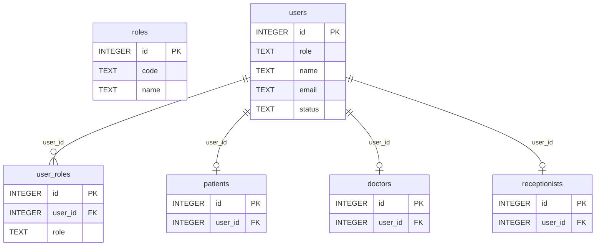

**Danh mục & Lịch làm việc** (5 bảng)

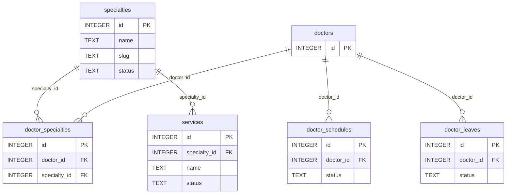

**Đặt lịch & Khám bệnh** (6 bảng)

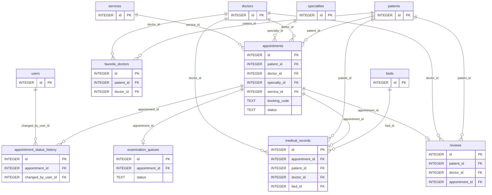

**Dược & Thanh toán** (4 bảng)

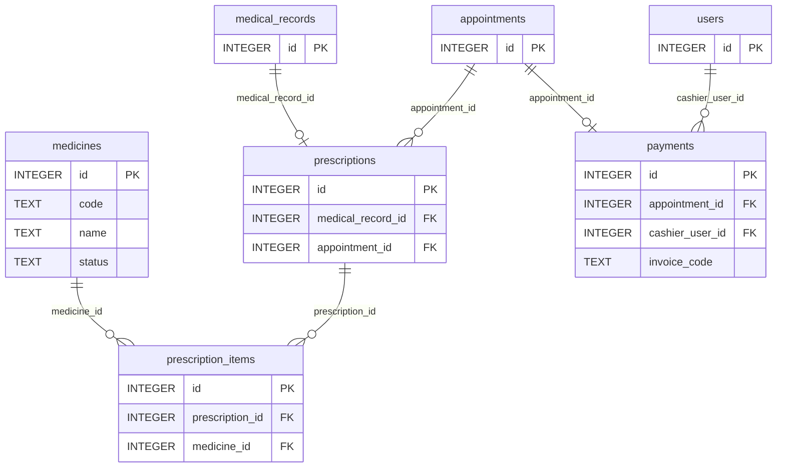

**Nội trú** (2 bảng)

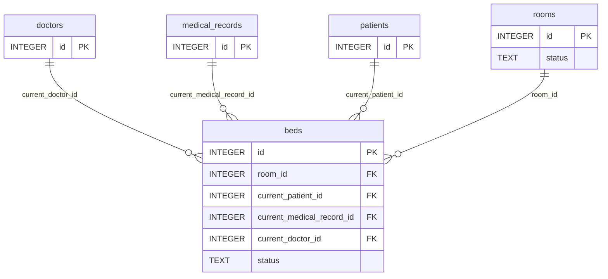

**Nội dung & Hệ thống** (3 bảng)

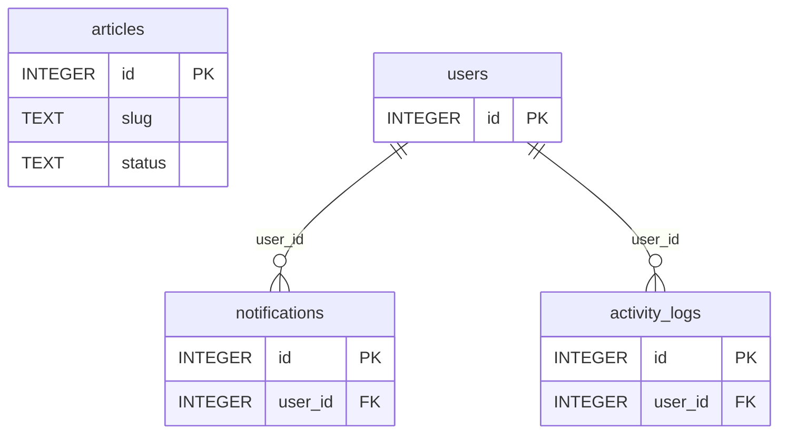

> Ghi chú ERD: `user_roles.role` là **TEXT**, không phải FK tới `roles` (pragma `foreign_key_list(user_roles)` chỉ có `user_id`). `||--o|` = quan hệ 1–1 (cột FK có UNIQUE). Ba quan hệ đa-hướng không được thể hiện bằng FK: `activity_logs.entity_id` (đa hình), `prescriptions.doctor_id/patient_id` và `medical_records.parent_visit_id` (không có FK).

## 4. Actor + Use Case

### 4.1 Actor (suy ra từ cơ chế phân quyền trong code)

| Actor | Cơ chế nhận diện | Bằng chứng |
|---|---|---|
| Guest | chưa có `session.user` | route public (server.ts:190…1100); `requireAuth` chuyển `/login` (middleware.ts:3) |
| Patient | `role=patient` | `requireRole('patient')` ở `/my-appointments` (server.ts:1152) |
| Doctor | `role=doctor` | `requireRole('doctor')` (server.ts:1285…1747) |
| Receptionist | `role=receptionist` (admin cũng vào được) | `requireRole('receptionist','admin')` (server.ts:1761…2336) |
| Admin | `role=admin` (chỉ 1 admin: server.ts ~2430) | `requireRole('admin')` (server.ts:2358…2931) |
| System | middleware/bootstrap, **không có cron/worker/socket** | `grep setInterval|setTimeout|cron|socket` = chỉ dòng `req.socket.remoteAddress` (server.ts:176) |
| (Đa vai trò) | 1 user có nhiều dòng `user_roles`, đổi bằng `/switch-role` | server.ts:462; real DB: 13 user có >1 vai trò |

### 4.2 Danh sách Use Case

Cột **Test** = đường dẫn route có xuất hiện trong `test_full_suite.js`/`test_render_views.js` (heuristic chuỗi; "Không" ≠ chắc chắn chưa test).

| ID | Actor | Use case | Tiền điều kiện | Luồng chính | Ngoại lệ | Xử lý tại | Trạng thái | Test |
|---|---|---|---|---|---|---|---|---|
| UC-01 | Guest | Xem trang chủ | Không | Mở `/` → hiển thị bác sĩ nổi bật, chuyên khoa, dịch vụ, bài viết | — | `server.ts:190` | **HOÀN CHỈNH** | Có |
| UC-02 | Guest | Đọc tin y tế / bài viết | Không | Danh sách + lọc/tìm → mở bài theo slug (tăng `views_count`) | Slug sai → 404 | `server.ts:236` `server.ts:265` `server.ts:293` | **HOÀN CHỈNH** _Không có route quản trị bài viết (THIẾU CRUD)_ | Không |
| UC-03 | Guest | Xem chuyên khoa & dịch vụ | Không | Danh sách chuyên khoa → chi tiết (bác sĩ + dịch vụ) | Slug sai → 404 | `server.ts:523` `server.ts:534` | **HOÀN CHỈNH** | Có |
| UC-04 | Guest | Xem danh sách & hồ sơ bác sĩ | Không | Lọc bác sĩ → xem hồ sơ, lịch trực, đánh giá | ID sai → 404 | `server.ts:555` `server.ts:585` | **HOÀN CHỈNH** | Có |
| UC-05 | Guest | Gửi liên hệ | Không | Điền form `/contact` → báo thành công | Thiếu trường → flash lỗi | `server.ts:503` `server.ts:507` `server.ts:511` | **LÀM DỞ** _Chỉ ghi `activity_logs` (server.ts:518), không lưu nội dung/không có người xử lý; message "sẽ phản hồi trong ít phút" không có cơ chế thật_ | Có |
| UC-06 | Guest | Đăng ký bệnh nhân | Chưa đăng nhập | Nhập form → tạo users + patients + user_roles → tự đăng nhập | Email trùng; mật khẩu < 8 ký tự; rate-limit 429 | `server.ts:401` `server.ts:406` | **HOÀN CHỈNH** | Có |
| UC-07 | Guest | Đăng nhập | Có tài khoản active | Email+mật khẩu → regenerate session → chuyển theo vai trò | Sai mật khẩu; khóa tài khoản; 429 | `server.ts:319` `server.ts:326` | **HOÀN CHỈNH** | Có |
| UC-08 | Mọi user | Đăng xuất | Đã đăng nhập | Hủy session → /login | — | `server.ts:482` | **HOÀN CHỈNH** _Đổi trạng thái bằng GET_ | Không |
| UC-09 | User đa vai trò | Chuyển vai trò làm việc | Có ≥2 dòng `user_roles` | Chọn vai trò → đổi `session.user.role` → portal tương ứng | Vai trò không thuộc user → flash lỗi | `server.ts:462` | **HOÀN CHỈNH** | Có |
| UC-10 | Guest/Màn hình công cộng | Xem bảng điện tử hàng đợi | Không (route public) | Mở live-board / poll `/api/queue/live` → thấy số đang gọi (tên đã che) | — | `server.ts:1912` `server.ts:1940` | **HOÀN CHỈNH** | Có |
| UC-11 | Guest/Bệnh nhân | Tra cứu khung giờ trống | Chọn chuyên khoa/bác sĩ/ngày | Form đặt lịch + API bác sĩ theo chuyên khoa, dịch vụ, slot theo lịch trực & nghỉ phép | Ngày nghỉ / quá khứ → slot khóa | `server.ts:620` `server.ts:649` `server.ts:660` … | **HOÀN CHỈNH** | Có |
| UC-12 | Guest/Bệnh nhân | Đặt lịch khám | Slot còn trống | POST đặt lịch → (khách mới: tạo tài khoản mật khẩu ngẫu nhiên) → transaction chặn trùng slot → ghi history + thông báo → trang thành công | Email đã có tài khoản → /login; slot trùng (UNIQUE); bác sĩ nghỉ; quá khứ; bác sĩ tự đặt | `server.ts:788` `server.ts:998` | **HOÀN CHỈNH** | Có |
| UC-13 | Bệnh nhân/Bác sĩ/Staff | Xem phiếu khám & chi tiết lịch | Đăng nhập; là chủ lịch/bác sĩ phụ trách/staff | Mở `/appointments/:code` → thấy bệnh án, đơn thuốc, STT | Không phải chủ → 403 | `server.ts:1020` | **HOÀN CHỈNH** | Có |
| UC-14 | Bệnh nhân | Xem lịch của tôi | Role patient | Danh sách lịch hẹn theo trạng thái | — | `server.ts:1152` | **HOÀN CHỈNH** | Có |
| UC-15 | Bệnh nhân | Hủy lịch hẹn | Là chủ lịch, lịch chưa khám | POST cancel → đổi trạng thái + ghi history | Không đúng chủ/trạng thái → từ chối | `server.ts:1070` | **HOÀN CHỈNH** _`appointments.cancellation_reason` không được ghi_ | Có |
| UC-16 | Bệnh nhân | Đánh giá bác sĩ | Lịch đã hoàn thành, chưa đánh giá | POST rating+comment → ghi `reviews` → cập nhật `doctors.rating/rating_count` | Đã đánh giá → từ chối | `server.ts:1105` | **HOÀN CHỈNH** _`reviews.is_anonymous` không dùng_ | Có |
| UC-17 | Mọi user đăng nhập | Quản lý hồ sơ cá nhân | Đăng nhập | Xem/sửa tên, SĐT, thông tin y tế (bệnh nhân) | — | `server.ts:1174` `server.ts:1224` | **HOÀN CHỈNH** | Có |
| UC-18 | Mọi user đăng nhập | Đổi mật khẩu | Biết mật khẩu cũ | POST mật khẩu cũ/mới → băm lại | Sai mật khẩu cũ; < 8 ký tự | `server.ts:1242` | **HOÀN CHỈNH** _THIẾU "quên mật khẩu" (không có route)_ | Không |
| UC-19 | Bệnh nhân | Bác sĩ yêu thích (toggle) | Đăng nhập | POST toggle → thêm/xóa `favorite_doctors` | — | `server.ts:1198` | **HOÀN CHỈNH** _Bảng đang 0 dòng_ | Không |
| UC-20 | Bác sĩ | Xem dashboard bác sĩ | Role doctor | Thống kê ca hôm nay | — | `server.ts:1285` | **HOÀN CHỈNH** | Có |
| UC-21 | Bác sĩ | Quản lý hàng đợi (gọi/vào phòng/bỏ qua) | Có ca đã check-in | Gọi số → bắt đầu khám → (bỏ qua) | Ca không thuộc bác sĩ → 403 | `server.ts:1320` `server.ts:1351` `server.ts:1376` … | **HOÀN CHỈNH** | Có |
| UC-22 | Bác sĩ | Khám bệnh & lập bệnh án | Ca đang khám của bác sĩ | Nhập sinh hiệu/chẩn đoán → lưu `medical_records` → hoàn tất lịch & hàng đợi → sinh hóa đơn | Không phải bác sĩ phụ trách → 403 | `server.ts:1426` `server.ts:1516` | **HOÀN CHỈNH** _Phí khám cố định 200000 (server.ts:1599,1717), không dùng `doctors.consultation_fee`/`services.price`_ | Có |
| UC-23 | Bác sĩ | Kê đơn thuốc & trừ kho | Đang khám | Chọn thuốc → kiểm tồn kho → transaction hoàn kho đơn cũ/ghi đơn mới/trừ kho | Vượt tồn kho → từ chối | `server.ts:1516` | **HOÀN CHỈNH** | Có |
| UC-24 | Bác sĩ | Chỉ định nhập viện nội trú | Chọn điều trị nội trú + phòng/giường | Khớp phòng/giường bằng tên (LIKE) → giường chuyển "occupied" | Không khớp giường → bỏ qua im lặng (try/catch rỗng) | `server.ts:1516` | **LÀM DỞ** _Khớp bằng chuỗi (server.ts ~1640), lỗi bị nuốt_ | Có |
| UC-25 | Bác sĩ | Xem ca trực & xin nghỉ phép | Role doctor | Xem lịch tuần → gửi đơn nghỉ (pending) | — | `server.ts:1739` `server.ts:1747` | **HOÀN CHỈNH** | Không |
| UC-26 | Lễ tân | Dashboard lễ tân | Role receptionist/admin | Thống kê lịch & thu ngân hôm nay | — | `server.ts:1761` | **HOÀN CHỈNH** | Có |
| UC-27 | Lễ tân | Xác nhận lịch hẹn | Lịch pending | POST confirm → status confirmed | — | `server.ts:1829` | **LÀM DỞ** _Không ghi `appointment_status_history`_ | Không |
| UC-28 | Lễ tân | Check-in & cấp số thứ tự (triage ưu tiên) | Lịch confirmed trong ngày | Check-in → tạo `examination_queues` → bump ca ưu tiên → thông báo bác sĩ | Đã check-in → bỏ qua | `server.ts:1790` `server.ts:1835` | **HOÀN CHỈNH** | Có |
| UC-29 | Lễ tân/Admin | Đặt lịch tại quầy (walk-in) | Role receptionist/admin | Nhập thông tin → tạo/ghép user+patient → tạo lịch + hàng đợi | Ngày quá khứ; bác sĩ nghỉ | `server.ts:1958` `server.ts:1972` | **HOÀN CHỈNH** | Có |
| UC-30 | Lễ tân | Thu viện phí | Có hóa đơn unpaid | Chọn phương thức → payment_status=paid, ghi thu ngân | — | `server.ts:2138` `server.ts:2171` | **HOÀN CHỈNH** _Không có cột/route ghi chú thanh toán (`payments.note/notes` không được ghi)_ | Có |
| UC-31 | Lễ tân | In biên lai | Hóa đơn tồn tại | Mở receipt → window.print() | — | `server.ts:2183` | **HOÀN CHỈNH** | Có |
| UC-32 | Lễ tân | Quản lý giường nội trú (đổi trạng thái, xuất viện) | Role receptionist/admin | Sơ đồ giường → đổi trạng thái / xuất viện (giường → cleaning) | — | `server.ts:2222` `server.ts:2293` `server.ts:2336` | **LÀM DỞ** _Không có CRUD phòng/giường (THIẾU); chỉ nạp qua seed trong db.ts_ | Có |
| UC-33 | Admin | Dashboard & báo cáo doanh thu | Role admin | Xem KPI & báo cáo | — | `server.ts:2358` `server.ts:2895` | **HOÀN CHỈNH** _Không xuất file (CSV/PDF)_ | Có |
| UC-34 | Admin | Quản lý người dùng & vai trò | Role admin | Danh sách/lọc → tạo/sửa (đa vai trò) → khóa/mở | Chỉ 1 admin; mật khẩu < 8 | `server.ts:2392` `server.ts:2419` `server.ts:2423` … | **HOÀN CHỈNH** | Không |
| UC-35 | Admin | Quản lý hồ sơ bác sĩ | Role admin | Danh sách → sửa chức danh/phòng/phí/chuyên khoa | — | `server.ts:2554` `server.ts:2566` `server.ts:2586` | **HOÀN CHỈNH** | Không |
| UC-36 | Admin | Quản lý chuyên khoa | Role admin | Danh sách/tạo/sửa (ẩn bằng status) | — | `server.ts:2606` `server.ts:2616` `server.ts:2620` … | **HOÀN CHỈNH** _`specialties.image` không được ghi_ | Không |
| UC-37 | Admin | Quản lý dịch vụ | Role admin | Danh sách/tạo/sửa | — | `server.ts:2645` `server.ts:2655` `server.ts:2660` … | **HOÀN CHỈNH** | Không |
| UC-38 | Admin | Quản lý thuốc & tồn kho | Role admin | Danh sách/tạo/sửa thuốc, nhập tồn | — | `server.ts:2688` `server.ts:2693` `server.ts:2697` … | **HOÀN CHỈNH** | Không |
| UC-39 | Admin | Quản lý ca trực & duyệt nghỉ phép | Role admin | Thêm/xóa ca trực, duyệt đơn nghỉ | — | `server.ts:2724` `server.ts:2750` `server.ts:2760` … | **HOÀN CHỈNH** | Không |
| UC-40 | Admin | Quản lý lịch hẹn (xem, ép đổi trạng thái) | Role admin | Danh sách → xem chi tiết → đổi trạng thái (kiểm tra hợp lệ) | Trạng thái lạ → 400 | `server.ts:2774` `server.ts:2822` `server.ts:2872` | **HOÀN CHỈNH** | Có |
| UC-41 | Admin | Xem nhật ký hoạt động | Role admin | Danh sách `activity_logs` | — | `server.ts:2920` | **HOÀN CHỈNH** | Không |
| UC-42 | Admin | Sao lưu CSDL | Role admin | Tải file SQLite đang chạy | Lỗi file → 500 | `server.ts:2931` | **HOÀN CHỈNH** | Có |
| UC-43 | System | Hiển thị thông báo (chuông) | Đã đăng nhập | Middleware đọc 5 thông báo mới + đếm chưa đọc mỗi request (server.ts:147-168) | Lỗi → mảng rỗng | `src/server.ts`/`src/db.ts` (xem luồng) | **LÀM DỞ** _Không có route đánh dấu đã đọc: `is_read` chỉ được đọc (real DB: 1/515 đã đọc); thông báo chỉ ghi ở UC-12/28/29_ | — |
| UC-44 | System | Ghi nhật ký hoạt động | Sự kiện nghiệp vụ | `logActivity()` (server.ts:174) INSERT activity_logs | Nuốt lỗi (try/catch) | `src/server.ts`/`src/db.ts` (xem luồng) | **HOÀN CHỈNH** | — |
| UC-45 | System | Khởi tạo & nâng cấp CSDL khi khởi động | Khởi động server | CREATE TABLE IF NOT EXISTS + ALTER (try/catch) + seed (roles, danh mục, demo dev) (db.ts) | Production: không seed demo | `src/server.ts`/`src/db.ts` (xem luồng) | **HOÀN CHỈNH** _Không có bảng version migration_ | — |

**Chức năng THIẾU (không có route/view — đã grep `forgot|reset-password|/notifications|reschedule|/admin/articles|/admin/rooms|/admin/reviews|/admin/roles` = 0 kết quả):** quên/đặt lại mật khẩu; đánh dấu thông báo đã đọc; đổi lịch hẹn; CRUD bài viết; CRUD phòng/giường; kiểm duyệt đánh giá; quản lý bảng `roles`; hộp thư liên hệ; xuất báo cáo (file); thanh toán online.

### 4.3 Use Case Diagram (Mermaid)

**Guest (công khai)**

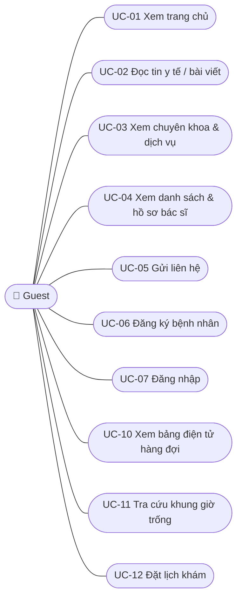

**Bệnh nhân**

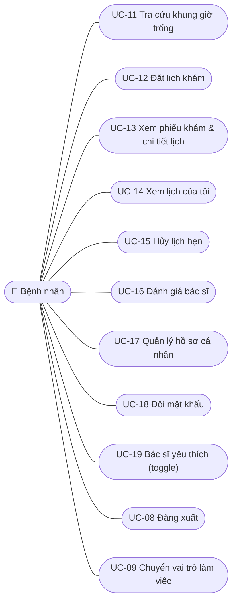

**Bác sĩ**

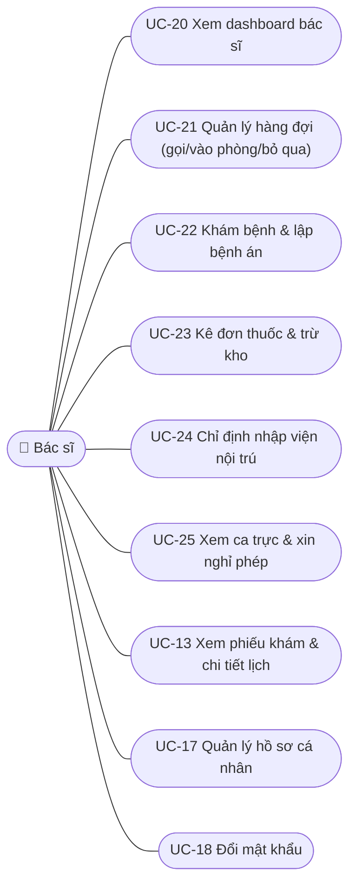

**Lễ tân**

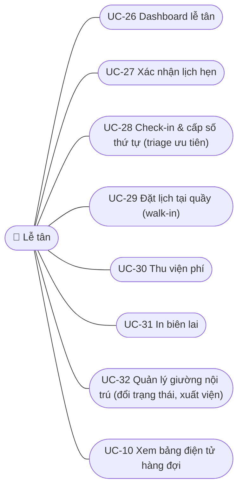

**Admin**

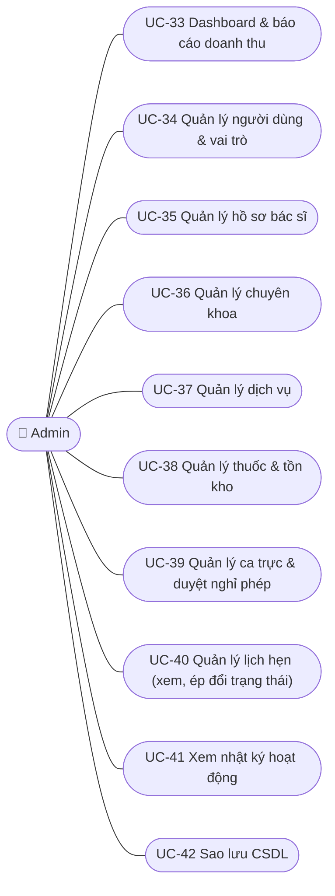

**System**

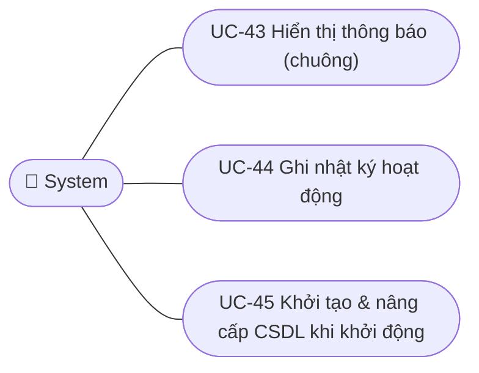

Quan hệ include/extend thực tế trong code (không phải suy diễn): UC-12 «include» UC-11 (slot) và UC-06 (tạo tài khoản tự động cho khách mới); UC-22 «include» UC-23 (kê đơn) và sinh hóa đơn (payments) trong cùng một POST; UC-22 «extend» UC-24 (khi chọn nội trú); mọi UC ghi dữ liệu «include» UC-44.

## 5. Ma trận Use Case × Bảng

R = đọc, W = ghi (INSERT/UPDATE/DELETE). Sinh tự động từ phân tích SQL trong từng route handler (`db_usage.js`) + các hàm trợ giúp một cấp (`logActivity`, `getOrCreateDoctorProfile`); UC-22/23/24 dùng chung 1 POST nên tách bảng theo nghiệp vụ thủ công.

### 5.1 Theo Use Case (UC → bảng)

| UC | Bảng R | Bảng W |
|---|---|---|
| UC-01 Xem trang chủ | appointments, articles, doctor_specialties, doctors, patients, services, specialties, users | — |
| UC-02 Đọc tin y tế / bài viết | articles | articles |
| UC-03 Xem chuyên khoa & dịch vụ | doctor_specialties, doctors, services, specialties, users | — |
| UC-04 Xem danh sách & hồ sơ bác sĩ | doctor_schedules, doctor_specialties, doctors, patients, reviews, specialties, users | — |
| UC-05 Gửi liên hệ | — | activity_logs |
| UC-06 Đăng ký bệnh nhân | users | activity_logs, patients, user_roles, users |
| UC-07 Đăng nhập | user_roles, users | activity_logs |
| UC-08 Đăng xuất | — | activity_logs |
| UC-09 Chuyển vai trò làm việc | user_roles | — |
| UC-10 Xem bảng điện tử hàng đợi | appointments, doctor_specialties, doctors, examination_queues, patients, specialties, users | — |
| UC-11 Tra cứu khung giờ trống | appointments, doctor_leaves, doctor_schedules, doctor_specialties, doctors, patients, services, specialties, users | — |
| UC-12 Đặt lịch khám | appointments, doctor_leaves, doctors, patients, specialties, users | activity_logs, appointment_status_history, appointments, notifications, patients, user_roles, users |
| UC-13 Xem phiếu khám & chi tiết lịch | appointments, doctors, examination_queues, medical_records, patients, prescription_items, prescriptions, reviews, specialties, users | — |
| UC-14 Xem lịch của tôi | appointments, doctors, patients, services, specialties, users | patients |
| UC-15 Hủy lịch hẹn | appointments, patients | appointment_status_history, appointments |
| UC-16 Đánh giá bác sĩ | appointments, patients, reviews | doctors, reviews |
| UC-17 Quản lý hồ sơ cá nhân | doctor_specialties, doctors, favorite_doctors, patients, specialties, users | patients, users |
| UC-18 Đổi mật khẩu | users | users |
| UC-19 Bác sĩ yêu thích (toggle) | favorite_doctors, patients | favorite_doctors |
| UC-20 Xem dashboard bác sĩ | appointments, doctors, examination_queues, patients, specialties, users | doctor_specialties, doctors |
| UC-21 Quản lý hàng đợi (gọi/vào phòng/bỏ qua) | appointments, doctor_specialties, doctors, examination_queues, patients, specialties, users | appointments, doctor_specialties, doctors, examination_queues |
| UC-22 Khám bệnh & lập bệnh án | appointments, doctors, examination_queues, medical_records, patients, payments, specialties, users | activity_logs, appointments, examination_queues, medical_records, payments |
| UC-23 Kê đơn thuốc & trừ kho | medicines, prescription_items, prescriptions | medicines, prescription_items, prescriptions |
| UC-24 Chỉ định nhập viện nội trú | beds, medical_records, rooms | beds, medical_records |
| UC-25 Xem ca trực & xin nghỉ phép | doctor_leaves, doctor_schedules, doctors, specialties | doctor_leaves, doctor_specialties, doctors |
| UC-26 Dashboard lễ tân | appointments, doctors, patients, payments, users | — |
| UC-27 Xác nhận lịch hẹn | — | appointments |
| UC-28 Check-in & cấp số thứ tự (triage ưu tiên) | appointments, doctors, examination_queues, patients, users | activity_logs, appointments, examination_queues, notifications |
| UC-29 Đặt lịch tại quầy (walk-in) | appointments, doctor_leaves, doctors, examination_queues, patients, specialties, users | appointments, examination_queues, notifications, patients, users |
| UC-30 Thu viện phí | appointments, doctors, patients, payments, users | payments |
| UC-31 In biên lai | appointments, doctors, medical_records, patients, payments, prescription_items, prescriptions, specialties, users | — |
| UC-32 Quản lý giường nội trú (đổi trạng thái, xuất viện) | beds, doctors, medical_records, patients, rooms, users | activity_logs, beds |
| UC-33 Dashboard & báo cáo doanh thu | appointments, doctors, patients, payments, specialties, users | — |
| UC-34 Quản lý người dùng & vai trò | doctors, patients, receptionists, user_roles, users | activity_logs, doctors, patients, receptionists, user_roles, users |
| UC-35 Quản lý hồ sơ bác sĩ | doctor_specialties, doctors, specialties, users | doctor_specialties, doctors |
| UC-36 Quản lý chuyên khoa | doctor_specialties, specialties | specialties |
| UC-37 Quản lý dịch vụ | services, specialties | services |
| UC-38 Quản lý thuốc & tồn kho | medicines | medicines |
| UC-39 Quản lý ca trực & duyệt nghỉ phép | doctor_leaves, doctor_schedules, doctors, users | doctor_leaves, doctor_schedules |
| UC-40 Quản lý lịch hẹn (xem, ép đổi trạng thái) | appointment_status_history, appointments, doctors, medical_records, medicines, patients, payments, prescription_items, prescriptions, services, specialties, users | activity_logs, appointment_status_history, appointments |
| UC-41 Xem nhật ký hoạt động | activity_logs, users | — |
| UC-42 Sao lưu CSDL | — | activity_logs |
| UC-43 Hiển thị thông báo (chuông) | notifications | — |
| UC-44 Ghi nhật ký hoạt động | — | activity_logs |
| UC-45 Khởi tạo & nâng cấp CSDL khi khởi động | — | articles, beds, doctor_leaves, doctor_schedules, doctor_specialties, doctors, medicines, patients, receptionists, roles, rooms, services, specialties, user_roles, users |

### 5.2 Theo bảng (bảng → UC) — đủ 26 bảng

| Bảng | Đọc bởi | Ghi bởi | Nhãn |
|---|---|---|---|
| `activity_logs` | UC-41 | UC-05, UC-06, UC-07, UC-08, UC-12, UC-22, UC-28, UC-32, UC-34, UC-40, UC-42, UC-44 | [CÓ-VÀ-DÙNG] |
| `appointment_status_history` | UC-40 | UC-12, UC-15, UC-40 | [CÓ-VÀ-DÙNG] |
| `appointments` | UC-01, UC-10, UC-11, UC-12, UC-13, UC-14, UC-15, UC-16, UC-20, UC-21, UC-22, UC-26, UC-28, UC-29, UC-30, UC-31, UC-33, UC-40 | UC-12, UC-15, UC-21, UC-22, UC-27, UC-28, UC-29, UC-40 | [CÓ-VÀ-DÙNG] |
| `articles` | UC-01, UC-02 | UC-02, UC-45 | [CÓ-VÀ-DÙNG] |
| `beds` | UC-24, UC-32 | UC-24, UC-32, UC-45 | [CÓ-VÀ-DÙNG] |
| `doctor_leaves` | UC-11, UC-12, UC-25, UC-29, UC-39 | UC-25, UC-39, UC-45 | [CÓ-VÀ-DÙNG] |
| `doctor_schedules` | UC-04, UC-11, UC-25, UC-39 | UC-39, UC-45 | [CÓ-VÀ-DÙNG] |
| `doctor_specialties` | UC-01, UC-03, UC-04, UC-10, UC-11, UC-17, UC-21, UC-35, UC-36 | UC-20, UC-21, UC-25, UC-35, UC-45 | [CÓ-VÀ-DÙNG] |
| `doctors` | UC-01, UC-03, UC-04, UC-10, UC-11, UC-12, UC-13, UC-14, UC-17, UC-20, UC-21, UC-22, UC-25, UC-26, UC-28, UC-29, UC-30, UC-31, UC-32, UC-33, UC-34, UC-35, UC-39, UC-40 | UC-16, UC-20, UC-21, UC-25, UC-34, UC-35, UC-45 | [CÓ-VÀ-DÙNG] |
| `examination_queues` | UC-10, UC-13, UC-20, UC-21, UC-22, UC-28, UC-29 | UC-21, UC-22, UC-28, UC-29 | [CÓ-VÀ-DÙNG] |
| `favorite_doctors` | UC-17, UC-19 | UC-19 | [CÓ-VÀ-DÙNG] (local 0 dòng) |
| `medical_records` | UC-13, UC-22, UC-24, UC-31, UC-32, UC-40 | UC-22, UC-24 | [CÓ-VÀ-DÙNG] |
| `medicines` | UC-23, UC-38, UC-40 | UC-23, UC-38, UC-45 | [CÓ-VÀ-DÙNG] |
| `notifications` | UC-43 | UC-12, UC-28, UC-29 | [CÓ-VÀ-DÙNG] |
| `patients` | UC-01, UC-04, UC-10, UC-11, UC-12, UC-13, UC-14, UC-15, UC-16, UC-17, UC-19, UC-20, UC-21, UC-22, UC-26, UC-28, UC-29, UC-30, UC-31, UC-32, UC-33, UC-34, UC-40 | UC-06, UC-12, UC-14, UC-17, UC-29, UC-34, UC-45 | [CÓ-VÀ-DÙNG] |
| `payments` | UC-22, UC-26, UC-30, UC-31, UC-33, UC-40 | UC-22, UC-30 | [CÓ-VÀ-DÙNG] |
| `prescription_items` | UC-13, UC-23, UC-31, UC-40 | UC-23 | [CÓ-VÀ-DÙNG] |
| `prescriptions` | UC-13, UC-23, UC-31, UC-40 | UC-23 | [CÓ-VÀ-DÙNG] |
| `receptionists` | UC-34 | UC-34, UC-45 | [CÓ-VÀ-DÙNG] |
| `reviews` | UC-04, UC-13, UC-16 | UC-16 | [CÓ-VÀ-DÙNG] |
| `roles` | — | UC-45 | [CÓ-NHƯNG-KHÔNG-DÙNG] |
| `rooms` | UC-24, UC-32 | UC-45 | [CÓ-VÀ-DÙNG] |
| `services` | UC-01, UC-03, UC-11, UC-14, UC-37, UC-40 | UC-37, UC-45 | [CÓ-VÀ-DÙNG] |
| `specialties` | UC-01, UC-03, UC-04, UC-10, UC-11, UC-12, UC-13, UC-14, UC-17, UC-20, UC-21, UC-22, UC-25, UC-29, UC-31, UC-33, UC-35, UC-36, UC-37, UC-40 | UC-36, UC-45 | [CÓ-VÀ-DÙNG] |
| `user_roles` | UC-07, UC-09, UC-34 | UC-06, UC-12, UC-34, UC-45 | [CÓ-VÀ-DÙNG] |
| `users` | UC-01, UC-03, UC-04, UC-06, UC-07, UC-10, UC-11, UC-12, UC-13, UC-14, UC-17, UC-18, UC-20, UC-21, UC-22, UC-26, UC-28, UC-29, UC-30, UC-31, UC-32, UC-33, UC-34, UC-35, UC-39, UC-40, UC-41 | UC-06, UC-12, UC-17, UC-18, UC-29, UC-34, UC-45 | [CÓ-VÀ-DÙNG] |

## 6. Kết quả phân tích A → E

Phương pháp: `db_usage.js` (đếm tham chiếu bảng/cột trong `server.ts` + 48 view + test), `db_detail.js` (PRAGMA table_info / foreign_key_list / index_list), `db_data.js` (truy vấn kiểm tra toàn vẹn trên **bản sao** DB local), `db_explain.js` (EXPLAIN QUERY PLAN), `db_n1.js` (quét truy vấn trong vòng lặp). Giới hạn: đếm từ khóa không thấy truy cập động kiểu `row[col]`/`SELECT *` → "0 tham chiếu" nghĩa là **không có ở bất kỳ câu SQL, view EJS nào**, còn "CÓ-VÀ-DÙNG" với `SELECT *` chỉ chắc khi view dùng cột đó.

### A. Bảng / cột thừa

**Bảng**

| Bảng | Bằng chứng | Kết luận |
|---|---|---|
| `roles` | Chỉ xuất hiện ở `src/db.ts:36` (DDL) và `db.ts:500-505` (seed 4 dòng). Không FK nào trỏ tới (`foreign_key_list` của mọi bảng), `server.ts`/`middleware.ts` không có câu SQL nào đọc/ghi `roles`. Vai trò được so sánh bằng chuỗi (`requireRole('admin')`, middleware.ts:15-30) và `user_roles.role` là TEXT. | **XÓA ĐƯỢC** (nhưng chi phí giữ ≈ 0 → xem OPT-08) |
| `favorite_doctors` | 0 dòng local; có UC-19 ghi/đọc (`server.ts:1183,1213-1219`) | **NÊN GIỮ** (tính năng đang chạy, chưa có dữ liệu) |
| Bảng khác (24) | Có ≥1 route đọc hoặc ghi (bảng 5.2) | **NÊN GIỮ** |

Không có bảng nào "rỗng và không UC nào dùng". Không có bảng không được tham chiếu bởi code ngoài `roles`.

**Cột — [CÓ-NHƯNG-KHÔNG-DÙNG]** (0 tham chiếu trong `server.ts` + toàn bộ `views/`; riêng `payments.note/notes` kiểm bằng cách đọc 3 câu ghi `payments` tại `server.ts:1723,1728,2174`):

| Cột | Ghi chú | Kết luận |
|---|---|---|
| `appointments.cancellation_reason` | UC-15 hủy lịch không hỏi/ghi lý do | Nên **dùng** (thiếu logic) hoặc xóa |
| `appointments.estimated_start_time` (db.ts:427) | không đọc/ghi | XÓA ĐƯỢC |
| `doctor_schedules.is_active` | trùng nghĩa `status` (code dùng `status`: server.ts:599,2753); DB local không có cột này | XÓA ĐƯỢC |
| `medical_records.treatment_plan` | không đọc/ghi; DB local không có | XÓA ĐƯỢC |
| `receptionists.department`, `shift_default` (db.ts:438-439) | không đọc/ghi | XÓA ĐƯỢC |
| `reviews.is_anonymous` (db.ts:444) | form đánh giá không có tùy chọn ẩn danh | XÓA ĐƯỢC hoặc làm tính năng |
| `rooms.total_beds` | giá trị khớp số giường thật (3/3 phòng) nhưng không đọc/ghi — dữ liệu dẫn xuất | XÓA ĐƯỢC (dùng `COUNT(beds)`) |
| `payments.note` + `payments.notes` | **hai cột trùng nghĩa**, không câu ghi nào; local có 1 dòng `note` từ dữ liệu cũ | XÓA 1 hoặc cả 2 |
| `patients.priority_category` | chỉ view đọc (1 chỗ), **không nơi nào ghi**; 108/108 = `normal` | XÓA ĐƯỢC hoặc làm tính năng |
| `specialties.image` | view đọc 1 chỗ, form quản trị không ghi | NÊN GIỮ nếu sắp có ảnh |

**Cột ghi nhưng không bao giờ đọc (write-only):** `medical_records.bed_id` (ghi `server.ts:1662`; sơ đồ giường join bằng `beds.current_medical_record_id`, server.ts:2248), `examination_queues.called_time/finish_time` (không view nào hiển thị), `appointments.bumped_from_slot`, `examination_queues.bumped_reason`, `activity_logs.user_agent`.

### B. Trùng lặp / chồng chéo

**B1. Cùng thực thể ở hai nơi:** `users.role` và `user_roles`. Login gộp cả hai (`server.ts:362-366`), lọc admin dùng cả hai (`server.ts:~2410`). Dữ liệu local: **2/108** user có `users.role` không nằm trong `user_roles`; **13** user có >1 vai trò → `user_roles` là cần thiết. **Kết luận: giữ cả hai** (`users.role` = vai trò chính/portal mặc định), chỉ cần giữ bất biến "users.role ∈ user_roles" (OPT-06).

**B2. Các bảng 1–1 (đều có UNIQUE trên cột FK — pragma index_list):**

| Cặp | Bằng chứng 1–1 | Lợi ích nếu gộp | Rủi ro / lý do giữ | Kết luận |
|---|---|---|---|---|
| `users` ↔ `patients` | UNIQUE(user_id); local 108 = 108 (13 user không phải bệnh nhân vẫn có dòng patients do tự đặt lịch: server.ts:803,1155) | bớt 1 JOIN (29 route đọc) | 6 bảng FK tới `patients.id` (appointments, medical_records, reviews, favorite_doctors, beds, prescriptions); 7 chỗ INSERT (server.ts:442,803,838,1155,1984,2469,2530) | **KHÔNG GỘP** |
| `users` ↔ `doctors` | UNIQUE(user_id) | — | `doctors` có 10 cột nghiệp vụ riêng, nhiều bảng FK | **KHÔNG GỘP** |
| `users` ↔ `receptionists` | UNIQUE(user_id), UNIQUE(staff_code); 2 dòng | `staff_code` là cột duy nhất còn dùng (server.ts:2395,2472,2533) → có thể thành cột của `users` | lợi ích rất nhỏ, đụng 3 route | Giữ (P2, không đáng) |
| `appointments` ↔ `examination_queues` | UNIQUE(appointment_id); local 4/7 lịch có hàng đợi (chỉ tạo khi check-in) | −1 bảng, −1 JOIN (11 route đọc) | ~10 cột nullable chỉ dùng sau check-in; vòng đời trạng thái riêng; logic bump ưu tiên; 15 tham chiếu trong test | **KHÔNG NÊN** |
| `appointments` ↔ `medical_records` | UNIQUE(appointment_id) | −1 bảng | dữ liệu y tế nhạy cảm tách quyền truy cập; 4/7 | **KHÔNG NÊN** |
| `appointments` ↔ `payments` | UNIQUE(appointment_id), UNIQUE(invoice_code) | −1 bảng | hóa đơn là bản ghi tài chính bất biến, có thu ngân/phương thức/thời điểm riêng | **KHÔNG NÊN** |
| `medical_records` ↔ `prescriptions` | UNIQUE(medical_record_id) | −1 bảng: header chỉ còn 2 cột có nghĩa (`total_amount`, `usage_instructions`) + 3 cột lặp (`appointment_id`, `doctor_id`, `patient_id`) | mất khả năng nhiều đơn/lượt khám; 5 route đọc + 10 tham chiếu test | Khả thi nhất nhưng **không đáng làm ngay** (OPT-14) |

**B3. Bảng lookup quá nhỏ:** chỉ `roles` (4 giá trị cố định) — thay bằng CHECK/hằng số được (OPT-08). `specialties` (8), `services` (9), `rooms` (3) có thuộc tính riêng (slug, giá, thời lượng) và có thể mở rộng bởi admin → giữ.

**B4. Bảng N–N có thật sự cần?** `doctor_specialties`: local 1 bác sĩ có >1 chuyên khoa, form sửa bác sĩ nhận danh sách `specialty_ids` (`server.ts:2587-2600`) → cần. `user_roles`: 13 user đa vai trò → cần. `favorite_doctors`: UNIQUE(patient_id, doctor_id) → cần.

**B5. Bảng log chồng chéo:** `activity_logs` (audit toàn hệ thống), `appointment_status_history` (lịch sử trạng thái có FK), `notifications` (thông báo cho user) khác mục đích → giữ. Chỉ chồng nhẹ: đổi trạng thái thủ công ghi cả history lẫn `OVERRIDE_STATUS` vào `activity_logs` (local: 30 dòng).

**B6. Liên kết hai chiều giường ↔ bệnh án:** `beds.current_patient_id/current_medical_record_id/current_doctor_id/admission_date` và `medical_records.bed_id/inpatient_room/inpatient_bed/admission_date/discharge_date` lưu cùng sự kiện. Khớp phòng/giường bằng chuỗi `LIKE` (`server.ts:1645`). Local: 3 giường `occupied` nhưng **0** giường có `current_medical_record_id` và **0** bệnh án có `bed_id` → dữ liệu seed không nhất quán với mô hình. Xem OPT-12.

**B7. `priority_level` lặp** ở `appointments` và `examination_queues` (local khác nhau 0/4). Denormalize hợp lý để sắp hàng đợi mà không join → giữ.

### C. Chuẩn hóa

- Không có cột chứa danh sách phân tách dấu phẩy. JSON nhồi: `medical_records.vital_signs` TEXT (JSON, `server.ts:1622`) — chỉ hiển thị, không lọc/query → chấp nhận. Liều dùng 4 cột `morning/noon/afternoon/night` TEXT → chấp nhận.
- **Denormalize có chủ đích (tốt):** `prescription_items.medicine_name/unit_price/amount` (chốt giá tại thời điểm kê), `payments.service_fee/medicine_fee/total_amount/final_amount` (chốt hóa đơn; local kiểm tra `final = total − discount` và `total = dịch vụ + thuốc` đều đúng 4/4; `medicine_fee = prescriptions.total_amount` đúng 4/4; `amount = qty × price` đúng 7/7).
- **Denormalize bị lệch:** `doctors.rating_count` ≠ `COUNT(reviews)` ở **9/9** bác sĩ có `rating_count>0` (local chỉ có 4 review) — seed ghi sẵn số liệu giả; code tự tính lại khi có review mới (`server.ts:1139-1144`) nên chỉ sai tới lúc có đánh giá đầu tiên (OPT-07). `doctors.rating` mặc định 5.00 kể cả khi chưa có review.
- `rooms.department_name` và `receptionists.department` là text lặp tên khoa, không FK `specialties` — chấp nhận ở quy mô này.
- Không thấy chuẩn hóa quá đà gây JOIN thừa.

### D. Toàn vẹn & hiệu năng

| Mục | Phát hiện | Bằng chứng |
|---|---|---|
| FK bật & sạch | `foreign_keys=1`; `PRAGMA foreign_key_check` = 0 vi phạm; `integrity_check` = ok (bản sao DB local) | `db_data.js` |
| Thiếu FK | `medical_records.parent_visit_id`, `prescriptions.doctor_id`, `prescriptions.patient_id` (không FK); `activity_logs.entity_id` đa hình (chấp nhận) | `db_detail.js` |
| CASCADE nguy hiểm | `appointments.patient_id/doctor_id` ON DELETE CASCADE, rồi `medical_records`/`payments` CASCADE theo `appointments` → xóa 1 user sẽ xóa cả hồ sơ bệnh án và hóa đơn. Hiện **không có route xóa user** (`grep "DELETE FROM users"` = 0) → rủi ro tiềm ẩn | db.ts:165-190 |
| Thiếu CHECK | Chỉ `reviews.rating` có CHECK. Mọi `status` là TEXT tự do (appointments, payments, beds, doctor_leaves…); `medicines.stock_quantity` có thể âm ở mức DB (app đã chặn: transaction + kiểm tồn kho) | `db_detail.js` (CHECK in DDL: chỉ reviews) |
| Kiểu tiền | **REAL** cho 11 cột tiền (payments ×5, prescription_items ×2, prescriptions.total_amount, medicines.unit_price, services.price, doctors.consultation_fee). VND là số nguyên → nên INTEGER | `db_detail.js` |
| Phí khám cố định | Hóa đơn dùng hằng 200000 (`server.ts:1599,1717`), bỏ qua `doctors.consultation_fee` (admin sửa được: `server.ts:2587-2592`) và `services.price`; thời lượng slot khi đặt lịch cố định 30 phút (+30 ở `server.ts:~880`) bỏ qua `services.duration_minutes`/`doctor_schedules.slot_duration` khi tính `end_time` | server.ts |
| "Hôm nay" theo UTC | `new Date().toISOString().slice(0,10)` ở 8 chỗ (`server.ts:145,630,1287,1332,1762,1792,1922,1941`) trong khi đặt lịch dùng ngày địa phương → 00:00–07:00 giờ VN các màn hình hàng đợi/dashboard truy vấn **ngày hôm qua** | grep |
| Thiếu index (EXPLAIN QUERY PLAN trên bản sao) | `SCAN`: `notifications` (2 truy vấn chạy ở **mọi request** của user đã đăng nhập, server.ts:150-158), `doctor_schedules` (doctor_id, day_of_week), `doctor_leaves` (kiểm tra đặt lịch), `reviews` (doctor_id), `services` (specialty_id), `appointment_status_history` (appointment_id), `medical_records` (patient_id). Có index tốt: `appointments` (3 index + UNIQUE một phần), `examination_queues`, `prescriptions` | `db_explain.js` |
| Index thừa | `idx_prescriptions_record` (db.ts:461) trùng UNIQUE(medical_record_id); `idx_user_roles_user` (db.ts:464) là tiền tố của UNIQUE(user_id, role) | `db_detail.js` |
| N+1 | 9 nghi vấn từ quét heuristic đều là truy vấn lẻ trong vòng lặp **danh sách nhỏ** (dòng thuốc của 1 đơn: server.ts:1548,1572,1578,1679,1697; vai trò khi tạo/sửa user: 2462,2523). Không thấy N+1 ở trang danh sách. `SELECT *` ×99, `LIKE '%…%'` ×22 (không dùng được index; dữ liệu nhỏ) | `db_n1.js` |
| Soft delete | Không có `deleted_at`. Thực thể chính dùng cột `status` (users, specialties, services, medicines, articles); xóa cứng ở 5 chỗ cho bảng liên kết (server.ts:1216,1683,2521,2594,2761) | grep |
| created_at/updated_at | Thiếu `created_at` ở `beds`, `roles`; thiếu `updated_at` ở 17 bảng (không bắt buộc) | `db_detail.js` |
| Dữ liệu rác (DB local) | **92/108** users khớp mẫu email test/example/walkin/guest; 798 `activity_logs`, 515 `notifications` cho 7 lịch hẹn; `patients` = 108 | `db_data.js` |
| Dữ liệu seed lệch | 3 giường `occupied` không gắn bệnh án; `rooms.total_beds` khớp; `doctor_schedules.status` toàn `active` | `db_data.js` |

### E. Mở rộng & an toàn

- **Đa người thuê:** không có `tenant_id`; mô hình một phòng khám. Chỉ cần nếu muốn nhiều chi nhánh (CHƯA XÁC MINH yêu cầu).
- **Dữ liệu nhạy cảm:** mật khẩu băm bcrypt (`server.ts:339,433,832`). `patients.health_insurance_no/medical_history/address/emergency_contact` và toàn bộ `medical_records` lưu **plain text**, không mã hóa at-rest; `/admin/backup-db` (`server.ts:~3000`) tải nguyên file SQLite; `activity_logs` lưu IP + user-agent.
- **Migration có version:** **THIẾU.** `PRAGMA user_version = 0` trên DB local; 30 câu `ALTER TABLE` chạy mỗi lần khởi động trong try/catch (`db.ts:414-444`); không biết DB ở phiên bản nào → đã gây drift 8 cột (mục 2).
- SQLite 3.48.0 (bundled) hỗ trợ `DROP COLUMN`/`RENAME COLUMN` → xóa cột thừa không cần rebuild bảng (trừ cột nằm trong index/FK/PK).

## 7. Đề xuất tối ưu theo ưu tiên + lộ trình migrate

Quy tắc: không đề xuất gộp bảng chỉ để "ít bảng cho đẹp". Với mỗi mục có cột **Phương án rẻ hơn**; mục "không nên" được liệt kê để chặn làm quá tay.

| ID | Hành động | Bảng/cột ảnh hưởng | Lý do + bằng chứng | Lợi ích | Rủi ro | Công sức | Ưu tiên | Cách migrate + rollback | Phương án rẻ hơn |
|---|---|---|---|---|---|---|---|---|---|
| OPT-01 | Migration có version bằng `PRAGMA user_version` (mảng migration tuần tự, mỗi bước 1 transaction, không nuốt lỗi) | toàn bộ DB; `src/db.ts:414-444` | user_version=0; 30 ALTER try/catch; drift 8 cột (mục 2) | DB local và DB mới luôn cùng schema; biết phiên bản | Viết lại khối khởi tạo; cần backup trước | M | **P1** | Migrate: v1 = baseline hiện tại, v2.. = từng thay đổi; backup file `.sqlite` trước khi nâng. Rollback: khôi phục file backup (SQLite không rollback DDL xuyên phiên bản) | Chỉ thêm bước kiểm tra cột còn thiếu rồi `ALTER` (không version) |
| OPT-02 | Xóa hoặc sinh lại `database/schema.sql`, `database/seed.sql`; cập nhật `docs/ERD.md` | file tài liệu | schema.sql: MySQL, không chạy được trên SQLite, thiếu 5 bảng, không ai tham chiếu; ERD.md 16/26 thực thể | Hết "nhiều nguồn sự thật", tránh người mới dùng nhầm | Không (không file nào được nạp) | S | **P1** | `git rm`/`git mv database/*.sql legacy/`; rollback `git revert` | Chỉ thêm dòng "LEGACY – MySQL, không dùng" ở đầu file |
| OPT-03 | Thêm index: `notifications(user_id,is_read)`; (tùy chọn) `doctor_schedules(doctor_id,day_of_week)`, `doctor_leaves(doctor_id,status)`, `reviews(doctor_id)`, `services(specialty_id)`, `appointment_status_history(appointment_id)`, `medical_records(patient_id)` | 7 bảng | EXPLAIN QUERY PLAN = SCAN; notifications truy vấn mỗi request (server.ts:150-158), 515 dòng/7 lịch | Giữ tốc độ khi dữ liệu tăng | Ghi chậm hơn không đáng kể | S | **P1** (notifications), P2 (còn lại) | `CREATE INDEX IF NOT EXISTS …` trong bước migration; rollback `DROP INDEX` | Chỉ làm notifications |
| OPT-04 | Gộp cột trùng `payments.note`/`payments.notes`: xóa cả hai hoặc giữ một và thật sự ghi (ô ghi chú ở form thu tiền) | `payments` | Hai cột trùng nghĩa, không câu ghi nào (server.ts:1723,1728,2174); `note` do migration db.ts:443 thêm vào | Bỏ cột mơ hồ | Mất 1 dòng ghi chú cũ ở DB local (nếu xóa `note`) | S | **P1** | `ALTER TABLE payments DROP COLUMN notes` (và/hoặc `note`) sau khi backup; rollback = khôi phục backup | Giữ `note`, bỏ `notes`, bỏ dòng ALTER thừa |
| OPT-05 | Xóa cột thừa: `doctor_schedules.is_active`, `receptionists.department/shift_default`, `reviews.is_anonymous`, `rooms.total_beds`, `medical_records.treatment_plan`, `appointments.estimated_start_time`, `patients.priority_category` | 7 bảng | 0 tham chiếu trong server.ts + views (mục 6.A); vài cột do migration db.ts:427,432,438-439,444 thêm vào | Schema gọn, bớt gây hiểu nhầm | Cột "dự phòng" có thể là kế hoạch sau; test cũ có nhắc `is_active`/`treatment_plan` (1 chỗ mỗi cột) | S | P2 | `DROP COLUMN` theo từng cột trong migration; xóa dòng ALTER tương ứng; rollback = restore backup | **Không xóa**, chỉ ghi chú "reserved" trong tài liệu |
| OPT-06 | Giữ bất biến `users.role ∈ user_roles`; sửa 2 dòng lệch ở DB local; không bỏ `users.role` | `users`, `user_roles` | 2/108 lệch; `users.role` được dùng ở hàng chục chỗ (login server.ts:362-375, admin lọc ~2410) | Tránh user đăng nhập ra portal không có quyền | Thấp | S | **P1** | `INSERT OR IGNORE INTO user_roles SELECT id, role FROM users WHERE …`; rollback xóa dòng vừa thêm (ghi lại id) | Thêm trigger/kiểm tra khi tạo user |
| OPT-07 | Sửa lệch `doctors.rating`/`rating_count` (tính lại từ `reviews` một lần, hoặc tính khi đọc) | `doctors`, `reviews` | 9/9 bác sĩ lệch; chỉ tự sửa sau review đầu tiên (server.ts:1139-1144) | Điểm hiển thị đúng ngay | Thấp | S | **P1** | `UPDATE doctors SET rating_count=(SELECT COUNT(*)…), rating=COALESCE((SELECT AVG(rating)…),5)`; rollback restore backup | Sửa dữ liệu seed trong `seed-data.json` |
| OPT-08 | Bỏ bảng `roles` (26 → 25): thay bằng CHECK trên `user_roles.role` hoặc hằng số TS | `roles` (+ rebuild `user_roles` nếu thêm CHECK) | Chỉ có DDL+seed (db.ts:36,500-505), không FK, không đọc | −1 bảng thật sự không dùng | Rebuild `user_roles` nếu thêm CHECK; docs/ERD nhắc `roles` | M | P2 (**không gấp**) | `DROP TABLE roles` trong migration; rollback restore backup | **Giữ nguyên** (4 dòng, chi phí ≈ 0) hoặc thêm FK `user_roles.role → roles.code` để bảng có tác dụng |
| OPT-09 | Sửa "hôm nay" theo giờ địa phương (hàm `localDate()` dùng chung) | `server.ts` 8 chỗ (không đổi schema) | `toISOString().slice(0,10)` = UTC; lệch ngày 00:00–07:00 giờ VN (mục 6.D) | Hàng đợi/dashboard đúng ngày | Thấp; cần test theo múi giờ | S | **P1** | Sửa code; rollback git revert | — |
| OPT-10 | Phí khám lấy từ `doctors.consultation_fee`/`services.price`; độ dài slot từ `slot_duration`/`duration_minutes` | `payments`, `appointments` (logic) | Hằng 200000 & +30 phút (server.ts:1599,1717,~880) trong khi admin sửa được phí/thời lượng | Dữ liệu đã lưu thật sự có tác dụng | Đổi số tiền hóa đơn; cần test 9.x | M | P1 | Sửa code + test; rollback git revert | Ẩn ô phí/thời lượng trong form admin nếu chưa muốn dùng |
| OPT-11 | Xóa index thừa `idx_prescriptions_record`, `idx_user_roles_user` | `prescriptions`, `user_roles` | Trùng UNIQUE/tiền tố UNIQUE (db.ts:461,464) | Ghi nhanh hơn, schema gọn | Planner đang chọn `idx_prescriptions_record` (EXPLAIN) — autoindex thay thế được | S | P2 | `DROP INDEX IF EXISTS …`; rollback `CREATE INDEX` | Bỏ qua (lợi ích rất nhỏ) |
| OPT-12 | Chọn giường bằng `bed_id` (dropdown) thay vì khớp chuỗi LIKE; bỏ `medical_records.inpatient_room/inpatient_bed` (suy ra từ beds→rooms) | `medical_records`, `beds` | Khớp chuỗi `LIKE` (server.ts:1645) + try/catch rỗng; liên kết hai chiều; local 0 liên kết | Hết lỗi "không xếp được giường mà không báo" | Đổi form khám + test nhóm 9.3 | M | P2 | Thêm `bed_id` vào form; migrate dữ liệu cũ; rollback git revert | Giữ mô hình, chỉ thêm flash báo lỗi khi không khớp giường |
| OPT-13 | Thêm FK hoặc bỏ cột `prescriptions.doctor_id/patient_id`, `medical_records.parent_visit_id` | `prescriptions`, `medical_records` | Cột `_id` không có FK (6.D) | Toàn vẹn tham chiếu | SQLite cần rebuild bảng để thêm FK | M | P2 | Rebuild theo quy trình `CREATE new → INSERT SELECT → DROP → RENAME`; rollback restore backup | Bỏ 2 cột lặp (suy ra từ `medical_records`) |
| OPT-14 | Tiền REAL → INTEGER (VND) và CHECK (status, giá ≥ 0, tồn kho ≥ 0); đổi CASCADE → RESTRICT cho `medical_records`/`payments` | 8–10 bảng | Mục 6.D | Tránh sai số, tăng toàn vẹn | Rebuild nhiều bảng, đụng toàn bộ test | L | P2 | Từng bảng một trong migration có version; rollback restore backup | Giữ REAL, làm tròn ở app (hiện luôn là số nguyên); chặn xóa ở tầng app (đã không có route xóa) |
| OPT-15 | Dọn dữ liệu rác trong `database/medibook.sqlite` (92 user test + log/notification liên quan) **sau khi backup và được chủ dự án đồng ý** | `users` và bảng con | 92/108 user mẫu test (6.D) | DB gọn, báo cáo đúng | Xóa nhầm dữ liệu thật nếu lọc sai | S | P1 | Backup file → xóa theo danh sách id đã duyệt; rollback restore backup | Tạo DB mới từ seed (`DATABASE_PATH` khác) |
| OPT-16 | Gộp `prescriptions` vào `medical_records` (−1 bảng) | `prescriptions`, `prescription_items` | 1–1 UNIQUE (6.B2) | −1 bảng, −1 JOIN | Mất nhiều đơn/lượt khám; sửa 5 route + 10 chỗ test | L | P2 | — | **KHÔNG NÊN** |
| OPT-17 | Gộp `examination_queues`/`medical_records`/`payments` vào `appointments` | 4 bảng | 1–1 UNIQUE (6.B2) | −3 bảng | Bảng `appointments` phình ~30 cột nullable, vòng đời & quyền riêng, phá logic bump | L | P2 | — | **KHÔNG NÊN** |
| OPT-18 | Bổ sung chức năng THIẾU có thể cần bảng mới: `contact_messages` (UC-05), `password_resets` (quên mật khẩu); đánh dấu thông báo đã đọc (không cần bảng) | +0 đến +2 bảng | Mục 4.2 (THIẾU) | UC-05/43 hoàn chỉnh | Tăng số bảng | M | P2 | Thêm trong migration; rollback `DROP TABLE` | Mark-read dùng cột có sẵn `notifications.is_read` |

**Kết luận tổng:** hiện **26 bảng**. Đề xuất thực tế: **giữ 26** (chỉ nên rút xuống **25** nếu muốn bỏ `roles`, OPT-08, ưu tiên thấp). **KHÔNG nên** gộp thêm bảng: các cặp 1–1 đều có vòng đời/quyền/ý nghĩa riêng (6.B2), mỗi lần gộp phải sửa nhiều route và test để tiết kiệm đúng một JOIN. Nếu muốn dự án "gọn" hơn, hãy giảm **cột** (OPT-04/05), **file nguồn schema** (OPT-02) và **drift** (OPT-01) — hiệu quả cao hơn nhiều.

### Lộ trình migrate an toàn (đề xuất)

1. **Backup trước mọi thứ:** `GET /admin/backup-db` hoặc sao chép `database/medibook.sqlite*` (cả `-wal`, `-shm`) ra ngoài dự án.
2. **Tuần 1 (không đổi schema):** OPT-09 (ngày địa phương), OPT-02 (file schema cũ), OPT-15 (dọn DB local khi được đồng ý), OPT-07/OPT-06 (sửa dữ liệu).
3. **Tuần 2 (schema nhẹ, có version):** OPT-01 (khung migration) → OPT-03 (index) → OPT-04 (cột `note/notes`).
4. **Sau đó (tùy chọn):** OPT-05, OPT-10, OPT-12, OPT-13. Mỗi bước: viết migration + test trước, chạy `npm test` (SQLite tạm) và đối chiếu schema DB rỗng với DB đã nâng cấp (`db_extract.js`) — hai bên phải giống nhau.
5. **Cuối cùng / có thể không làm:** OPT-08, OPT-11, OPT-14, OPT-16/17 (không nên), OPT-18 (theo nhu cầu).

## 8. CHƯA XÁC MINH

| # | Nội dung | Vì sao chưa kiểm chứng | Ai cần xác nhận |
|---|---|---|---|
| 1 | `docs/MediBook_ERD.drawio` và `docs/MediBook_UseCase.drawio` có khớp thực tế không | Chưa parse file drawio (chỉ so `docs/ERD.md` và `docs/USE_CASE.md`: ERD.md 16 thực thể, USE_CASE.md mô tả 4 UC trọng tâm) | Chủ dự án |
| 2 | Có DB production thật ngoài `database/medibook.sqlite` không | Chỉ có file local (nhiều dữ liệu test); không biết môi trường triển khai | Chủ dự án |
| 3 | Các cột "dự phòng" (`is_anonymous`, `department`, `shift_default`, `priority_category`, `estimated_start_time`, `treatment_plan`) có nằm trong kế hoạch tính năng không | Chỉ biết hiện không có code dùng | Chủ dự án |
| 4 | Yêu cầu đa chi nhánh (tenant) / mã hóa dữ liệu y tế / chuẩn tuân thủ | Không có tài liệu yêu cầu | Chủ dự án |
| 5 | Hiệu năng dưới tải thật | Chỉ có EXPLAIN QUERY PLAN trên DB ~0,5 MB; không đo thời gian thực | Đo thử sau khi có dữ liệu lớn |
| 6 | Mức độ phủ test theo UC | Cột "Test" chỉ là heuristic khớp chuỗi đường dẫn; không đo coverage | Chạy coverage nếu cần |
| 7 | Truy cập cột động (`row[col]`, `SELECT *` + vòng lặp trong EJS) có thể làm "0 tham chiếu" bỏ sót | Phân tích tĩnh bằng từ khóa | Rà thủ công trước khi `DROP COLUMN` |
| 8 | Tính nhất quán của tài liệu `docs/PROJECT_SPEC.md`, `TEST_CASES.md` với code | Ngoài phạm vi quét | — |

## 9. Phụ lục

### 9.1 Lệnh / script đã chạy (đều chỉ đọc; thư mục scratch nằm ngoài dự án)

| Mục đích | Lệnh |
|---|---|
| Cây file, stack | `git ls-files`; đọc `package.json`, `tsconfig.json`, `server.js` |
| Tìm nguồn schema | `Select-String -Pattern "schema\.sql\|seed\.sql" src,test*,README,package.json` (0 kết quả); đếm `CREATE TABLE` trong `database/schema.sql` (21) |
| Trích schema thật | `node db_extract.js` — (A) nạp `dist/db.js` với `DATABASE_PATH` tạm; (B) mở `database/medibook.sqlite` `readonly` + `VACUUM INTO` bản sao; (C) thử `exec` `database/schema.sql` vào `:memory:` → lỗi `near "SET"` |
| Chi tiết cột/FK/index | `node db_detail.js` (PRAGMA `table_info`, `foreign_key_list`, `index_list`, `index_info`) |
| Route → bảng, cột dùng | `node db_usage.js` (89 route; đếm từ khóa cột trong `server.ts`, `views/*.ejs`, test) |
| Quét view/route | `node uc_scan.js` (48 view, form/link/route khớp, `fetch()`) |
| Kiểm tra dữ liệu | `node db_data.js` (foreign_key_check, integrity_check, so khớp dẫn xuất, đếm bất nhất) |
| Kế hoạch truy vấn | `node db_explain.js` (EXPLAIN QUERY PLAN ×13) |
| N+1 / DELETE / SELECT * | `node db_n1.js` |
| Grep bổ sung | `Select-String` các mẫu: `is_read`, `payments`, `UPDATE payments`, `INSERT INTO patients/doctors`, `toISOString().slice`, `forgot|reset-password|/notifications|…`, `setInterval|cron|socket`, `bed_id`, `consultation_fee`, `200000` |
| Kiểm tra phiên bản | `PRAGMA user_version` = 0; `sqlite_version()` = 3.48.0 |
| Sinh báo cáo | `node gen_part1.js` + nối phần 6–9 (file `DB_AUDIT.md` này là file duy nhất được tạo trong dự án) |

### 9.2 File đã đọc

`src/db.ts`, `src/server.ts` (toàn bộ route), `src/middleware.ts`, `src/helpers.ts`, `src/seed.ts`, `src/seed-data.json` (đếm), `server.js`, `package.json`, `tsconfig.json`, `database/schema.sql`, `database/seed.sql`, `docs/ERD.md`, `docs/USE_CASE.md` (tiêu đề), `test_full_suite.js`, `test_render_views.js`, 48 file `views/**/*.ejs` (quét tự động), `database/medibook.sqlite` (bản sao readonly).

### 9.3 Tự kiểm tra trước khi kết thúc

| Câu hỏi | Kết quả |
|---|---|
| Số bảng trong báo cáo khớp schema thật? | ✅ 26 = `db.ts` trên DB rỗng = DB local (script in "A: 26 / B: 26") |
| Mọi bảng có trong ERD và ma trận UC×Bảng? | ✅ ERD sinh tự động từ 26 bảng (6 domain); bảng 5.2 liệt kê đủ 26 dòng |
| Mọi đề xuất "xóa/gộp" đã grep chắc không còn chỗ dùng? | ✅ cột/bảng đề xuất xóa đều có 0 tham chiếu trong `server.ts` + `views/` (mục 6.A); riêng test cũ còn nhắc `is_active`, `treatment_plan` (1 chỗ/cột) — đã ghi ở OPT-05. Đề xuất gộp bảng đều bị **từ chối** có lý do |
| Kết luận nào thiếu bằng chứng? | Không; các điểm chưa kiểm chứng được ghi ở mục 8 |
| Ghi chú tự sửa | Câu trả lời trước đó trong hội thoại nói "25 bảng"; con số đúng là **26** (đã đếm lại bằng `sqlite_master`) |
