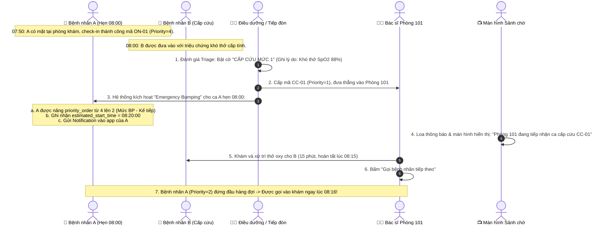
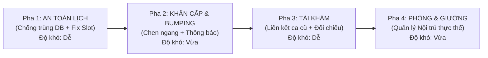

# BẢN ĐỀ XUẤT THIẾT KẾ KIẾN TRÚC & NGHIỆP VỤ MEDIBOOK
**Tài liệu**: `MEDIBOOK_DESIGN_PROPOSAL.md`  
**Giai đoạn**: C — Đề xuất thiết kế (Chờ duyệt, CHƯA can thiệp code)  
**Tác giả**: Solution Architect & Senior Fullstack Lead  
**Dự án**: MediBook Clinical Platform (`D:\MediBook` & bản sao `MediBook - Copy`)  

---

## 1. THAY ĐỔI SCHEMA CƠ SỞ DỮ LIỆU ĐỀ XUẤT (SQL DDL)

Nguyên tắc: **Chỉ thêm những gì thật sự cần thiết, giữ nguyên 100% tương thích ngược (Backward Compatible) với code cũ và bộ 52 test suites hiện tại.**

```sql
-- ========================================================
-- 1.1 CHỐNG TRÙNG LỊCH BẰNG PARTIAL UNIQUE INDEX (CỰC KỲ AN TOÀN)
-- Lý do: Ngăn chặn triệt để race condition khi 2 request bấm cùng lúc.
-- Sử dụng Partial Index loại trừ 'cancelled' để slot được tái sử dụng khi hủy hẹn.
-- ========================================================
CREATE UNIQUE INDEX IF NOT EXISTS uq_appointment_doctor_slot 
ON appointments(doctor_id, appointment_date, start_time) 
WHERE status NOT IN ('cancelled');

-- ========================================================
-- 1.2 BỔ SUNG TRƯỜNG CHO APPOINTMENTS (BUMPING & RE-SCHEDULING)
-- ========================================================
ALTER TABLE appointments ADD COLUMN is_bumped INTEGER DEFAULT 0;
ALTER TABLE appointments ADD COLUMN bumped_from_slot TEXT;
ALTER TABLE appointments ADD COLUMN estimated_start_time TEXT;

-- ========================================================
-- 1.3 BỔ SUNG TRƯỜNG CHO PHIẾU KHÁM BỆNH (MEDICAL_RECORDS)
-- Lý do: Liên kết ca tái khám với ca trước đó, liên kết buồng/giường thực thể.
-- ========================================================
ALTER TABLE medical_records ADD COLUMN parent_visit_id INTEGER REFERENCES medical_records(id) ON DELETE SET NULL;
ALTER TABLE medical_records ADD COLUMN room_id INTEGER REFERENCES rooms(id) ON DELETE SET NULL;
ALTER TABLE medical_records ADD COLUMN bed_id INTEGER REFERENCES beds(id) ON DELETE SET NULL;

-- ========================================================
-- 1.4 THIẾT KẾ BẢNG THỰC THỂ BUỒNG BỆNH & GIƯỜNG (ROOMS & BEDS)
-- Lý do: Chuyển đổi chuỗi văn bản tự do thành thực thể quản lý trạng thái giường thực tế.
-- ========================================================
CREATE TABLE IF NOT EXISTS rooms (
  id INTEGER PRIMARY KEY AUTOINCREMENT,
  code TEXT NOT NULL UNIQUE,          -- Ví dụ: 'P.201', 'P.CAP_CUU'
  name TEXT NOT NULL,                 -- 'Phòng Lưu Bệnh 01', 'Phòng Hồi Sức Sau Tiểu Phẫu'
  department TEXT DEFAULT 'Lưu viện ngắn ngày',
  room_type TEXT DEFAULT 'standard',  -- 'standard', 'vip', 'isolation'
  status TEXT NOT NULL DEFAULT 'active',
  created_at DATETIME DEFAULT CURRENT_TIMESTAMP
);

CREATE TABLE IF NOT EXISTS beds (
  id INTEGER PRIMARY KEY AUTOINCREMENT,
  room_id INTEGER NOT NULL,
  bed_number TEXT NOT NULL,           -- 'G-01', 'G-02', 'G-03'
  daily_fee REAL NOT NULL DEFAULT 150000.00,
  status TEXT NOT NULL DEFAULT 'available', -- 'available' (Trống), 'occupied' (Đang dùng), 'cleaning' (Đang dọn), 'maintenance' (Hỏng)
  current_patient_id INTEGER,
  current_record_id INTEGER,
  notes TEXT,
  updated_at DATETIME DEFAULT CURRENT_TIMESTAMP,
  FOREIGN KEY (room_id) REFERENCES rooms(id) ON DELETE CASCADE,
  FOREIGN KEY (current_patient_id) REFERENCES patients(id) ON DELETE SET NULL,
  UNIQUE(room_id, bed_number)
);

CREATE INDEX IF NOT EXISTS idx_beds_status ON beds(status);
CREATE INDEX IF NOT EXISTS idx_medical_records_parent ON medical_records(parent_visit_id);
```

### Đánh giá tác động đến Code cũ:
- **Tương thích 100%**: Tất cả các bảng cũ (`appointments`, `medical_records`) giữ nguyên các cột hiện có. Các trường mới đều có giá trị `DEFAULT` hoặc `NULL`, không làm gãy bất kỳ câu lệnh `INSERT` hay `SELECT` hiện tại.
- **Phương án đơn giản hơn cho đồ án**: Bảng `rooms` và `beds` được tạo tự động với dữ liệu seed sẵn (2 phòng, 8 giường). Bác sĩ khi chọn "Nội trú" chỉ cần chọn qua dropdown giường trống thay vì gõ tay text tự do.

---

## 2. THUẬT TOÁN HÀNG ĐỢI ƯU TIÊN & XỬ LÝ CHEN NGANG (EMERGENCY BUMPING)

### 2.1. Thang điểm ưu tiên phân cấp (Priority Hierarchy)

| Cấp bậc | Mã ưu tiên (`priority_order`) | Tiền tố STT | Tên phân loại | Đối tượng áp dụng |
|:---:|:---:|:---:|:---|:---|
| **1** | **`1`** | **`CC-`** | **🚨 Cấp cứu / Nguy kịch** | Khó thở, co giật, đau ngực dữ dội, chấn thương chảy máu ồ ạt. |
| **2** | **`2`** | **`BP-`** | **⚡ Ca hẹn bị lùi do Cấp cứu** | Bệnh nhân đặt trước nhưng bị lùi giờ do ca cấp cứu xen ngang $\rightarrow$ **Được ưu tiên ngay sau ca cấp cứu!** |
| **3** | **`3`** | **`UT-`** | **⭐ Đối tượng ưu tiên** | Người già $\ge 60$ tuổi, Trẻ nhỏ $\le 6$ tuổi, Phụ nữ mang thai, Người khuyết tật. |
| **4** | **`4`** | **`ON-`** | **🌐 Đặt lịch Online đúng giờ** | Bệnh nhân hẹn trước qua web và có mặt check-in đúng giờ hẹn. |
| **5** | **`5`** | **`WL-`** | **🚶 Vãng lai tiêu chuẩn** | Khám thường đến trực tiếp không đặt trước (Walk-in). |

### 2.2. Trật tự sắp xếp hàng đợi phòng khám (SQL Query)
```sql
SELECT q.*, a.booking_code, u.name as patient_name
FROM examination_queues q
JOIN appointments a ON q.appointment_id = a.id
JOIN patients p ON a.patient_id = p.id
JOIN users u ON p.user_id = u.id
WHERE q.room = ? AND q.status IN ('waiting', 'calling')
ORDER BY 
  q.priority_order ASC,       -- 1. Cấp cứu -> 2. Bị hoãn -> 3. Ưu tiên -> 4. Online -> 5. Vãng lai
  q.checkin_time ASC;         -- Cùng mức ưu tiên thì ai check-in trước vào trước
```

---

### 2.3. Ví dụ chạy từng bước: Kịch bản Bệnh nhân A hẹn 08:00, B cấp cứu tới 08:00



> **Giới hạn chống lạm dụng**:
> 1. Mỗi bệnh nhân tối đa chỉ bị hoãn 1 lần trong ngày. Nếu tiếp tục có ca cấp cứu thứ 2, ca cấp cứu 2 sẽ được chuyển sang phòng Bác sĩ trực dự phòng khác.
> 2. Gán nhãn cấp cứu bắt buộc phải chọn Lý do lâm sàng và lưu vết `user_id` người gán vào bảng `activity_logs`.

---

## 3. THIẾT KẾ CHỐNG TRÙNG SLOT (DOUBLE-BOOKING PREVENTION)

### 3.1. Ràng buộc cấp Cơ sở Dữ liệu (Database Invariant)
Sử dụng **Partial Unique Index** trong SQLite:
```sql
CREATE UNIQUE INDEX IF NOT EXISTS uq_appointment_doctor_slot 
ON appointments(doctor_id, appointment_date, start_time) 
WHERE status NOT IN ('cancelled');
```
*Ưu điểm*: Bất kỳ nỗ lực INSERT nào vi phạm (cùng Bác sĩ + cùng Ngày + cùng Giờ bắt đầu) sẽ bị CSDL chặn đứng ngay lập tức với lỗi `SQLITE_CONSTRAINT_UNIQUE`, không bao giờ lọt dữ liệu rác vào bảng.

### 3.2. Bọc Transaction nguyên tử tại Backend (`src/server.ts`)
```ts
const createAppointmentTx = db.transaction((data) => {
  // 1. Kiểm tra lại va chạm thời gian một lần nữa
  const conflict = checkSlotConflict.get(data.doctor_id, data.appointment_date, data.end_time, data.start_time);
  if (conflict) {
    throw new Error('SLOT_CONFLICT');
  }
  // 2. Insert Appointment
  const res = insertAppointmentStmt.run(...);
  // 3. Insert History & Notifications
  ...
  return res.lastInsertRowid;
});
```

### 3.3. Xử lý lỗi thân thiện cho Người dùng
Khi bắt gặp lỗi `SLOT_CONFLICT` hoặc `SQLITE_CONSTRAINT_UNIQUE`:
- Hệ thống **rollback** toàn bộ thay đổi.
- Hiển thị thông báo:
  > *"Rất tiếc! Khung giờ bạn chọn vừa có một bệnh nhân khác hoàn tất đặt trước bạn vài giây. Vui lòng chọn một khung giờ kế tiếp!"*
- Frontend tự động gọi lại `/api/slots` để làm mới danh sách khung giờ trống.

### 3.4. Vá 2 lỗ hổng tại API `/api/slots`:
1. **Kiểm tra ngày nghỉ phép của bác sĩ**:
   ```sql
   SELECT id FROM doctor_leaves 
   WHERE doctor_id = ? AND status = 'approved' AND ? BETWEEN start_date AND end_date
   ```
   Nếu bác sĩ có lịch nghỉ đã duyệt vào ngày đó $\rightarrow$ Trả về ngay: `slots = []` kèm thông báo: *"Bác sĩ có lịch nghỉ phép đã được phê duyệt vào ngày này"*.
2. **Loại bỏ các giờ đã qua nếu đặt trong ngày hôm nay**:
   Nếu `appointment_date === today`, kiểm tra `slot_start_time <= current_time` $\rightarrow$ Đánh dấu `available: false` (hoặc ẩn khỏi danh sách) để ngăn đặt giờ trong quá khứ.

---

## 4. LUỒNG MÀN HÌNH TỪNG ROLE (UI/UX WORKFLOWS)

```
[Khách / Bệnh nhân]                [Lễ tân / Điều dưỡng]              [Bác sĩ khám bệnh]                 [Quản trị viên]
  │                                  │                                  │                                  │
  ├─ /booking                        ├─ /receptionist/checkin           ├─ /doctor/examine/:id             ├─ /admin/rooms-beds
  │  (Ẩn giờ quá khứ,                │  (Gắn nhãn Triage 4 cấp,         │  (Phân biệt Khám đầu/Tái khám,   │  (Quản lý danh mục
  │   Khóa ngày nghỉ phép BS)        │   Cấp STT tiền tố CC-, UT-)      │   Xem đơn thuốc cũ qua Modal,    │   buồng bệnh & giường)
  │                                  │                                  │   Chọn giường nội trú trống)     │
  └─ /appointments/:code             ├─ /receptionist/live-board        │                                  └─ /admin/users/form
     (Hiện cảnh báo Bumping          │  (Hiện banner cấp cứu,           └─ /doctor/queue                   (Checkbox phân nhiều
      nếu bị lùi giờ)                │   chuông báo ưu tiên)               (Hàng đợi ưu tiên tự động)         role cho 1 tài khoản)
                                     │
                                     └─ /receptionist/beds
                                        (Sơ đồ buồng/giường 4 màu)
```

1. **Giao diện Khám bệnh của Bác sĩ (`/doctor/examine/:id`)**:
   - Khi chọn **"Tái khám" (`follow_up`)**: Hiển thị dropdown các lần khám trước của bệnh nhân kèm nút **"👁️ Xem bệnh án & đơn thuốc cũ"** (Mở popup xem nhanh lịch sử không cần rời trang).
   - Khi chọn **"Nội trú lưu viện" (`inpatient`)**: Hiển thị dropdown chọn Phòng và Giường trống (`beds.status = 'available'`), tự động cập nhật trạng thái giường sang `occupied` khi lưu bệnh án.
2. **Giao diện Quản lý Buồng & Giường (`/receptionist/beds`)**:
   - Hiển thị trực quan ma trận phòng bệnh:
     - 🟢 **Xanh lá**: Giường trống sẵn sàng.
     - 🔴 **Đỏ**: Đang có bệnh nhân nằm (Hiển thị tên bệnh nhân, giờ nhập viện).
     - 🟡 **Vàng**: Đang dọn dẹp vệ sinh.
     - ⚪ **Xám**: Đang bảo trì.
   - Hỗ trợ đổi trạng thái giường 1 chạm cho điều dưỡng/hộ lý.

---

## 5. KẾ HOẠCH KIỂM THỬ TỰ ĐỘNG (AUTOMATED TEST SUITE EXTENSION)

Bổ sung thêm **10 bài kiểm thử mới** (Nâng tổng số test từ **52 lên 62 test cases**):

| Test Case ID | Tên bài kiểm thử | Kịch bản kiểm thử | Kết quả mong đợi |
|:---:|:---|:---|:---|
| **TC-53** | **Chống đặt trùng slot đồng thời (Race Condition)** | Chạy 2 Promise gửi song song cùng đặt 1 bác sĩ, 1 ngày, 1 khung giờ. | Đúng 1 request thành công, request thứ hai bị bắt bởi `UNIQUE` index và trả về lỗi thân thiện. |
| **TC-54** | **Chặn khung giờ trong quá khứ của ngày hôm nay** | Gọi `/api/slots` với ngày hôm nay, kiểm tra các khung giờ trước giờ hiện tại. | Các slot sáng sớm phải có `available: false`. |
| **TC-55** | **Khóa slot khi bác sĩ nghỉ phép (`doctor_leaves`)** | Duyệt đơn nghỉ phép cho bác sĩ vào ngày X, gọi `/api/slots` ngày X. | Không sinh ra slot khám nào (`slots = []`). |
| **TC-56** | **Thuật toán chen ngang Cấp cứu (Bumping)** | Ca A đặt 08:00; tạo ca B Cấp cứu (`CC-01`). | Ca B được xếp trước ca A; ca A được chuyển sang mức ưu tiên `bumped` kế tiếp. |
| **TC-57** | **Gán liên kết tái khám (`parent_visit_id`)** | Khám lần 1 sinh ra bệnh án #1. Tạo ca khám lần 2 chọn `visit_type = 'follow_up'`, liên kết `parent_visit_id = 1`. | Bệnh án #2 lưu chính xác `parent_visit_id = 1`. |
| **TC-58** | **Xem lại bệnh án cũ từ ca tái khám** | Bác sĩ truy cập trang khám bệnh của ca tái khám. | Dữ liệu chẩn đoán và đơn thuốc của ca lần 1 hiển thị đầy đủ. |
| **TC-59** | **Quản lý Giường nội trú thực thể** | Bác sĩ chỉ định bệnh nhân vào Giường G-01 Phòng 201. | Giường G-01 tự động chuyển trạng thái từ `available` $\rightarrow$ `occupied`. |
| **TC-60** | **Chống xếp 2 người vào cùng 1 giường** | Bác sĩ cố gắng xếp bệnh nhân thứ 2 vào Giường G-01 đang có người. | Hệ thống từ chối và báo lỗi: Giường đang có bệnh nhân sử dụng. |
| **TC-61** | **Trả giường khi xuất viện / hoàn tất** | Bệnh nhân hoàn tất đợt lưu trú. | Giường chuyển sang trạng thái `cleaning` hoặc `available`. |
| **TC-62** | **Bảo toàn 100% 52 Test Suites cũ** | Chạy toàn bộ bộ test `test_full_suite.js`. | **62/62 test suites PASS 100%**. |

---

## 6. THỨ TỰ TRIỂN KHAI THEO 4 PHA NHỎ (ROADMAP)

Mỗi pha được thiết kế độc lập, sau mỗi pha đều chạy được ứng dụng và chạy được kiểm thử ngay lập tức:



- **Pha 1 (Độ khó: DỄ — Ưu tiên cao nhất)**:
  - Tạo Partial Unique Index trên `appointments`.
  - Bọc `POST /appointments/book` trong `db.transaction()`.
  - Sửa `/api/slots`: Chặn ngày nghỉ phép (`doctor_leaves`) và lọc bỏ giờ quá khứ trong ngày.
- **Pha 2 (Độ khó: VỪA)**:
  - Bổ sung trường `is_bumped`, `bumped_from_slot`, `estimated_start_time`.
  - Nâng cấp thuật toán hàng đợi đẩy ca bị hoãn lên mức ưu tiên kế tiếp ngay sau cấp cứu.
  - Tự động gửi notification giải thích lý do cho bệnh nhân bị hoãn lịch.
- **Pha 3 (Độ khó: DỄ)**:
  - Bổ sung `parent_visit_id` trong `medical_records`.
  - Thêm modal xem lại bệnh án và đơn thuốc cũ trên trang khám bệnh của Bác sĩ.
- **Pha 4 (Độ khó: VỪA)**:
  - Tạo bảng `rooms` và `beds`, seed 2 phòng 8 giường mẫu.
  - Sửa form bác sĩ chọn giường trống qua dropdown liên kết thực thể.
  - Thêm trang sơ đồ giường bệnh cho Lễ tân/Điều dưỡng (`/receptionist/beds`).
  - Áp dụng đồng bộ sang folder `MediBook - Copy` (nếu có).

---

## 7. CÂU HỎI CẦN BẠN XÁC NHẬN TRƯỚC KHI DUYỆT (CHỐNG LÀM QUÁ TAY)

Trước khi bạn gõ **"DUYỆT"** để tôi bắt tay vào code Giai đoạn D, xin bạn cho ý kiến về 2 điểm sau:

1. **Về chính sách giá Tái khám**:
   - *Phương án A (Khuyên dùng cho đồ án)*: Tái khám giảm 50% tiền khám (ví dụ: Khám lần đầu 200.000 đ $\rightarrow$ Tái khám 100.000 đ nếu trong vòng 14 ngày).
   - *Phương án B*: Giữ đồng giá 200.000 đ như hiện tại cho đơn giản.
2. **Về giao diện Quản lý Giường bệnh**:
   - Bạn muốn có thêm **1 trang xem sơ đồ giường bệnh riêng** cho Lễ tân/Điều dưỡng (`/receptionist/beds`) để demo cho giảng viên xem màu sắc trực quan (Xanh: Trống, Đỏ: Đang nằm, Vàng: Dọn dẹp), hay chỉ cần làm dropdown chọn giường trong form khám của Bác sĩ là đủ?
