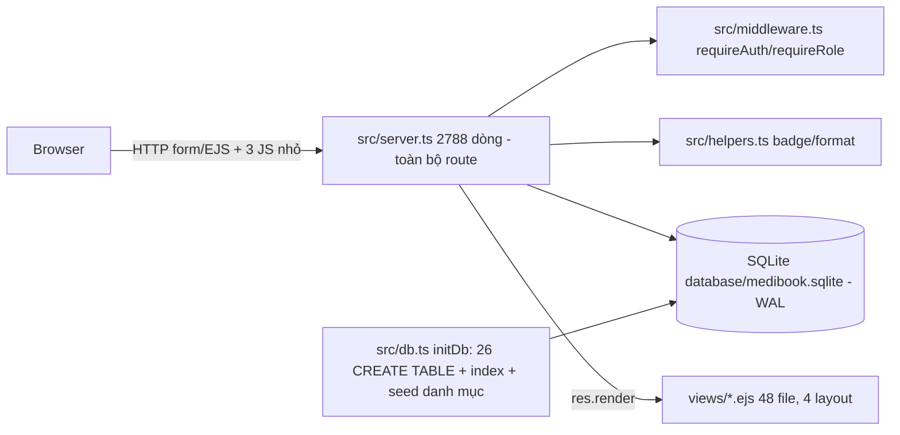

# PROJECT_AUDIT.md — MediBook

> Kiểm toán ngày 2026-10-04 · commit `bec294b` (nhánh `main`) · Auditor: chỉ-đọc (không sửa file dự án; mọi thí nghiệm chạy trên **bản sao DB tạm** `VACUUM INTO` ngoài dự án).
> Bằng chứng = `file:dòng` hoặc lệnh đã chạy. README/commit message KHÔNG được dùng làm bằng chứng.

---

## 1. Tóm tắt điều hành

MediBook là web đặt lịch khám + quản lý phòng khám (4 vai trò: bệnh nhân / lễ tân / bác sĩ / admin) — Node.js + Express 5 + EJS + SQLite (better-sqlite3), viết bằng TypeScript.

| Chỉ số | Giá trị |
|---|---|
| **Tiến độ VERIFIED** (chỉ tính ✅) | **52.8 %** (19 / 36 điểm trọng số) |
| **Tiến độ ước tính** | **73.3 %** (26.4 / 36) — độ tin cậy: **vừa** |

**3 điểm mạnh**
1. Nghiệp vụ lâm sàng cốt lõi chạy thật & có test: đặt lịch → check-in → hàng đợi ưu tiên → khám/kê đơn → thu tiền (`npm test` = 87/87 PASS, build 0 lỗi).
2. Chống double-booking ở tầng DB (`uq_appointment_doctor_slot`, `src/db.ts:457`) + test race-condition; chống IDOR hồ sơ bệnh án.
3. 51/51 trang (4 vai trò + public) render đúng; RBAC chặn đúng (patient → `/admin/*` bị redirect).

**3 rủi ro lớn nhất (đã tái hiện bằng lệnh chạy thật)**
1. 🔴 **Chiếm tài khoản qua "đặt lịch khách"**: gửi form với email của admin/doctor/lễ tân → được đăng nhập vào đúng user đó (`src/server.ts:718-741`). Tài khoản khách mới còn có mật khẩu mặc định `password` (`:720`).
2. 🔴 **Bản clone mới KHÔNG chạy được**: `db.ts` không tạo cột `specialties.status/image` mà code truy vấn ⇒ trang chủ 500 (`no such column: status`); `schema.sql`/`seed.sql` là dialect **MySQL** nên không cứu được; DB mới có **0 user**. "87/87 PASS" chỉ đúng với file SQLite local cũ (không nằm trong git).
3. 🔴 **XSS lưu trữ** qua tên người dùng (`views/layouts/main.ejs:243`) + `res.redirect('back')` ×14 **hỏng trên Express 5** (Location = chuỗi `back`).

**Việc nên làm ngay:** B-01 → B-04 (P0) bên dưới.

---

## 2. Tổng quan & kiến trúc

- **Người dùng:** bệnh nhân (kể cả khách), lễ tân/thu ngân, bác sĩ, quản trị viên; 1 người nhiều role (`user_roles`) + `/switch-role/:role`.
- **Stack:** Node 22.22.2, Express 5.2.1, EJS 6, express-session (MemoryStore mặc định), connect-flash, bcryptjs, better-sqlite3 11.8.1, TypeScript 7.0.2 (`strict:false`).
- **Entry point:** `server.js` → `dist/server.js` (build từ `src/server.ts`). Không có Dockerfile, CI, lint.
- **Cách chạy (lệnh thật):** `npm install` → `npm run build` (tsc) → `npm start` (cổng `PORT`, mặc định 3000) → `npm test` (chạy `test_full_suite.js`, cổng 3001).

**Số liệu (lệnh thật):** 99 file tracked (`git ls-files`); `src/*.ts` = 3 735 dòng (server 2 788, db 812, helpers 94, middleware 41); `views` 48 file EJS (~5 780 dòng không rỗng); `public/assets` CSS ~2 490 + JS 3 file (~490); test 2 file (884 + ~100 dòng); 20 commit. Route: ~100 handler trong `src/server.ts` (grep `app.(get|post|use)`).

**Tích hợp ngoài:** không có (không email/SMS/thanh toán thật). VietQR = chỉ sinh nội dung/URL hiển thị trên biên lai (không gọi cổng thanh toán).

---

## 3. Bảng tính năng

| ID | Tính năng | Nhóm (w) | Trạng thái | Bằng chứng | Còn thiếu |
|---|---|---|---|---|---|
| F-01 | Đăng nhập / đăng ký / đăng xuất / RBAC / đổi role | Core (3) | 🟠 PARTIAL | `server.ts:267-405`, `middleware.ts:17-40`; smoke RBAC-neg đúng; test nhóm 7 | Không rate-limit (15 lần sai liên tiếp đều 302), mật khẩu `1` được chấp nhận, không `session.regenerate`, không CSRF, `GET /logout` & `GET /switch-role` đổi trạng thái; chặn quyền trả 302 thay vì 403 (`middleware.ts:35`) |
| F-02 | Trang công khai: home, chuyên khoa, bác sĩ, tin y tế, liên hệ | Phụ (1) | ✅ VERIFIED | Smoke: 17 path public đúng (200/404 như kỳ vọng) | — |
| F-03 | Tra slot & đặt lịch (đã đăng nhập), chặn double-booking, chặn nghỉ phép, chặn đặt quá khứ | Core (3) | ✅ VERIFIED | `server.ts:581-884`, `db.ts:457`; test nhóm 4 (race condition, unique index) PASS | — |
| F-04 | Đặt lịch **khách** (tự tạo tài khoản + auto-login) | Core (3) | 🟠 PARTIAL | `server.ts:710-742`; probe P7/P8 | **Account takeover**, mật khẩu mặc định `password`, không xác minh email |
| F-05 | Lễ tân: tiếp đón, cấp STT, hàng đợi ưu tiên CC/UT/Online/Offline, emergency bumping | Core (3) | ✅ VERIFIED | `server.ts:1609-1760`; test nhóm 5 & 8 PASS | — |
| F-06 | Bác sĩ: gọi số, khám, kê đơn, trừ kho, tái khám giảm 50% ≤14 ngày | Core (3) | ✅ VERIFIED | `server.ts:1198-1590`; test nhóm 5, 9, 10 PASS | — |
| F-07 | Thanh toán & biên lai (VietQR) | Core (3) | ✅ VERIFIED | `server.ts:1984-2066`; test nhóm 5 PASS | VietQR chỉ là link ảnh, không đối soát giao dịch |
| F-08 | Nội trú: sơ đồ giường, nhập/xuất viện | Quan trọng (2) | ✅ VERIFIED | `server.ts:2068-2200`; test nhóm 9.3 PASS | — |
| F-09 | Admin CRUD: user, bác sĩ, chuyên khoa, dịch vụ, thuốc, lịch trực, đơn nghỉ | Quan trọng (2) | 🟡 UNVERIFIED | 21/21 trang GET render 200 (smoke) | Các POST `store/update/toggle/delete` **không có test**, chưa chạy |
| F-10 | Báo cáo doanh thu, nhật ký hoạt động, sao lưu DB | Quan trọng (2) | ✅ VERIFIED | test nhóm 6 PASS; smoke `/admin/logs` 200 | `server.ts:2762` hard-code đường dẫn DB, bỏ qua `DATABASE_PATH` |
| F-11 | Bác sĩ: lịch trực & xin nghỉ phép | Quan trọng (2) | 🟡 UNVERIFIED | `server.ts:1587-1606`; trang render 200; chặn đặt lịch khi nghỉ phép có test | `POST /doctor/leave/request` không test |
| F-12 | Đánh giá bác sĩ (sao, điểm TB) | Phụ (1) | ✅ VERIFIED | `server.ts:988`; test nhóm 5 PASS | — |
| F-13 | Hồ sơ cá nhân, đổi mật khẩu, bác sĩ yêu thích | Phụ (1) | 🟡 UNVERIFIED | `server.ts:1057-1160`; `/profile` 200 | 0 test |
| F-14 | Bảng gọi số trực tiếp + `/api/queue/live` | Phụ (1) | 🟠 PARTIAL | `server.ts:1760-1802` (không `requireAuth`); probe P1/P2 = 200 | Công khai tên bệnh nhân (PII), 0 test |
| F-15 | Form liên hệ | Phụ (1) | 🟠 PARTIAL | `server.ts:427-437` chỉ ghi `activity_logs`, không lưu/gửi | Không lưu bảng riêng, không email |
| F-16 | Thông báo trong app | Phụ (1) | ✅ VERIFIED | `server.ts:88-109`; test nhóm 8 (thông báo bumping) PASS | — |
| F-17 | Khởi tạo DB cho bản clone mới (schema/seed/tài khoản demo) | Core (3) | 🔴 BROKEN | Clone sạch (`git clone` → `npm ci` → `npm run build` OK) rồi `npm test` ⇒ **FAIL ngay ở trang chủ**: `SqliteError: no such column: status`. DB mới: `users=0`, `specialties` chỉ có `id,name,slug,description,icon,created_at,updated_at` (thiếu `image,status` mà `server.ts:132` truy vấn); DB local cũ có đủ 27 bảng + `image,status`. `seed.sql` lỗi `table specialties has no column named image`; `schema.sql` là MySQL (`AUTO_INCREMENT/ENGINE=InnoDB`) | Xem B-02. ⇒ "87/87 PASS" chỉ đúng với **DB local cũ không nằm trong git** |
| F-18 | Hạ tầng kiểm thử/chất lượng | Phụ (1) | 🟠 PARTIAL | `test_full_suite.js:8,14` dùng DB thật; `test_render_views.js:5` hard-code `D:/MediBook/views`, không nằm trong script npm | Không lint, không coverage, test dùng DB thật |

---

## 4. Kết quả chạy thật

| Lệnh | Kết quả |
|---|---|
| `npm ls --depth=0` | 6 dep runtime + 7 dev, không thiếu/thừa |
| `npm run build` (tsc) | ✅ exit 0, 0 lỗi |
| `npm test` | ✅ **87/87 PASS** (2 lần chạy; ⚠ chạy trên **DB thật** `database/medibook.sqlite` → làm bẩn dữ liệu local) |
| Smoke route (scratch `route_smoke.js`, DB copy) | ✅ 51 path, 0 NOK; RBAC: patient→`/admin/*`,`/doctor/*`,`/receptionist/*`,`/admin/backup-db` = 302 `/`; anon→`/login` |
| Probe bảo mật (scratch `audit_probe.js`, DB copy) | P1/P2: queue công khai 200 · P3: chỉ có `x-powered-by: Express`, không CSP/XFO/HSTS · P6: `Location: back` · P7: ATO admin/doctor/lễ tân = `showsVictimEmail=true` · P8: login `password` OK · P9: payload `</script>` xuất hiện nguyên văn trong layout · P10: 15 lần sai đều 302 · P11: mật khẩu `1` OK |
| Lint / coverage | ❌ không có |
| Không chạy được | Docker/CI (không có); thanh toán/email thật (không có tích hợp) |

---

## 5. Gap

| ID | Mô tả | Vị trí |
|---|---|---|
| G-01 | `res.redirect('back')` ×14 — Express 5 đã bỏ magic string, redirect tới `/back` | `server.ts` (grep `redirect('back')`: 14 chỗ, vd `:700,715,751,1757`) |
| G-02 | XSS: `JSON.stringify(...name...)` in raw trong thẻ `<script>` | `views/layouts/main.ejs:243` |
| G-03 | `<%-` in raw: badge helpers nhận chuỗi động (`getStatusBadge` fallback in `${status}`; `getPriorityBadge(...reason)`) | `helpers.ts:36,56,64`; 26 chỗ `<%-` trong views |
| G-04 | Mật khẩu mặc định hard-code `'password'` (2 chỗ: khách và lễ tân đặt hộ) | `server.ts:720`, `server.ts:1824`; seed demo đều `password` |
| G-05 | `schema.sql`/`seed.sql` (MySQL) lệch hẳn `db.ts` (SQLite, 26 bảng vs 21) | `database/*.sql` |
| G-06 | `renderWithLayout` trả `err.message` cho client; không có error handler toàn cục | `server.ts:60-68,2774` |
| G-07 | Backup hard-code đường dẫn DB | `server.ts:2762` |
| G-08 | `console.log` banner khởi động (4 dòng, chấp nhận được) | `server.ts:2780-2783` |
| G-09 | `test_render_views.js` mồ côi: mock thủ công, hard-code ổ `D:`, mojibake, không có trong script | `test_render_views.js:5` |
| G-10 | 47 chỗ `as any`, `strict:false` | `src/*.ts` |
| G-11 | `res.status(403).redirect('/')` → trạng thái thực = 302 | `middleware.ts:35` |
| G-12 | Mã đặt lịch `MByymmdd-NNNN` (4 số) + `/appointments/success/:code` không cần đăng nhập → dò được thông tin lịch hẹn | `server.ts:886-901` |
| G-13 | 5 file báo cáo `.md` ở root + `MEDIBOOK_*.md` (tài liệu sinh ra bởi agent trước) | root |

Không có `TODO|FIXME|mock|stub` trong `src/`, `views/`, `public/assets/js` (grep = 0).

---

## 6. Chất lượng & rủi ro

| Mảng | Mức | Bằng chứng |
|---|---|---|
| Bảo mật: xác thực/phiên | 🔴 | ATO (P7), mật khẩu mặc định, không rate-limit (P10), không regenerate, MemoryStore, cookie không `sameSite/secure` |
| Bảo mật: CSRF/XSS/headers | 🔴 | 0 match `csrf|helmet|rateLimit`; XSS P9; P3 thiếu header |
| Bảo mật: phân quyền | 🟢 | RBAC smoke đúng; IDOR bệnh án/ca khám bị chặn (test nhóm 10) |
| Bảo mật: lộ PII | 🟡 | `/api/queue/live` + `/live-board` công khai |
| Bảo mật: secret | 🟢 | `.env` không tracked; production fail-fast thiếu `SESSION_SECRET` (`server.ts:29-33`) |
| Dữ liệu | 🟡 | FK ON + WAL + 12 index + unique slot; nhưng schema/seed không dùng được cho SQLite, không migration |
| Vận hành | 🟡 | Không log chuẩn, không health check, không Docker/CI, backup có nhưng hard-code |
| Hiệu năng & UX | 🟡 | SQLite đồng bộ 1 process; responsive/a11y chưa đo |
| Bảo trì | 🟠 | `server.ts` 2 788 dòng monolith, `strict:false`, test dùng DB thật, không lint |

---

## 7. Tính tiến độ

Điểm: ✅=1.0 · 🟡=0.7 · 🟠=0.4 · 🔴=0.1.

| ID | w | Nhãn | Điểm | w×điểm |
|---|---|---|---|---|
| F-01 | 3 | 🟠 | 0.4 | 1.2 |
| F-02 | 1 | ✅ | 1.0 | 1.0 |
| F-03 | 3 | ✅ | 1.0 | 3.0 |
| F-04 | 3 | 🟠 | 0.4 | 1.2 |
| F-05 | 3 | ✅ | 1.0 | 3.0 |
| F-06 | 3 | ✅ | 1.0 | 3.0 |
| F-07 | 3 | ✅ | 1.0 | 3.0 |
| F-08 | 2 | ✅ | 1.0 | 2.0 |
| F-09 | 2 | 🟡 | 0.7 | 1.4 |
| F-10 | 2 | ✅ | 1.0 | 2.0 |
| F-11 | 2 | 🟡 | 0.7 | 1.4 |
| F-12 | 1 | ✅ | 1.0 | 1.0 |
| F-13 | 1 | 🟡 | 0.7 | 0.7 |
| F-14 | 1 | 🟠 | 0.4 | 0.4 |
| F-15 | 1 | 🟠 | 0.4 | 0.4 |
| F-16 | 1 | ✅ | 1.0 | 1.0 |
| F-17 | 3 | 🔴 | 0.1 | 0.3 |
| F-18 | 1 | 🟠 | 0.4 | 0.4 |
| **Σ** | **36** | | | **26.4** |

- **Ước tính** = 26.4 / 36 = **73.3 %**.
- **VERIFIED** = (1+3+3+3+3+2+2+1+1) / 36 = 19 / 36 = **52.8 %**.
- Độ tin cậy **vừa**: luồng lâm sàng có test + smoke; phần admin CRUD POST, hồ sơ cá nhân chưa chạy; không đo hiệu năng/a11y.

---

## 8. Backlog (P0 → P3)

### P0
**B-01 — Vá chiếm tài khoản & mật khẩu mặc định ở đặt lịch khách** (L: M)
- Hiện trạng: 🟠 F-04; `server.ts:710-742`; probe P7/P8.
- Việc: không tự đăng nhập user đã tồn tại; nếu email đã có → yêu cầu đăng nhập; khách mới → tạo tài khoản mật khẩu ngẫu nhiên + link đặt mật khẩu (hoặc đặt lịch không tạo phiên); bỏ `hashSync('password')`.
- Hoàn thành khi: test mới "guest dùng email admin → không có session"; `login` bằng `password` với tài khoản khách mới thất bại.

**B-02 — Khởi tạo DB cho bản clone mới** (M)
- Hiện trạng: 🔴 F-17.
- Việc: (1) thêm `specialties.image`, `specialties.status` (và mọi cột code đang dùng mà `db.ts` chưa tạo) vào `initDb()`; (2) bỏ/thay `database/schema.sql`+`seed.sql` (MySQL) bằng seed chạy được trên SQLite (script `npm run seed` hoặc seed trong `db.ts` khi `users=0`), tạo tài khoản demo có cờ chỉ dùng dev; (3) cập nhật README.
- Hoàn thành khi: **clone sạch** → `npm ci && npm run build && npm test` = PASS (không phụ thuộc DB local); xoá `database/*.sqlite*` → `npm start` → trang chủ 200 và đăng nhập `admin@medibook.local` được; `NODE_ENV=production` không seed mật khẩu yếu.

**B-03 — Vá XSS** (S)
- `views/layouts/main.ejs:243`: escape `<`, `>`, `&`, U+2028/9 trong JSON (hoặc đưa vào `data-*` bằng `<%=`); rà `helpers.ts` badge (escape `status`/`reason`).
- Hoàn thành khi: probe P9 trả `false`.

**B-04 — Sửa `res.redirect('back')` ×14** (S)
- Thay bằng `req.get('Referer') || '<route cụ thể>'` (kiểm tra cùng origin).
- Hoàn thành khi: probe P6 `Location` ≠ `back`; grep `redirect('back')` = 0.

**B-05 — Che PII ở bảng gọi số công khai** (S): `/receptionist/live-board`, `/api/queue/live` chỉ trả STT + tên rút gọn (vd "N. V. A").

### P1
- **B-06** CSRF token cho mọi POST + đổi `GET /logout`, `GET /switch-role` sang POST (M).
- **B-07** `express-rate-limit` cho `/login`,`/register`,`/appointments/book`; chính sách mật khẩu ≥8 ký tự; `req.session.regenerate` khi đăng nhập; cookie `httpOnly,sameSite=lax,secure(prod)`; `helmet`; tắt `x-powered-by` (M).
- **B-08** Cho test dùng DB tạm qua `DATABASE_PATH` (không đụng DB thật); thêm test POST cho admin CRUD, doctor leave, profile (M).
- **B-09** Error handler toàn cục, không trả `err.message`; trả 403 đúng nghĩa (S).
- **B-10** Backup dùng đường dẫn thực từ `db.ts` (S).
- **B-11** Mã đặt lịch khó đoán hơn + `/appointments/success/:code` yêu cầu quyền sở hữu hoặc token (S).

### P2
- **B-12** Lưu form liên hệ vào bảng + hiển thị cho admin (S).
- **B-13** Tách `server.ts` thành router theo vai trò (L).
- **B-14** Xoá/di chuyển `test_render_views.js` hoặc sửa để chạy được (S).

### P3
- **B-15** Bật `strict` TS dần, loại 47 `as any` (L); ESLint (S).

---

## 9. Đề xuất nâng cấp (ngoài phạm vi)

| ID | Ý tưởng | Lợi ích | Đánh đổi | Khi nào |
|---|---|---|---|---|
| U-01 | SQLite session store + `better-sqlite3` migrations có version | Giữ phiên khi restart, migrate an toàn | Thêm dependency | Sau P0/P1 |
| U-02 | Dockerfile + GitHub Actions (build + test) | Tái lập môi trường, chặn regression | Công sức S | Khi có B-08 |
| U-03 | Email/SMS nhắc lịch | Giảm no-show | Cần nhà cung cấp, chi phí | Giai đoạn production |
| U-04 | Endpoint `/healthz` + log có cấu trúc | Vận hành | Nhỏ | Cùng U-02 |
| U-05 | Đối soát thanh toán VietQR thật (webhook ngân hàng) | Tự động hoá thu tiền | Phụ thuộc đối tác, bảo mật webhook | Khi go-live |

---

## 10. Điều chưa chắc chắn (❓)

- Chưa chạy POST của admin CRUD / hồ sơ cá nhân / xin nghỉ phép (cần kịch bản riêng) → F-09, F-11, F-13 mới là 🟡.
- Session fixation chỉ xác nhận ở mức code (`regenerate` = 0 match), chưa tái hiện bằng request.
- a11y/responsive/hiệu năng tải chưa đo (không chạy Lighthouse).
- Thiết bị triển khai thật (reverse proxy, HTTPS) chưa rõ → mức độ rủi ro `x-forwarded-for` trong `logActivity` (`server.ts:117`) chưa đánh giá.

---

## 11. Phạm vi đã quét

| Thư mục/file | Mức |
|---|---|
| `src/server.ts` | Sâu (auth, booking, live-board, backup, 404, đầu/cuối file) + lướt (phần còn lại qua grep route, smoke, test) |
| `src/db.ts`, `helpers.ts`, `middleware.ts` | Sâu |
| `views/` | Lướt (grep `<%-`; render 51 trang) |
| `public/assets/js`, `css`, `images` | Lướt (chưa đối chiếu tham chiếu — để cleanup) |
| `database/*.sql` | Sâu (xác nhận lệch dialect) |
| `docs/`, các `.md` root | Lướt |
| `test_*.js` | Sâu (cấu trúc, DB dùng, phạm vi route) |
| `node_modules`, `dist`, `.git` | Không quét |

---

## 12. HANDOFF CHO AI KHÁC

- **Dự án:** MediBook — Express 5 + EJS + better-sqlite3, TS biên dịch `src/` → `dist/`; entry `server.js`.
- **Chạy:** `npm install && npm run build && npm start`; test `npm test` (hiện dùng DB thật — sửa ở B-08).
- **Thứ tự làm:** B-04 → B-03 → B-01 → B-02 → B-05 → B-07 → B-06 → B-08 …
- **Convention:** route gom trong `src/server.ts`, view ở `views/<role>/…`, layout theo vai trò (`layouts/*.ejs`), flash qua `connect-flash`, SQL prepared statement của better-sqlite3.
- **Giữ nguyên:** unique index slot (`db.ts:457`), logic hàng đợi ưu tiên/emergency bumping, test 87/87 phải vẫn PASS; không commit `.env`, `database/*.sqlite*`.
- **Cấm động tới:** `package-lock.json`, `.env*`, `database/medibook.sqlite*` (dữ liệu local), `docs/`.

> Câu dán kèm: *"Đọc PROJECT_AUDIT.md này. Với mỗi mục backlog (bắt đầu từ P0), viết cho tôi một prompt hoàn chỉnh để AI Agent code làm nốt, gồm bối cảnh, file liên quan, yêu cầu, tiêu chí hoàn thành, và những gì KHÔNG được sửa."*
