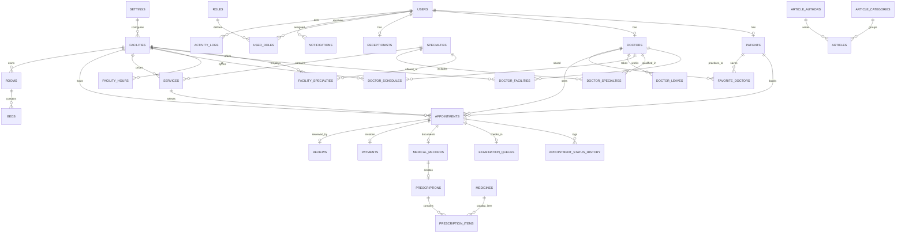
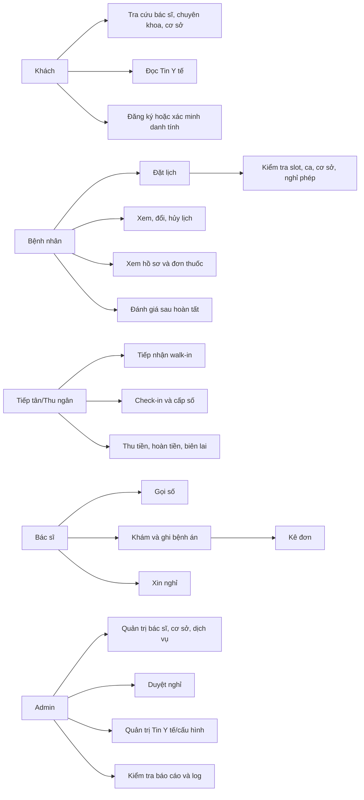
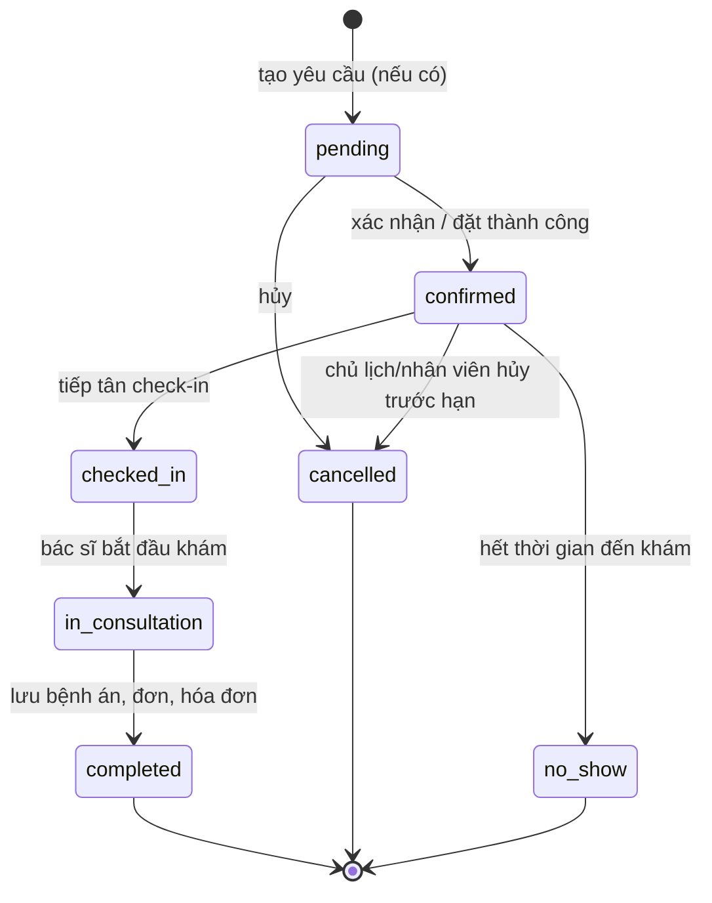
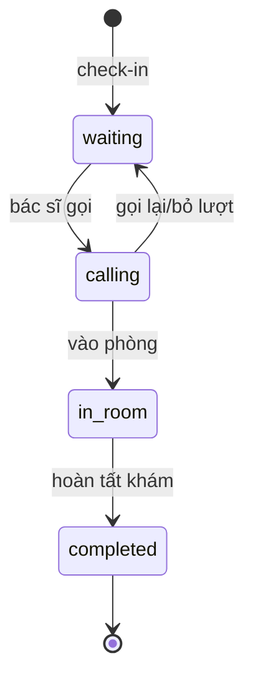
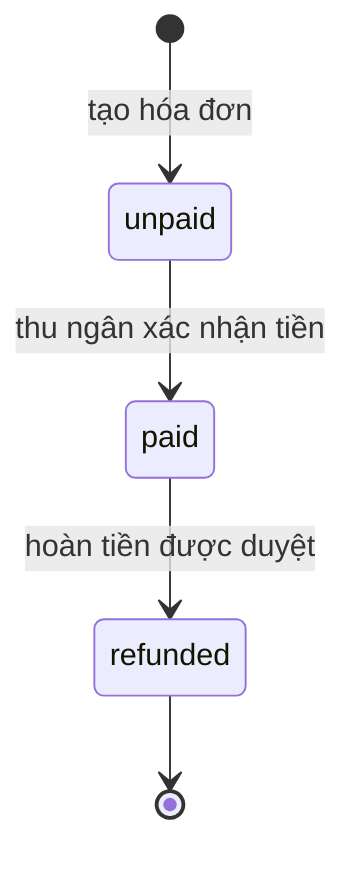

# PROJECT_AUDIT — MediBook

> Cập nhật 04/10/2026: xem [báo cáo xác minh mới](docs/VERIFICATION_2026-10-04.md) và [ERD sinh từ SQLite](docs/ERD.md). Schema hiện tại có 27 bảng/41 FK (thêm `contact_requests`), kiểm thử 154/154 và render 49/49. Các số 26 bảng, 137 assertion và mô tả schema MySQL bên dưới thuộc ảnh chụp lịch sử trước đợt sửa mới.

**Ngày kiểm tra:** 04/10/2026 (Asia/Ho_Chi_Minh). Chỉ kiểm tra dự án `D:\MediBook`. Các mục 1–8 và phụ lục là **ảnh chụp trước khi sửa** tại commit `b68492a`; đường dẫn dòng trong các mục đó trỏ tới bản gốc và có thể dịch chuyển sau thay đổi. Bảng dưới đây là kết quả hiện tại và có hiệu lực khi khác phần baseline. Dữ liệu kiểm thử dùng SQLite tạm, không thay đổi DB đang chạy.

## Kết quả sau sửa

| Phát hiện baseline | Trạng thái hiện tại | Bằng chứng |
|---|---|---|
| B-01, B-06: POST nhận giờ ngoài ca, khách bị tạo tài khoản mồ côi | Đã sửa | `src/booking-rules.ts`; online và walk-in gọi cùng validator trong transaction; `npm test` có assertion giờ 03:00 và tài khoản không được tạo |
| B-02: Trang success lộ thông tin | Đã sửa | GET cần đăng nhập và kiểm owner/role; `npm test` kiểm khách và bệnh nhân khác |
| B-03: Admin nhảy sang completed | Đã sửa | State transition chỉ cho pending→confirmed/cancelled, confirmed→cancelled/no_show; test HTTP 409 và DB không đổi |
| B-04: Quảng bá cơ sở y tế không có thật | Đã gỡ nội dung sai | `views/home/index.ejs` hiển thị trạng thái chưa có cơ sở được công bố. **Mô hình cơ sở y tế và chức năng đặt theo cơ sở vẫn thiếu.** |
| B-05, H-04: schema trôi và queue number trùng | Đã sửa phần cốt lõi | `src/db.ts` migration `user_version=1`, backfill queue_date, unique index phòng/ngày/số; kiểm trên bản sao DB: `integrity_check=ok`, `foreign_key_check=0` |
| H-01: Thu lại hóa đơn | Đã sửa | Chỉ thu invoice unpaid/pending của ca completed; test gửi thanh toán lần hai nhận 409 |
| H-02: KPI/review/footer/QR ngân hàng cố định | Đã sửa các vị trí công khai chính | Home lấy COUNT/AVG từ SQLite; footer và biên lai dùng `SITE_*`; không có cấu hình thì không hiện thông tin liên hệ/tài khoản nhận tiền mẫu |
| H-03: POST thiếu Origin và Referer | Đã sửa | middleware trả 403; test thiếu cả hai header |
| Ghi bệnh án/kho/hóa đơn nửa chừng | Đã gom transaction | `src/server.ts` khám bệnh ghi hồ sơ, đơn, kho, trạng thái, hóa đơn trong cùng SQLite transaction |
| Có thể sửa bệnh án sau khi thu tiền | Đã chặn | POST khám lại trả 409 khi hóa đơn đã paid; test xác nhận kho và đơn thuốc không đổi |
| Check-in lặp và queue state sai | Đã sửa | Check-in transaction, điều kiện trạng thái; gọi số/bắt đầu/bỏ lượt chỉ chuyển từ trạng thái hợp lệ; test check-in/gọi lặp |
| Form liên hệ trước đây không lưu nội dung | Đã sửa | `contact_requests` lưu yêu cầu; admin xem tại `/admin/contact-requests`; test HTTP và DB |
| EJS dry-run báo PASS giả | Đã sửa công cụ | `test_render_views.js` chờ `renderFile` thực sự; 49/49 PASS |

**Kiểm chứng:** `npm run build` PASS; `npm test` **137/137 PASS** trên DB tạm; `node test_render_views.js` **49/49 PASS**; `npm audit --omit=dev --audit-level=high` báo **0 vulnerabilities**. Bộ test tích hợp bao phủ các luồng chính nhưng chưa chứng minh toàn bộ handler và UI trên thiết bị thật.

**Vấn đề còn mở trước production:** chưa có mô hình/cấu hình cơ sở y tế và quy trình xác minh đối tác; chưa có thanh toán cổng/đối soát/hoàn tiền; chưa có quên mật khẩu, hồ sơ người thân, đổi lịch, nhắc lịch; chưa kiểm tra accessibility/responsive bằng trình duyệt; một số route quản trị và nhập liệu chưa có test biên đầy đủ; thiếu CHECK cho nhiều enum trạng thái ở DB và lint độc lập. Chưa thể khẳng định hệ thống hết mọi lỗi hoặc sẵn sàng production.

## Baseline trước khi sửa

## 1. Tóm tắt điều hành tại baseline

**Phán quyết:** có thể demo luồng đặt khám và khám bệnh trên dữ liệu demo có kiểm soát; **chưa sẵn sàng bảo vệ như một hệ thống đặt khám nhiều bệnh viện đầy đủ**, và **không sẵn sàng production**. `npm test` đạt 124/124 nhưng một số quy tắc cốt lõi nằm ngoài bộ test đã bị probe độc lập bác bỏ.

Tỷ lệ dưới đây là **tỷ lệ năng lực mục tiêu đã có bằng chứng chạy thành công**, không phải điểm chất lượng hay lời khẳng định các ca chưa test đã hỏng. Mỗi năng lực chỉ được tính khi có assertion tích hợp hoặc HTTP probe đạt kỳ vọng nghiệp vụ; các con số là sàn xác minh, không phải ước lượng tùy ý về mức hoàn thiện.

| Module | Đã chứng minh / mục tiêu | Tỷ lệ xác minh | Giới hạn chính |
|---|---:|---:|---|
| Tài khoản và phân quyền | 5/8 | 63% | Chưa có quên mật khẩu, người thân; validation còn yếu |
| Khám phá bác sĩ, cơ sở, nội dung | 3/8 | 38% | Cơ sở y tế chỉ là HTML; số liệu quảng bá không từ DB |
| Đặt và quản lý lịch | 4/10 | 40% | POST nhận giờ ngoài ca; chưa đổi lịch, nhắc lịch, hoàn tiền |
| Tiếp tân và hàng đợi | 4/7 | 57% | Chưa gộp hồ sơ walk-in; queue number thiếu unique |
| Bác sĩ và hồ sơ khám | 4/7 | 57% | Trạng thái khám chưa khóa đủ; ghi bệnh án và thu tiền không nguyên tử |
| Thanh toán | 2/6 | 33% | Chỉ ghi nhận thanh toán nội bộ/VietQR hiển thị; chưa đối soát/hoàn tiền |
| Quản trị và báo cáo | 2/8 | 25% | GET CRUD có, các POST CRUD chưa được test hết; không CMS/config |
| Hạ tầng và chất lượng | 3/8 | 38% | Build/test/render qua; thiếu lint, kiểm thử UI thiết bị/production |

### Mười vấn đề cần xử lý trước

| Ưu tiên | ID | Vấn đề | Bằng chứng ngắn |
|---|---|---|---|
| 1 | B-01 | Đặt lịch ngoài ca trực bằng POST trực tiếp | Probe: `/api/slots` không có 03:00, POST vẫn 302 success, DB có `2099-01-01 03:00 confirmed`; `src/server.ts:788-972` |
| 2 | B-02 | Trang thành công của lịch hẹn công khai lộ tên bệnh nhân theo mã | Probe khách GET trang thành công = 200, `shows_patient_name true`; `src/server.ts:998-1017` |
| 3 | B-03 | Admin có thể nhảy trạng thái đến `completed` khi chưa khám/thu tiền | Probe `confirmed -> completed`, `records=0`, `payments=0`; `src/server.ts:2872-2892` |
| 4 | B-04 | Web quảng bá 25 bệnh viện và 100 phòng khám nhưng DB không có cơ sở | `views/home/index.ejs:10,200-277`; PRAGMA 26 bảng không có `hospitals/clinics` |
| 5 | B-05 | DB local và DB mới khác 12 cột, một số UNIQUE; không có migration version | So hai `PRAGMA table_info/index_list` ở mục 3; `src/db.ts:415-452`; `PRAGMA user_version=0` |
| 6 | B-06 | Tạo tài khoản khách trước khi xác thực ngày/slot; đặt lỗi để lại tài khoản | Probe ngày 2020 trả 302 `/`, `user_created=1`, `appointments=0`; `src/server.ts:813-869` |
| 7 | H-01 | Thanh toán có thể ghi `paid` lại, không kiểm trạng thái/đối soát | `src/server.ts:2171-2180` chỉ `UPDATE ... WHERE id=?`; chưa probe nhắc lại |
| 8 | H-02 | Bài đăng, review, KPI, cơ sở và footer chứa dữ liệu/khẳng định mẫu | `views/home/index.ejs:10,314,437-483`; `views/layouts/main.ejs:116-164` |
| 9 | H-03 | Kiểm CSRF bỏ qua POST thiếu cả Origin lẫn Referer | `src/server.ts:65-77`: chỉ từ chối khi `source` có giá trị |
| 10 | H-04 | DB chưa ép số hàng đợi duy nhất theo phòng/ngày, chưa CHECK đa số trạng thái | `PRAGMA index_list(examination_queues)` chỉ autoindex `appointment_id` và index `(room,status)`; `src/db.ts:205-222` |

## 2. Bảng phát hiện có hướng sửa

| ID | Mức | Phân loại | Mô tả và bằng chứng | Cách sửa đề xuất | Ước tính |
|---|---|---|---|---|---|
| B-01 | Blocker | Nghiệp vụ | POST online và walk-in chỉ kiểm quá khứ, nghỉ phép, overlap; không xác thực doctor/specialty/service đang hoạt động, ca, `slot_duration`, `max_patients`. Probe ngoài ca đã tái hiện. `src/server.ts:788-972,1972-2073`, API chặt hơn ở `:665-766`. | Một service `validateAndReserveSlot` dùng chung, đọc ca và công suất trong transaction, DB khóa unique; test POST giả mạo. | 2–3 ngày |
| B-02 | Blocker | Bảo mật | `GET /appointments/success/:code` public và SELECT tên bệnh nhân. Probe khách 200. `src/server.ts:998-1017`. Mã chỉ có 4 chữ số ngẫu nhiên, ngày hiển thị trong mã `:890-893`. | Chỉ chủ lịch/nhân viên xem; mã truy cập dài ngẫu nhiên hoặc ID phiên tạm; test IDOR khách. | 0,5–1 ngày |
| B-03 | Blocker | Nghiệp vụ | Admin status route dùng whitelist giá trị nhưng không kiểm transition, probe chuyển thẳng hoàn tất không bệnh án/hóa đơn. `src/server.ts:2872-2892`. | State machine chung, guard theo vai trò và điều kiện tồn tại hồ sơ, ghi transition trong transaction. | 1–2 ngày |
| B-04 | Blocker | ERD/Hard-code | Không có bảng cơ sở/quan hệ bác sĩ–cơ sở; 3 thẻ BV viết trực tiếp. `views/home/index.ejs:200-277`; schema dump mục 3. | Thêm `facilities`, `doctor_facilities`, `facility_specialties`, `facility_hours`; lọc bác sĩ/slot theo cơ sở. | 3–5 ngày |
| B-05 | Blocker | ERD | 12 cột trong fresh DB vắng ở DB local; `doctor_specialties`/`prescriptions` mất UNIQUE; migrations `ALTER` nuốt mọi lỗi. `src/db.ts:415-468`, probe schema mục 3. | Migration version + kiểm tra hậu migration; chạy trên copy DB cũ và DB rỗng; thống nhất DDL SQLite. | 2 ngày |
| B-06 | Blocker | Logic | Đăng ký khách diễn ra trước validation và transaction lịch; lỗi tạo orphan. Probe mục 6. `src/server.ts:813-870,921-971`. | Validate trước; đặt user + patient + appointment trong một transaction; rollback toàn bộ khi lỗi. | 1 ngày |
| H-01 | High | Thanh toán | Route thu tiền cập nhật không có guard `pending/unpaid`, không xác minh phương thức và không chống replay; `src/server.ts:2171-2180`. | Transition `unpaid→paid` có điều kiện, idempotency key, audit và test gửi lặp. | 1 ngày |
| H-02 | High | Hard-code/UI-UX | KPI/review/địa chỉ/hotline/bệnh viện mẫu trình bày như thật. SQL local: 10 bác sĩ, 7 lịch, 4 reviews, 0 bảng cơ sở; nguồn HTML mục 7. | DB/config thực, gắn nhãn demo khi chưa có dữ liệu, bỏ các cam kết chưa xác minh. | 1–2 ngày |
| H-03 | High | Bảo mật | CSRF chỉ kiểm Origin/Referer nếu header hiện diện; thiếu token. `src/server.ts:65-77`. | CSRF token gắn form + xác minh server; giữ SameSite/Origin như lớp bổ sung. | 1–2 ngày |
| H-04 | High | ERD | `queue_number` không unique theo phòng/ngày, được tính `countToday+1` và `INSERT OR REPLACE`; `src/server.ts:1894-1908,2064-2074`; PRAGMA mục 3. | Lưu `queue_date`, unique `(queue_date,room,queue_number)`, cấp số trong transaction, không `REPLACE`. | 1–2 ngày |
| H-05 | High | Logic | Khám cập nhật `medical_records`, giường, đơn, tồn kho, appointment, payment ở nhiều đoạn; transaction chỉ bao phần đơn. `src/server.ts:1617-1730`. | Bao toàn bộ lần hoàn tất khám trong transaction, kiểm lỗi, kiểm trạng thái và test rollback. | 2 ngày |
| H-06 | High | Bảo mật/Validation | Đăng ký server chỉ kiểm trường rỗng/mật khẩu 8 ký tự; không kiểm format email, SĐT VN/độ dài. `src/server.ts:406-457`; admin create dùng `name.trim()/email.trim()` trực tiếp `:2423-2479`. | Schema validation chung + thông báo tiếng Việt; test rỗng/sai kiểu/chuỗi dài. | 1–2 ngày |
| H-07 | High | Nghiệp vụ | Check-in/confirm không có guard trạng thái/date; `src/server.ts:1829-1908`. | Chỉ chuyển từ `confirmed` đúng ngày, idempotent theo appointment; test gửi lặp. | 1 ngày |
| M-01 | Med | ERD | `payments` và `prescription_items` dùng `REAL` cho VND; `articles` nhúng tên category/author, `doctors.rating` là aggregate có thể lệch. `src/db.ts:83-95,275-313,364-381`; PRAGMA mục 3. | VND integer, ràng buộc >=0; tách category/author nếu cần CMS; rating tính từ reviews hoặc cache có bảo đảm. | 2 ngày |
| M-02 | Med | Logic | Dùng ngày máy chủ và `date('now')` UTC lẫn `new Date()` local/ISO UTC. `src/server.ts:143,857-864,1763-1766,2141-2142`. | Quy ước `Asia/Ho_Chi_Minh` cho ngày kinh doanh, UTC lưu timestamp, test ranh giới 00:00. | 1 ngày |
| M-03 | Med | UI-UX | Form booking báo có thể đổi giờ nhưng không có route đổi lịch; `views/appointments/book.ejs:228`, catalog route mục A. | Bổ sung reschedule hoặc sửa lời hướng dẫn. | 0,5–1 ngày |
| M-04 | Med | Chất lượng | Không có script lint, `tsconfig.json:14` loại views khỏi tsc. `npm run lint` exit 1; render 48/48 vẫn không kiểm accessibility/JS. | Thêm lint EJS/JS/TS và CI, test render route thực. | 1 ngày |
| M-05 | Med | UseCase | `docs/MediBook_UseCase.drawio` thiếu khách, quên mật khẩu, người thân, nhắc lịch, CMS/config và có XML entity `&rarr;` không chuẩn với parser XML; `docs/MediBook_UseCase.drawio:102,139-181`. | Cập nhật diagram và nhãn `<<include>>/<<extend>>`; kiểm file mở được. | 0,5–1 ngày |
| M-06 | Med | SEO/a11y | Layout có title động nhưng không thấy meta description; tab Tin Y tế chỉ button/data-cat, chưa có `role=tab`, `aria-selected`; `views/layouts/main.ejs:4-7`, `views/home/index.ejs:332-426`. | Metadata theo trang, keyboard/tab semantics, kiểm Lighthouse/axe. | 1–2 ngày |
| L-01 | Low | Nội dung | Chuỗi YouMed còn trong CSS/comment và lời review, năm bản quyền cố định; `views/home/index.ejs:477`, `views/layouts/main.ejs:164`, `public/assets/css/app.css:7-9`. | Xóa thương hiệu khác, năm/config động, đánh dấu review demo. | 0,5 ngày |

## 3. ERD, schema và ràng buộc

**Nguồn sự thật:** `src/db.ts:36-412` tạo 26 bảng SQLite; `:415-468` chạy ALTER/index khi khởi động. `database/schema.sql:6,31,43` là MySQL (`SET FOREIGN_KEY_CHECKS`, `AUTO_INCREMENT`, `ENGINE=InnoDB`) và không được app nạp. `database/seed.sql` là seed MySQL cũ; seed đang chạy là `src/seed.ts:9-42`/`src/seed-data.json`. `PRAGMA integrity_check` trên DB local = `ok`, `foreign_key_check` = 0 vi phạm, `user_version=0`. Chi tiết mọi bảng/cột/FK/index ở phụ lục B.

**So diagram với DB:** `docs/MediBook_ERD.drawio` có 18 entity; DB có thêm `receptionists`, `services`, `appointment_status_history`, `reviews`, `notifications`, `articles`, `rooms`, `beds`. Diagram chưa mô tả 8 bảng này; không có entity nào trong diagram mà DB không có. `hospitals/clinics`, `article_categories`, `article_authors`, `settings/site_config`, `audit_logs`, `doctor_shifts`, `leave_requests` không tồn tại với tên đó. Chức năng tương ứng hiện dùng `activity_logs`, `doctor_schedules`, `doctor_leaves`, và cột text trong `articles`. Đây là lệch yêu cầu/đặt tên, không tự giả định cần bảng mới cho mọi tên. `doctor_specialties` là N-N bác sĩ–chuyên khoa; **không có khóa cơ sở** nên không thể xác định bác sĩ/chuyên khoa thuộc BV nào. `doctors.room_number` chỉ là chuỗi phòng `src/db.ts:83-96`.

**Drift đo trên DB thật so với DB mới tạo bởi `dist/db.js`:** thiếu ở DB local `appointments.notes,cancellation_reason`; `doctor_schedules.is_active,created_at,updated_at`; `doctor_specialties.created_at`; `examination_queues.created_at,updated_at`; `medical_records.treatment_plan`; `payments.notes,updated_at`; `prescription_items.created_at` = **12 cột**. Fresh DB có UNIQUE cho `doctor_specialties(doctor_id,specialty_id)` và `prescriptions.medical_record_id`; DB local không có. Ngược lại DB local có UNIQUE cho `medicines.code`, `specialties.name`, fresh DB không có. `src/db.ts:415-452` chỉ thêm một số cột, nuốt mọi lỗi ALTER, nên các khác biệt khác không được chữa. Mọi FK quan sát có `ON UPDATE NO ACTION`; `ON DELETE` cụ thể ở phụ lục B.

**Ràng buộc nghiệp vụ:** `uq_appointment_doctor_slot` chặn cùng bác sĩ/ngày/giờ với status khác `cancelled` (`src/db.ts:468`), race test 1 trong 2 yêu cầu ghi thành công. `payments.appointment_id` UNIQUE tại DB; `reviews.appointment_id` UNIQUE và `rating` CHECK 1..5 (`src/db.ts:295-327`); điều kiện “chỉ review sau khám hoàn tất” nằm ở app `src/server.ts:1124`, DB không ép. `examination_queues.appointment_id` UNIQUE nhưng không unique `(ngày, phòng, số)`; nhiều `status` trong DB không có CHECK. Soft delete chưa có ở users/doctors/appointments; `users.status` và `specialties.status` là ẩn/khóa ứng dụng. `created_at/updated_at` không đồng đều và các `updated_at` phần lớn không có trigger; xem PRAGMA phụ lục B.

Sơ đồ trên là **đề xuất**, không mô tả bảng đang tồn tại: `FACILITIES`, hai bảng nối cơ sở, `FACILITY_HOURS`, `ARTICLE_CATEGORIES`, `ARTICLE_AUTHORS`, `SETTINGS` cần migration. Có thể giữ tên `doctor_schedules/doctor_leaves/activity_logs` hiện hành để tránh đổi tên vô ích. Phải xác nhận quy tắc một bác sĩ được làm ở nhiều cơ sở; đề xuất N-N vì yêu cầu hiển thị bác sĩ theo BV, nhưng **CHƯA XÁC MINH** với chủ sản phẩm.

| Thay đổi dữ liệu | Loại | Tiêu chí migration |
|---|---|---|
| `facilities`, `doctor_facilities`, `facility_specialties`, `facility_hours` | Thêm | Mỗi appointment/slot gắn 1 cơ sở hợp lệ; bác sĩ/chuyên khoa hiển thị đúng theo cơ sở |
| `article_categories`, `article_authors`, `settings` | Thêm nếu CMS/config được duyệt | Không còn tab/footer viết cứng; dữ liệu seed có nguồn |
| `queue_date`, UNIQUE `(queue_date,room,queue_number)` | Sửa | Gửi check-in đồng thời không trùng STT |
| CHECK trạng thái, số lượng/tiền >=0, `INTEGER` VND | Sửa | Giá âm, status sai bị DB từ chối |
| Migration version cho 12 cột và UNIQUE drift | Sửa | DB cũ và DB mới cùng `PRAGMA table_info/index_list`; `foreign_key_check=0` |
| `database/schema.sql`, `database/seed.sql` | Thay/loại bỏ nguồn cũ | SQLite DDL/seed có thể chạy độc lập hoặc tài liệu chỉ rõ `db.ts/seed.ts` là nguồn duy nhất |

## 4. Use case đối chiếu thiết kế và code

`docs/MediBook_UseCase.drawio` có 28 ellipse `uc_*`, 4 actor nghiệp vụ + actor màn hình, nhưng **không có actor Khách**. File dùng `&rarr;` ở dòng 102 nên XML parser chuẩn báo `undefined entity`; khi thay entity để đọc, các cạnh `inc_*` là nét đứt nhưng không có `value="<<include>>"`. Generalization bốn actor → User có mũi tên block nét đứt `:139-142`; UML generalization nên nét liền. Các quan hệ include/extend chưa thể coi là chuẩn. Ma trận dùng “Thiết kế” = có ellipse hoặc được mô tả rõ; “Chạy” = test/probe nêu tại mục 6; “Quyền” = middleware và guard code, không tự chấm PASS hành vi chưa chạy.

| Actor / use case | Thiết kế | Route | View | Chạy | Quyền / gap |
|---|---|---|---|---|---|
| Khách xem home/bác sĩ/chuyên khoa | Thiếu actor | `GET /,/doctors,/specialties` | Có | ĐÃ CHẠY 200 | Public |
| Khách xem BV/phòng khám | Không | Không | HTML home | CHƯA XÁC MINH chức năng | Chỉ thẻ tĩnh |
| Khách xem/lọc Tin Y tế | Không | `GET /articles`, `/api/articles` | Có | GET 200; lọc chưa test | Public |
| Đăng ký | Không | `GET/POST /register` | Có | Probe đăng ký 302, DB user=1/patient=1 | Public; validation yếu |
| Đăng nhập/đăng xuất | Có | `/login`, `/logout` | Login | ĐÃ CHẠY 4 role; logout probe 302, session hết quyền | Logout GET đổi trạng thái |
| Quên mật khẩu | Không | Không | Không | Không | Thiếu |
| Hồ sơ cá nhân/đổi mật khẩu | Có | `/profile`, `/profile/password` | Có | GET 200; POST CHƯA XÁC MINH | Auth |
| Người thân/đặt hộ | Không | Không | Không | Không | Thiếu quan hệ patient-dependent |
| Đặt lịch/tra slot | Có | `/api/slots`, POST `/appointments/book` | Có | Race, quá khứ, nghỉ phép, ngoài ca đã chạy | Ngoài ca FAIL |
| Xem/hủy lịch | Có | `/my-appointments`, `/:code/cancel` | Có | GET 200; cancel POST CHƯA XÁC MINH | Owner guard có code |
| Đổi lịch/nhắc lịch | Không | Không | Không | Không | Thiếu |
| Xem hồ sơ/đơn thuốc | Có | `GET /appointments/:code` | Có | Suite PASS và IDOR âm | Owner/doctor/staff guard |
| Đánh giá/yêu thích | Có | POST `/:code/review`, `/api/favorite-doctor` | Detail/profile | Review PASS; favorite CHƯA XÁC MINH | Owner review guard |
| Walk-in | Có | `/receptionist/booking` | Có | Suite có luồng; gộp tài khoản CHƯA XÁC MINH | Receptionist/admin |
| Check-in/cấp số | Có | `/receptionist/checkin/:id` | Có | Suite PASS | Guard trạng thái yếu |
| Bảng gọi số | Có | `/receptionist/live-board`, `/api/queue/live` | Có | GET 200, masking test PASS | Public, tên đã che |
| Bác sĩ gọi/khám/kê đơn | Có | `/doctor/queue/*`, `/doctor/examine/:id` | Có | Suite PASS | Doctor + ownership guard |
| Bác sĩ xin nghỉ/Admin duyệt | Có | POST `/doctor/leave/request`, `/admin/leaves/update/:id` | Schedule | Slot nghỉ PASS; POST tạo/duyệt CHƯA XÁC MINH | Theo role |
| Thu tiền/in biên lai | Có | `/receptionist/payments/*` | Có | Suite PASS 1 lần | Replay/hoàn tiền chưa test |
| Thanh toán trực tuyến/hoàn tiền | Không | Không | Biên lai VietQR | Không | QR hiển thị, không đối soát |
| Admin CRUD user/doctor/spec/service/medicine | Có một phần | Nhiều `/admin/*` | Có | GET 200; POST CHƯA XÁC MINH | Admin |
| Admin báo cáo/log | Có | `/admin/reports`, `/admin/logs` | Có | GET 200, suite report PASS | Admin |
| CMS Tin Y tế/cấu hình | Không | Không | Không | Không | Thiếu |
| Nhật ký bảo mật | Có | `/admin/logs` | Có | GET 200 | `activity_logs`, chưa audit mọi hành động |

### Use case đề xuất

Đây là sơ đồ chức năng, mũi tên diễn tả actor thực hiện hoặc bước bắt buộc; với UML chi tiết, `Book <<include>> Slot`, `Checkin <<include>> cấp số`, `Exam <<extend>> Rx` khi có chỉ định, `Pay <<extend>> Refund` khi hoàn tiền. Không gán `include` giữa actor và use case.

**Đặc tả UC chính (đề xuất nghiệm thu):**

| UC | Tiền điều kiện | Luồng chính | Thay thế / ngoại lệ | Hậu điều kiện |
|---|---|---|---|---|
| Đăng ký/đăng nhập | Email chưa dùng / tài khoản active | Xác thực input → hash/so mật khẩu → regenerate session | Trùng email, sai mật khẩu, rate limit | User/patient/role cùng tồn tại; session thuộc đúng user |
| Đặt lịch | Người khám xác định; bác sĩ, cơ sở, ca active | Chọn chuyên khoa/cơ sở/bác sĩ/ngày/slot → xác minh lại server → transaction giữ slot → mã hẹn | Hết slot, nghỉ, ngoài ca, quá khứ, race, mất kết nối | 1 lịch confirmed, 0 orphan khi lỗi |
| Check-in/walk-in | Lịch confirmed đúng ngày hoặc bệnh nhân walk-in hợp lệ | Xác thực → cấp STT nguyên tử → hàng đợi waiting | Gửi lặp, hết công suất, cấp cứu chen hàng | 1 appointment–1 queue, STT không trùng |
| Khám/kê đơn | Đúng bác sĩ, queue in_room | Ghi bệnh án, kê thuốc, kiểm tồn → transaction → hóa đơn | Hết thuốc, thiếu chẩn đoán, đổi giường | Hồ sơ/đơn/kho/tiền nhất quán |
| Thanh toán | Có hóa đơn unpaid đúng số tiền | Thu ngân chọn phương thức → xác nhận nguồn tiền → paid một lần | Gửi lại, hoàn tiền, thất bại cổng | Có paid_at, cashier, biên lai; log đối soát |
| Đánh giá | Lịch completed thuộc bệnh nhân | Chọn 1–5 sao → lưu 1 review/lịch → tính điểm | Chưa hoàn tất, sai chủ, gửi lại | 1 review; rating không lệch |

## 5. Luồng nghiệp vụ và trạng thái

**Luồng thực đã chạy:** `npm test` nhóm 4–5: đặt lịch → check-in → `waiting/calling/in_room` → khám/kê đơn → sinh payment → thu tiền → bệnh nhân xem hồ sơ → review; 124/124 PASS. **Chưa chạy** cổng tiền thật, nhắc lịch, hoàn tiền, merge walk-in. Code walk-in tạo email `walkin.<timestamp>@medibook.local` nếu trống và password ngẫu nhiên (`src/server.ts:1972-1991`); không có route merge tài khoản, nên người bệnh không tự truy cập hồ sơ đó. Không có đặt hộ người thân. `src/server.ts:1739-1759,2766-2773` xử lý nghỉ/duyệt; API slot loại approved leave `:686-699`.

Các sơ đồ là **trạng thái mong muốn**. Code hiện không áp các cung đó toàn cục: admin có thể đặt mọi giá trị trong whitelist (`src/server.ts:2872-2892`); `POST /receptionist/confirm/:id` luôn set confirmed (`:1829-1833`), check-in luôn set checked_in (`:1835-1908`), doctor queue `calling/in_room/waiting` cập nhật theo ID sau guard chủ bác sĩ nhưng ít guard trạng thái (`:1351-1423`), payment có thể paid lại (`:2171-2180`). DB không CHECK enum appointment/queue/payment; enum chỉ là magic string ở nhiều route. `no_show` có trong admin whitelist nhưng không có job tự đánh dấu. Không có thời hạn hủy X giờ, hoàn tiền hay giới hạn công suất trong POST. API có `max_patients` trong schema nhưng vòng tạo slot `src/server.ts:724-766` không dùng. Race cùng start_time được unique partial index và test suite chứng minh 1 thành công; overlap lệch start_time chỉ được app check, không được DB ép.

## 6. Lệnh kiểm chứng thực tế và ma trận đồng bộ

| Lệnh / probe (toàn bộ trên DB tạm, trừ PRAGMA đọc DB local) | Output đã quan sát | Kết luận hẹp |
|---|---|---|
| `npm run build` | `tsc`, exit 0, không diagnostics | TypeScript build được |
| `npm run lint` | `Missing script: "lint"`, exit 1 | Không có lint gate |
| `node test_render_views.js` | `Found 48 EJS files`; `48 PASS, 0 FAIL` | Mock data render được cả `doctor/`, `doctors/`, `home/`; chưa phải HTTP thực |
| `npm test` | `124/124 PASS`, warning `[DEP0044] util.isArray` | Các assertion của suite qua trên DB tạm |
| HTTP sweep 57 GET bằng Node `fetch` trên server `NODE_ENV=test,DATABASE_PATH=%TEMP%/...` | 52×200; 5×404; 0×500 | 404 là ID/code không tồn tại: success, detail, examine, receipt, admin appointment view |
| `PRAGMA integrity_check; PRAGMA foreign_key_check; PRAGMA user_version` trên `database/medibook.sqlite` readonly | `ok`; 0 rows; `0` | DB local toàn vẹn nhưng chưa version migration |
| `SELECT COUNT(*)` local | doctors 10; appointments 7; reviews 4; articles 13; specialties 8 | KPI 1.000/50.000/3.500 không phản ánh DB này |
| Probe POST `/register`, GET `/my-appointments`, GET `/logout`, GET protected lần nữa | 302 `/my-appointments`, DB user/patient=1; 200; logout 302 `/login`; sau logout 302 `/login` | Đăng ký và đăng xuất chạy được với input hợp lệ |
| `GET /api/slots?doctor_id=1&date=2099-01-01`; POST `/appointments/book` lúc 03:00 trên DB test | API không có 03:00; POST 302 `/appointments/success/MB990101-4130`; DB `confirmed` | **FAIL** chống ngoài ca |
| Khách GET URL success vừa tạo, không cookie | HTTP 200, HTML chứa `Audit Probe` | **FAIL** bảo mật thông tin lịch |
| POST booking ngày `2020-01-01` với email mới | 302 `/`; `user_created=1`, appointments 0 | **FAIL** rollback tài khoản |
| Admin POST `/admin/appointments/status/:id` với `status=completed` cho lịch confirmed | HTTP 302; DB completed, records 0, payments 0 | **FAIL** state machine |

HTTP sweep chỉ bao 57 GET có tham số mẫu hợp lệ hoặc ID cố ý không tồn tại. Nó **không** chứng minh tất cả 89 handler, mọi nhánh lỗi, hay từng POST. `npm test` là script smoke tích hợp sẵn, đã có đăng ký/đăng nhập/đặt/race/check-in/khám/kê đơn/thu tiền/review/RBAC/report; **chưa có** ca hủy, nhiều POST Admin CRUD, merge tài khoản, thanh toán lại/hoàn tiền. Không tự gọi các phần đó PASS. Với 404 của ID không tồn tại, kỳ vọng 404 và thực tế 404; không coi là lỗi app.

### Đồng bộ giữa role

| Cặp thay đổi | Kỳ vọng | Thực tế & bằng chứng | Nhãn |
|---|---|---|---|
| Bệnh nhân đặt → bác sĩ/lễ tân | Lịch mới ở hàng đợi và dashboard | Suite nhóm 4–5 tạo lịch, check-in, queue gọi số; `src/server.ts:973-997` ghi thông báo | PASS cho ca suite; dashboard đồng thời CHƯA XÁC MINH |
| Bác sĩ khám/kê đơn → bệnh nhân/thu ngân | Hồ sơ và payment cùng số tiền | Suite nhóm 5 PASS, hóa đơn 220.000₫, bệnh nhân xem đơn | PASS cho ca suite |
| Thu ngân paid → báo cáo Admin | Doanh thu cập nhật | Suite nhóm 5–6 PASS | PASS cho ca suite |
| Bệnh nhân review → điểm bác sĩ | rating/count đổi | Suite nhóm 5 PASS `Rating: 5, Đánh giá: 1`; `src/server.ts:1138-1148` | PASS cho ca suite |
| Bác sĩ nghỉ/Admin duyệt → slot ẩn | Approved leave loại slot | Suite nhóm 4 thử approved leave, API từ chối | PASS cho approved leave; quy trình tạo/duyệt CHƯA XÁC MINH |
| Admin thêm/sửa/ẩn bác sĩ → home/booking | Cập nhật đồng thời | Chỉ thấy truy vấn home không lọc `users.status` ở `src/server.ts:190-202`; POST admin chưa chạy | CHƯA XÁC MINH, có nguy cơ ẩn không hiệu lực |
| Admin sửa chuyên khoa → mọi dropdown | Đồng nhất | Home dùng `WHERE status='active'` `src/server.ts:191`; walk-in dùng tương tự `:1958-1970`; POST update chưa chạy | CHƯA XÁC MINH |
| Walk-in → tài khoản bệnh nhân sau này | Lịch và hồ sơ được gộp | Không có route merge trong catalog A; code tạo email nội bộ `:1972-1991` | THIẾU |

## 7. Hard-code và dữ liệu mẫu

| File:dòng | Giá trị/biểu hiện | Nguồn đúng | Mức |
|---|---|---|---|
| `views/home/index.ejs:10` | 1.000 BS, 25 BV, 100 PK | COUNT doctors/facilities theo active; nếu demo, nhãn demo | Cao |
| `views/layouts/main.ejs:116-118` | Lặp lại 1.000 BS/25 BV | COUNT hoặc bỏ claim | Cao |
| `views/home/index.ejs:437-441` | 50.000+ lượt, 4.9/5, 3.500+ review | appointments completed, AVG/COUNT reviews | Cao |
| `views/home/index.ejs:446-483` | 3 review/tên người viết sẵn, có YouMed | reviews đã duyệt + patient/doctor; demo label | Cao |
| `views/home/index.ejs:200-277` | 3 BV, địa chỉ, giờ làm, 24/7, ảnh bác sĩ giả làm BV | facilities + hours + ảnh thực/được phép | Cao |
| `views/home/index.ejs:314` | `sp.doctor_count || 1`; home không query count | `COUNT(DISTINCT doctor_id)`/specialty, cho phép 0 | Cao |
| `views/home/index.ejs:29-37` | Tag tìm kiếm gợi ý cố định | specialty/popular_search config | Trung |
| `views/home/index.ejs:332-336` | 4 tab bài viết cố định | article_categories, count bài active | Trung |
| `views/home/index.ejs:269`; `views/contact/index.ejs:7,126` | “Phục vụ 24/7” | giờ trực thực từ facilities/settings | Cao |
| `views/home/index.ejs:58` | “Ưu tiên không chờ đợi” | chính sách SLA/queue thực; bỏ lời cam kết khi chưa đo | Trung |
| `views/layouts/main.ejs:119-121,164` | hotline, email, địa chỉ, giờ hỗ trợ, brand, ©2026 | settings/site_config | Trung |
| `views/for-doctors/index.ejs:113`, `views/contact/index.ejs:93` | 1900 8888 | settings.hotline | Trung |
| `views/appointments/book.ejs:228` | Hướng dẫn “đổi giờ” không có route | reschedule UC hoặc sửa nội dung | Trung |
| `src/server.ts:1599-1611,1717` | phí khám 200.000, tái khám 100.000 | services.price + chính sách discount | Cao |
| `src/server.ts:873-877,2015-2027` | 30 phút/slot và thứ tự triage | doctor_schedules.slot_duration + enum/policy | Cao |
| `views/articles/index.ejs:83`; `src/db.ts:376` | lượt xem mặc định 120 | `articles.views_count` bắt đầu 0 | Trung |
| `views/doctor/examine.ejs:131-151` | sinh hiệu mặc định 120/80, 75, 36.8, 65, 170 | để trống hoặc dữ liệu bệnh nhân đo thật | Cao |
| `public/assets/js/queue.js:67` | subtotal “50.000 ₫” mẫu | tính từ thuốc/số lượng | Trung |
| `views/layouts/main.ejs:164`; `views/home/index.ejs:477` | YouMed trong nội dung hiện người dùng | MediBook hoặc xóa | Trung |

`rg` trên `views/` không tìm `href="#"`/`action="#"`; có `javascript:history.back()` tại `views/articles/index.ejs:9`, cần fallback khi mở tab mới. `views/articles/detail.ejs:68` dùng `<%- article.content %>`; nguồn hiện là DB/seed, chưa có CMS POST, nhưng khi mở CMS phải sanitize HTML và kiểm quyền. Ảnh `doctor-hero.jpg` dùng cho BV ở home; **CHƯA XÁC MINH** giấy phép ảnh/tên BV và bác sĩ. `src/server.ts:190-229` lấy bác sĩ/chuyên khoa/bài viết từ DB nhưng home không filter bác sĩ inactive, không query BV và review thật.

## 8. Logic, bảo mật, UI/UX, hiệu năng

- **Phân quyền:** `requireRole` đọc `session.user.roles` và cho phép bất kỳ role đã cấp, không chỉ active role (`src/middleware.ts:17-40`). Khách đến protected route redirect 302 `/login`; sai role đặt `status(403).redirect('/')` nên HTTP thực tế là **302**, không phải 403 (`:35-38`). Guard owner trong detail `src/server.ts:1044-1051` đã có test IDOR PASS. Route success thiếu guard là B-02. `GET /logout` và `/switch-role/:role` thay đổi session bằng GET (`src/server.ts:462-502`).
- **SQL/XSS:** truy vấn người dùng chủ yếu dùng bind `?` (`src/server.ts:249-252,570-574,1020-1041`); query động ghép điều kiện cố định, chưa thấy SQL injection trong các route đã đọc. EJS đa số `<%=`; badge helpers và layout body dùng `<%-` có chủ đích, article.content raw là rủi ro khi CMS ra đời. Test suite có assertion chống `</script>` ở `layouts/main.ejs:243` PASS. Không thể suy ra “an toàn XSS toàn bộ” từ đó.
- **Session/CSRF/rate:** session `httpOnly`, `sameSite=lax`, secure auto trong production (`src/server.ts:110-116`); login `regenerate` (`:353-399`); rate limit in-memory theo IP/email `:79-107`, suite test 429 PASS. MemoryStore chưa cấu hình store bền/vận hành đa replica; CSRF thiếu token/missing-header guard. Cookie/HSTS trên HTTPS production **CHƯA XÁC MINH**.
- **Y tế nhạy cảm:** `activity_logs` có user/IP/user-agent (`src/db.ts:340-351`), nhưng không chứng minh mọi lần xem hồ sơ đều log. Public live board dùng `maskedItems` và suite maskName PASS (`src/server.ts:1912-1954`); cần rà riêng log/backup/phân quyền tải DB vì backup chứa dữ liệu thật.
- **Transactions/tiền:** booking và walk-in insert appointment có `db.transaction` (`src/server.ts:921,2040`), prescription items/tồn kho có transaction `:1674`; toàn ca khám và tạo payment chưa là một transaction. `REAL` cho VND và `parseFloat` số lượng/giá cần quy tắc làm tròn integer; test số lẻ/âm CHƯA XÁC MINH.
- **Tìm kiếm/hiệu năng:** các danh sách bài viết/bác sĩ/appointments/admin dùng `.all()` không phân trang (`src/server.ts:255,574,1167,2413,2808`); tìm bằng SQLite `LIKE`, chưa có chuẩn hóa không dấu tiếng Việt; không có index `articles.category/status`, `notifications(user_id,is_read)` trong PRAGMA. N+1 không đo bằng query profiler. Lighthouse/số request **CHƯA XÁC MINH**.
- **UI:** 48 EJS render mock PASS, 57 GET không 500. Chưa kiểm trực quan ở 360px/tablet/desktop, contrast, focus, cỡ chạm ≥44px, trạng thái loading/empty/error cho từng role, breadcrumb/selected menu, double submit, giữ form sau lỗi. Form booking `views/appointments/book.ejs:188` có nút submit nhưng chưa chứng minh disable khi gửi. Home tab bài viết `views/home/index.ejs:332-426` có JS filter; thiếu semantics tab ARIA quan sát từ source. `views/articles/detail.ejs:32,49,75` có ngày, tác giả, disclaimer nhưng chưa có trích dẫn nguồn y khoa riêng.

## 10. CHƯA XÁC MINH

2. Mọi POST Admin CRUD, xin/duyệt nghỉ phép, hủy/đổi lịch, favorite, profile update, payment replay/refund, merge walk-in chưa có probe đầy đủ. Code có route không đồng nghĩa chạy đúng.
3. Ma trận HTTP **mọi POST × mọi role** chưa chạy vì mỗi route cần dữ liệu/trạng thái chuẩn; phụ lục A chỉ ghi chính sách middleware và 57 GET sample. Các guard owner phụ thuộc bản ghi, không thể suy ra chỉ từ role.
4. Responsive 360px, tablet, desktop; tương tác bàn phím, focus, contrast, chạm 44px, Lighthouse, ảnh stock/giấy phép, dữ liệu y tế thật, HTTPS production, email/SMS/payment gateway: chưa có môi trường/bằng chứng thực nghiệm.
5. Chính sách sản phẩm chưa rõ: bác sĩ thuộc một hay nhiều cơ sở, giờ hủy X, no-show, hoàn tiền, quota mỗi ca, quyền bệnh nhân được xem hồ sơ người thân, độ tin cậy của review. ERD/UC đề xuất ở trên cần chốt nghiệp vụ.

## Phụ lục A. Catalog toàn bộ route và ma trận middleware × role

Nguồn trích tự động từ 89 `app.get/post` ở `src/server.ts` bằng regex đọc file; alias mảng mở rộng theo cùng handler. `G/P/R/D/A` = khách/bệnh nhân/tiếp tân/bác sĩ/admin đơn role. Ký hiệu `✓` middleware cho qua; `L` redirect `/login`; `X` `requireRole` từ chối bằng **302 về `/`** (dù code gọi `status(403)`); `*` còn guard chủ bản ghi/trạng thái. `POST` chưa được kiểm từng role bằng HTTP; đây là **ma trận chính sách code**, không phải ma trận PASS. Các GET đã quét runtime được nêu ở mục 6.

| Dòng | Method | Path | Middleware | G | P | R | D | A | View/JSON/action |
|---:|---|---|---|:---:|:---:|:---:|:---:|:---:|---|
| 190 | GET | `/` | `public` | ✓ | ✓ | ✓ | ✓ | ✓ | `home/index` |
| 236 | GET | `/articles, /tin-y-te` | `public` | ✓ | ✓ | ✓ | ✓ | ✓ | `articles/index` |
| 265 | GET | `/articles/:slug, /tin-y-te/:slug` | `public` | ✓ | ✓ | ✓ | ✓ | ✓ | `articles/detail` |
| 293 | GET | `/api/articles` | `public` | ✓ | ✓ | ✓ | ✓ | ✓ | `JSON` |
| 319 | GET | `/login` | `public` | ✓ | ✓ | ✓ | ✓ | ✓ | `auth/login` |
| 326 | POST | `/login` | `public` | ✓ | ✓ | ✓ | ✓ | ✓ | `redirect/action` |
| 401 | GET | `/register` | `public` | ✓ | ✓ | ✓ | ✓ | ✓ | `auth/register` |
| 406 | POST | `/register` | `public` | ✓ | ✓ | ✓ | ✓ | ✓ | `redirect/action` |
| 462 | GET | `/switch-role/:role` | `auth` | L | ✓ | ✓ | ✓ | ✓ | `redirect/action` |
| 482 | GET | `/logout` | `public` | ✓ | ✓ | ✓ | ✓ | ✓ | `redirect/action` |
| 503 | GET | `/contact` | `public` | ✓ | ✓ | ✓ | ✓ | ✓ | `contact/index` |
| 507 | GET | `/for-doctors` | `public` | ✓ | ✓ | ✓ | ✓ | ✓ | `for-doctors/index` |
| 511 | POST | `/contact` | `public` | ✓ | ✓ | ✓ | ✓ | ✓ | `redirect/action` |
| 523 | GET | `/specialties` | `public` | ✓ | ✓ | ✓ | ✓ | ✓ | `specialties/index` |
| 534 | GET | `/specialties/:slug` | `public` | ✓ | ✓ | ✓ | ✓ | ✓ | `specialties/detail` |
| 555 | GET | `/doctors` | `public` | ✓ | ✓ | ✓ | ✓ | ✓ | `doctors/index` |
| 585 | GET | `/doctors/:id` | `public` | ✓ | ✓ | ✓ | ✓ | ✓ | `doctors/detail` |
| 620 | GET | `/book, /booking, /appointments/book` | `public` | ✓ | ✓ | ✓ | ✓ | ✓ | `appointments/book` |
| 649 | GET | `/api/doctors/by-specialty/:specialtyId` | `public` | ✓ | ✓ | ✓ | ✓ | ✓ | `JSON` |
| 660 | GET | `/api/services/by-specialty/:specialtyId` | `public` | ✓ | ✓ | ✓ | ✓ | ✓ | `JSON` |
| 665 | GET | `/api/slots` | `public` | ✓ | ✓ | ✓ | ✓ | ✓ | `JSON` |
| 788 | POST | `/appointments/book` | `public` | ✓ | ✓ | ✓ | ✓ | ✓ | `redirect/action` |
| 998 | GET | `/appointments/success/:code` | `public` | ✓ | ✓ | ✓ | ✓ | ✓ | `appointments/success` |
| 1020 | GET | `/appointments/:code` | `auth` | L | ✓* | ✓* | ✓* | ✓* | `appointments/detail` |
| 1070 | POST | `/appointments/:code/cancel` | `auth` | L | ✓* | ✓* | ✓* | ✓* | `redirect/action` |
| 1105 | POST | `/appointments/:code/review` | `auth` | L | ✓* | ✓* | ✓* | ✓* | `redirect/action` |
| 1152 | GET | `/my-appointments` | `role(patient)` | L | ✓ | X | X | X | `appointments/index` |
| 1174 | GET | `/profile` | `auth` | L | ✓ | ✓ | ✓ | ✓ | `profile/index` |
| 1198 | POST | `/api/favorite-doctor` | `auth` | L | ✓* | ✓* | ✓* | ✓* | `JSON` |
| 1224 | POST | `/profile` | `auth` | L | ✓ | ✓ | ✓ | ✓ | `redirect/action` |
| 1242 | POST | `/profile/password` | `auth` | L | ✓ | ✓ | ✓ | ✓ | `redirect/action` |
| 1285 | GET | `/doctor/dashboard` | `role(doctor)` | L | X | X | ✓ | X | `doctor/dashboard` |
| 1320 | GET | `/doctor/queue` | `role(doctor)` | L | X | X | ✓ | X | `doctor/queue` |
| 1351 | POST | `/doctor/queue/call/:id` | `role(doctor)` | L | X | X | ✓ | X | `redirect/action` |
| 1376 | POST | `/doctor/queue/start/:id` | `role(doctor)` | L | X | X | ✓ | X | `redirect/action` |
| 1401 | POST | `/doctor/queue/skip/:id` | `role(doctor)` | L | X | X | ✓ | X | `redirect/action` |
| 1426 | GET | `/doctor/examine/:appointmentId` | `role(doctor)` | L | X | X | ✓ | X | `doctor/examine` |
| 1516 | POST | `/doctor/examine/:appointmentId` | `role(doctor)` | L | X | X | ✓ | X | `redirect/action` |
| 1739 | GET | `/doctor/schedule` | `role(doctor)` | L | X | X | ✓ | X | `doctor/schedule` |
| 1747 | POST | `/doctor/leave/request` | `role(doctor)` | L | X | X | ✓ | X | `redirect/action` |
| 1761 | GET | `/receptionist/dashboard` | `role(receptionist, admin)` | L | X | ✓ | X | ✓ | `receptionist/dashboard` |
| 1790 | GET | `/receptionist/checkin` | `role(receptionist, admin)` | L | X | ✓ | X | ✓ | `receptionist/checkin` |
| 1829 | POST | `/receptionist/confirm/:id` | `role(receptionist, admin)` | L | X | ✓ | X | ✓ | `redirect/action` |
| 1835 | POST | `/receptionist/checkin/:id` | `role(receptionist, admin)` | L | X | ✓ | X | ✓ | `redirect/action` |
| 1912 | GET | `/receptionist/live-board` | `public` | ✓ | ✓ | ✓ | ✓ | ✓ | `receptionist/live_board` |
| 1940 | GET | `/api/queue/live` | `public` | ✓ | ✓ | ✓ | ✓ | ✓ | `JSON` |
| 1958 | GET | `/receptionist/booking` | `role(receptionist, admin)` | L | X | ✓ | X | ✓ | `receptionist/walkin_booking` |
| 1972 | POST | `/receptionist/booking` | `role(receptionist, admin)` | L | X | ✓ | X | ✓ | `redirect/action` |
| 2138 | GET | `/receptionist/payments` | `role(receptionist, admin)` | L | X | ✓ | X | ✓ | `receptionist/payments` |
| 2171 | POST | `/receptionist/payments/pay/:id` | `role(receptionist, admin)` | L | X | ✓ | X | ✓ | `redirect/action` |
| 2183 | GET | `/receptionist/payments/receipt/:id` | `role(receptionist, admin)` | L | X | ✓ | X | ✓ | `receptionist/receipt_print` |
| 2222 | GET | `/receptionist/beds` | `role(receptionist, admin)` | L | X | ✓ | X | ✓ | `receptionist/beds` |
| 2293 | POST | `/receptionist/beds/:id/status` | `role(receptionist, admin)` | L | X | ✓ | X | ✓ | `redirect/action` |
| 2336 | POST | `/receptionist/beds/:id/discharge` | `role(receptionist, admin)` | L | X | ✓ | X | ✓ | `redirect/action` |
| 2358 | GET | `/admin/dashboard` | `role(admin)` | L | X | X | X | ✓ | `admin/dashboard` |
| 2392 | GET | `/admin/users` | `role(admin)` | L | X | X | X | ✓ | `admin/users/index` |
| 2419 | GET | `/admin/users/create` | `role(admin)` | L | X | X | X | ✓ | `admin/users/form` |
| 2423 | POST | `/admin/users/store` | `role(admin)` | L | X | X | X | ✓ | `redirect/action` |
| 2481 | GET | `/admin/users/edit/:id` | `role(admin)` | L | X | X | X | ✓ | `admin/users/form` |
| 2492 | POST | `/admin/users/update/:id` | `role(admin)` | L | X | X | X | ✓ | `redirect/action` |
| 2541 | POST | `/admin/users/toggle/:id` | `role(admin)` | L | X | X | X | ✓ | `redirect/action` |
| 2554 | GET | `/admin/doctors` | `role(admin)` | L | X | X | X | ✓ | `admin/doctors/index` |
| 2566 | GET | `/admin/doctors/edit/:id` | `role(admin)` | L | X | X | X | ✓ | `admin/doctors/form` |
| 2586 | POST | `/admin/doctors/update/:id` | `role(admin)` | L | X | X | X | ✓ | `redirect/action` |
| 2606 | GET | `/admin/specialties` | `role(admin)` | L | X | X | X | ✓ | `admin/specialties/index` |
| 2616 | GET | `/admin/specialties/create` | `role(admin)` | L | X | X | X | ✓ | `admin/specialties/form` |
| 2620 | POST | `/admin/specialties/store` | `role(admin)` | L | X | X | X | ✓ | `redirect/action` |
| 2630 | GET | `/admin/specialties/edit/:id` | `role(admin)` | L | X | X | X | ✓ | `admin/specialties/form` |
| 2635 | POST | `/admin/specialties/update/:id` | `role(admin)` | L | X | X | X | ✓ | `redirect/action` |
| 2645 | GET | `/admin/services` | `role(admin)` | L | X | X | X | ✓ | `admin/services/index` |
| 2655 | GET | `/admin/services/create` | `role(admin)` | L | X | X | X | ✓ | `admin/services/form` |
| 2660 | POST | `/admin/services/store` | `role(admin)` | L | X | X | X | ✓ | `redirect/action` |
| 2670 | GET | `/admin/services/edit/:id` | `role(admin)` | L | X | X | X | ✓ | `admin/services/form` |
| 2676 | POST | `/admin/services/update/:id` | `role(admin)` | L | X | X | X | ✓ | `redirect/action` |
| 2688 | GET | `/admin/medicines` | `role(admin)` | L | X | X | X | ✓ | `admin/medicines/index` |
| 2693 | GET | `/admin/medicines/create` | `role(admin)` | L | X | X | X | ✓ | `admin/medicines/form` |
| 2697 | POST | `/admin/medicines/store` | `role(admin)` | L | X | X | X | ✓ | `redirect/action` |
| 2707 | GET | `/admin/medicines/edit/:id` | `role(admin)` | L | X | X | X | ✓ | `admin/medicines/form` |
| 2712 | POST | `/admin/medicines/update/:id` | `role(admin)` | L | X | X | X | ✓ | `redirect/action` |
| 2724 | GET | `/admin/schedules` | `role(admin)` | L | X | X | X | ✓ | `admin/schedules/index` |
| 2750 | POST | `/admin/schedules/store` | `role(admin)` | L | X | X | X | ✓ | `redirect/action` |
| 2760 | POST | `/admin/schedules/delete/:id` | `role(admin)` | L | X | X | X | ✓ | `redirect/action` |
| 2766 | POST | `/admin/leaves/update/:id` | `role(admin)` | L | X | X | X | ✓ | `redirect/action` |
| 2774 | GET | `/admin/appointments` | `role(admin)` | L | X | X | X | ✓ | `admin/appointments/index` |
| 2822 | GET | `/admin/appointments/view/:id` | `role(admin)` | L | X | X | X | ✓ | `admin/appointments/view` |
| 2872 | POST | `/admin/appointments/status/:id` | `role(admin)` | L | X | X | X | ✓ | `redirect/action` |
| 2895 | GET | `/admin/reports` | `role(admin)` | L | X | X | X | ✓ | `admin/reports/index` |
| 2920 | GET | `/admin/logs` | `role(admin)` | L | X | X | X | ✓ | `admin/logs/index` |
| 2931 | GET | `/admin/backup-db` | `role(admin)` | L | X | X | X | ✓ | `download` |

**Middleware/catch-all:** `express.static` ở `src/server.ts:47`; CSRF/global locals ở `:56-169`; 404 `app.use` ở `:2946-2949` render `errors/error`; handler 4xx/5xx ở `:2951-2958` render `errors/error`. 48 EJS gồm 43 view chức năng, 4 layout, 1 error; tất cả view chức năng có route render theo catalog trên (kiểm tra tĩnh), không phát hiện view mồ côi. Route POST không cần view riêng; lỗi 404/500 dùng `errors/error`.

## Phụ lục B. Dump schema SQLite local

Lệnh đọc: `PRAGMA table_info(<table>); PRAGMA foreign_key_list(<table>); PRAGMA index_list(<table>); PRAGMA index_info(<index>);` cho 26 bảng trong `database/medibook.sqlite` ở chế độ readonly. Cột ghi `PK`, `NN` (NOT NULL), `=default`; FK ghi `from→table.to / ON DELETE`; mọi `ON UPDATE` là `NO ACTION`. Index ghi `U` nếu UNIQUE, `P` nếu partial. `sqlite_autoindex_*` là UNIQUE sinh từ DDL.

| Bảng (số dòng) | `table_info`: cột/kiểu/ràng buộc | `foreign_key_list` | `index_list` + cột |
|---|---|---|---|
| `activity_logs` (798) | id:INTEGER PK, user_id:INTEGER, action:TEXT NN, entity_type:TEXT, entity_id:INTEGER, ip_address:TEXT, user_agent:TEXT, details:TEXT, created_at:DATETIME=CURRENT_TIMESTAMP | user_id→users.id/SET NULL | idx_activity_logs_user(user_id) |
| `appointment_status_history` (4) | id:INTEGER PK, appointment_id:INTEGER NN, old_status:TEXT, new_status:TEXT NN, changed_by_user_id:INTEGER, note:TEXT, created_at:DATETIME=CURRENT_TIMESTAMP | changed_by_user_id→users.id/SET NULL, appointment_id→appointments.id/CASCADE | — |
| `appointments` (7) | id:INTEGER PK, booking_code:TEXT NN, patient_id:INTEGER NN, doctor_id:INTEGER NN, specialty_id:INTEGER, service_id:INTEGER, appointment_date:TEXT NN, start_time:TEXT NN, end_time:TEXT NN, status:TEXT NN='pending', symptoms:TEXT, created_at:DATETIME=CURRENT_TIMESTAMP, updated_at:DATETIME=CURRENT_TIMESTAMP, priority_level:TEXT NN='online', priority_reason:TEXT, source:TEXT NN='online', is_bumped:INTEGER=0, bumped_from_slot:TEXT, estimated_start_time:TEXT | service_id→services.id/SET NULL, specialty_id→specialties.id/SET NULL, doctor_id→doctors.id/CASCADE, patient_id→patients.id/CASCADE | uq_appointment_doctor_slot U P(doctor_id,appointment_date,start_time), idx_appointments_status(status), idx_appointments_patient(patient_id), idx_appointments_doc_date(doctor_id,appointment_date), sqlite_autoindex_appointments_1 U(booking_code) |
| `articles` (13) | id:INTEGER PK, category:TEXT NN, category_name:TEXT NN, pill_label:TEXT NN, icon:TEXT='💊', slug:TEXT NN, title:TEXT NN, summary:TEXT NN, content:TEXT NN, author_name:TEXT NN, author_role:TEXT NN, views_count:INTEGER=120, status:TEXT NN='active', created_at:DATETIME=CURRENT_TIMESTAMP, updated_at:DATETIME=CURRENT_TIMESTAMP | — | sqlite_autoindex_articles_1 U(slug) |
| `beds` (10) | id:INTEGER PK, room_id:INTEGER NN, bed_number:TEXT NN, status:TEXT NN='available', current_patient_id:INTEGER, current_medical_record_id:INTEGER, current_doctor_id:INTEGER, admission_date:DATETIME, notes:TEXT, updated_at:DATETIME=CURRENT_TIMESTAMP | current_doctor_id→doctors.id/SET NULL, current_medical_record_id→medical_records.id/SET NULL, current_patient_id→patients.id/SET NULL, room_id→rooms.id/CASCADE | idx_beds_patient(current_patient_id), idx_beds_room_status(room_id,status), sqlite_autoindex_beds_1 U(room_id,bed_number) |
| `doctor_leaves` (2) | id:INTEGER PK, doctor_id:INTEGER NN, start_date:TEXT NN, end_date:TEXT NN, reason:TEXT, status:TEXT NN='pending', created_at:DATETIME=CURRENT_TIMESTAMP | doctor_id→doctors.id/CASCADE | — |
| `doctor_schedules` (70) | id:INTEGER PK, doctor_id:INTEGER NN, day_of_week:INTEGER NN, start_time:TEXT NN, end_time:TEXT NN, slot_duration:INTEGER NN=30, max_patients:INTEGER NN=16, status:TEXT NN='active' | doctor_id→doctors.id/CASCADE | — |
| `doctor_specialties` (10) | id:INTEGER PK, doctor_id:INTEGER NN, specialty_id:INTEGER NN, is_primary:INTEGER NN=0 | specialty_id→specialties.id/CASCADE, doctor_id→doctors.id/CASCADE | — |
| `doctors` (10) | id:INTEGER PK, user_id:INTEGER NN, title:TEXT NN='Bác sĩ', bio:TEXT, experience_years:INTEGER=1, consultation_fee:REAL NN=200000.00, rating:REAL NN=5.00, rating_count:INTEGER NN=0, room_number:TEXT NN='P.101', created_at:DATETIME=CURRENT_TIMESTAMP, updated_at:DATETIME=CURRENT_TIMESTAMP | user_id→users.id/CASCADE | sqlite_autoindex_doctors_1 U(user_id) |
| `examination_queues` (4) | id:INTEGER PK, appointment_id:INTEGER NN, queue_number:TEXT NN, room:TEXT NN, status:TEXT NN='waiting', checkin_time:DATETIME=CURRENT_TIMESTAMP, called_time:DATETIME, finish_time:DATETIME, priority_level:TEXT NN='online', priority_order:INTEGER NN=3, is_bumped:INTEGER=0, bumped_reason:TEXT | appointment_id→appointments.id/CASCADE | idx_queue_room_status(room,status), sqlite_autoindex_examination_queues_1 U(appointment_id) |
| `favorite_doctors` (0) | id:INTEGER PK, patient_id:INTEGER NN, doctor_id:INTEGER NN, created_at:DATETIME=CURRENT_TIMESTAMP | doctor_id→doctors.id/CASCADE, patient_id→patients.id/CASCADE | sqlite_autoindex_favorite_doctors_1 U(patient_id,doctor_id) |
| `medical_records` (4) | id:INTEGER PK, appointment_id:INTEGER NN, patient_id:INTEGER NN, doctor_id:INTEGER NN, anamnesis:TEXT, vital_signs:TEXT, clinical_diagnosis:TEXT, icd10_code:TEXT, doctor_notes:TEXT, re_examination_date:TEXT, created_at:DATETIME=CURRENT_TIMESTAMP, updated_at:DATETIME=CURRENT_TIMESTAMP, visit_type:TEXT NN='initial', treatment_type:TEXT NN='outpatient', inpatient_room:TEXT, inpatient_bed:TEXT, admission_date:TEXT, discharge_date:TEXT, parent_visit_id:INTEGER, bed_id:INTEGER | doctor_id→doctors.id/CASCADE, patient_id→patients.id/CASCADE, appointment_id→appointments.id/CASCADE, bed_id→beds.id/NO ACTION, parent_visit_id→medical_records.id/NO ACTION | sqlite_autoindex_medical_records_1 U(appointment_id) |
| `medicines` (8) | id:INTEGER PK, code:TEXT NN, name:TEXT NN, category:TEXT, unit:TEXT NN, unit_price:REAL NN=0.00, stock_quantity:INTEGER NN=0, usage_instruction:TEXT, status:TEXT NN='active', created_at:DATETIME=CURRENT_TIMESTAMP, updated_at:DATETIME=CURRENT_TIMESTAMP | — | sqlite_autoindex_medicines_1 U(code) |
| `notifications` (515) | id:INTEGER PK, user_id:INTEGER NN, title:TEXT NN, message:TEXT NN, type:TEXT NN='system', is_read:INTEGER NN=0, link:TEXT, created_at:DATETIME=CURRENT_TIMESTAMP | user_id→users.id/CASCADE | — |
| `patients` (108) | id:INTEGER PK, user_id:INTEGER NN, dob:TEXT, gender:TEXT='other', blood_group:TEXT, address:TEXT, emergency_contact:TEXT, health_insurance_no:TEXT, medical_history:TEXT, created_at:DATETIME=CURRENT_TIMESTAMP, updated_at:DATETIME=CURRENT_TIMESTAMP, priority_category:TEXT='normal' | user_id→users.id/CASCADE | sqlite_autoindex_patients_1 U(user_id) |
| `payments` (4) | id:INTEGER PK, appointment_id:INTEGER NN, invoice_code:TEXT NN, service_fee:REAL NN=0.00, medicine_fee:REAL NN=0.00, total_amount:REAL NN=0.00, discount:REAL NN=0.00, final_amount:REAL NN=0.00, payment_method:TEXT NN='cash', payment_status:TEXT NN='pending', paid_at:DATETIME, cashier_user_id:INTEGER, note:TEXT, created_at:DATETIME=CURRENT_TIMESTAMP | cashier_user_id→users.id/SET NULL, appointment_id→appointments.id/CASCADE | idx_payments_status(payment_status), sqlite_autoindex_payments_2 U(invoice_code), sqlite_autoindex_payments_1 U(appointment_id) |
| `prescription_items` (7) | id:INTEGER PK, prescription_id:INTEGER NN, medicine_id:INTEGER, medicine_name:TEXT NN, dosage:TEXT, unit:TEXT, quantity:INTEGER NN=1, morning:TEXT='0', noon:TEXT='0', afternoon:TEXT='0', night:TEXT='0', instructions:TEXT, unit_price:REAL NN=0.00, amount:REAL NN=0.00 | medicine_id→medicines.id/SET NULL, prescription_id→prescriptions.id/CASCADE | idx_prescription_items_pres(prescription_id) |
| `prescriptions` (4) | id:INTEGER PK, medical_record_id:INTEGER NN, appointment_id:INTEGER NN, doctor_id:INTEGER NN, patient_id:INTEGER NN, total_amount:REAL NN=0.00, usage_instructions:TEXT, created_at:DATETIME=CURRENT_TIMESTAMP | patient_id→patients.id/CASCADE, doctor_id→doctors.id/CASCADE, appointment_id→appointments.id/CASCADE, medical_record_id→medical_records.id/CASCADE | idx_prescriptions_record(medical_record_id) |
| `receptionists` (2) | id:INTEGER PK, user_id:INTEGER NN, staff_code:TEXT NN, department:TEXT NN='Bộ phận Tiếp đón & Thu ngân', shift_default:TEXT='Sáng - Chiều', created_at:DATETIME=CURRENT_TIMESTAMP, updated_at:DATETIME=CURRENT_TIMESTAMP | user_id→users.id/CASCADE | sqlite_autoindex_receptionists_2 U(staff_code), sqlite_autoindex_receptionists_1 U(user_id) |
| `reviews` (4) | id:INTEGER PK, appointment_id:INTEGER NN, patient_id:INTEGER NN, doctor_id:INTEGER NN, rating:INTEGER NN, comment:TEXT, is_anonymous:INTEGER NN=0, created_at:DATETIME=CURRENT_TIMESTAMP | doctor_id→doctors.id/CASCADE, patient_id→patients.id/CASCADE, appointment_id→appointments.id/CASCADE | sqlite_autoindex_reviews_1 U(appointment_id) |
| `roles` (4) | id:INTEGER PK, code:TEXT NN, name:TEXT NN, description:TEXT | — | sqlite_autoindex_roles_1 U(code) |
| `rooms` (3) | id:INTEGER PK, room_number:TEXT NN, room_name:TEXT NN, department_name:TEXT='Khoa Nội', room_type:TEXT='inpatient', total_beds:INTEGER=4, status:TEXT='active', created_at:DATETIME=CURRENT_TIMESTAMP | — | sqlite_autoindex_rooms_1 U(room_number) |
| `services` (9) | id:INTEGER PK, specialty_id:INTEGER NN, name:TEXT NN, description:TEXT, price:REAL NN=0.00, duration_minutes:INTEGER NN=30, status:TEXT NN='active', created_at:DATETIME=CURRENT_TIMESTAMP, updated_at:DATETIME=CURRENT_TIMESTAMP | specialty_id→specialties.id/CASCADE | — |
| `specialties` (8) | id:INTEGER PK, name:TEXT NN, slug:TEXT NN, description:TEXT, icon:TEXT='stethoscope', image:TEXT, status:TEXT NN='active', created_at:DATETIME=CURRENT_TIMESTAMP, updated_at:DATETIME=CURRENT_TIMESTAMP | — | sqlite_autoindex_specialties_2 U(slug), sqlite_autoindex_specialties_1 U(name) |
| `user_roles` (123) | id:INTEGER PK, user_id:INTEGER NN, role:TEXT NN, created_at:DATETIME=CURRENT_TIMESTAMP | user_id→users.id/CASCADE | idx_user_roles_user(user_id), sqlite_autoindex_user_roles_1 U(user_id,role) |
| `users` (108) | id:INTEGER PK, role:TEXT NN='patient', name:TEXT NN, email:TEXT NN, password_hash:TEXT NN, phone:TEXT, avatar:TEXT, status:TEXT NN='active', created_at:DATETIME=CURRENT_TIMESTAMP, updated_at:DATETIME=CURRENT_TIMESTAMP | — | sqlite_autoindex_users_1 U(email) |

**CHECK thực:** DDL local có `reviews.rating >= 1 AND rating <= 5`; đa số trạng thái khác không CHECK. DB không có view/trigger. Tên/index/cột trong bảng này là snapshot local, không tự đại diện cho DB mới tạo; khác biệt đã liệt kê ở mục 3.

## Phụ lục C. Toàn bộ EJS view → route render

Mọi file dưới đây được `node test_render_views.js` báo PASS với mock data. Đây là kiểm tra cú pháp/render, không chấm UX. 57 GET smoke ở mục 6 bao phủ route có dữ liệu seed; các view cần bản ghi chi tiết hợp lệ phải xem test suite hoặc ghi CHƯA XÁC MINH HTTP. Layout là wrapper `renderWithLayout` ở `src/server.ts:119-127`; error view qua 404/500 `:2946-2958`.

| View | Route render theo source | Render mock | Responsive/a11y/empty/error |
|---|---|---|---|
| `views/admin/appointments/index.ejs` | `/admin/appointments` | PASS | CHƯA XÁC MINH |
| `views/admin/appointments/view.ejs` | `/admin/appointments/view/:id` | PASS | CHƯA XÁC MINH |
| `views/admin/dashboard.ejs` | `/admin/dashboard` | PASS | CHƯA XÁC MINH |
| `views/admin/doctors/form.ejs` | `/admin/doctors/edit/:id` | PASS | CHƯA XÁC MINH |
| `views/admin/doctors/index.ejs` | `/admin/doctors` | PASS | CHƯA XÁC MINH |
| `views/admin/logs/index.ejs` | `/admin/logs` | PASS | CHƯA XÁC MINH |
| `views/admin/medicines/form.ejs` | `/admin/medicines/create; /admin/medicines/edit/:id` | PASS | CHƯA XÁC MINH |
| `views/admin/medicines/index.ejs` | `/admin/medicines` | PASS | CHƯA XÁC MINH |
| `views/admin/reports/index.ejs` | `/admin/reports` | PASS | CHƯA XÁC MINH |
| `views/admin/schedules/index.ejs` | `/admin/schedules` | PASS | CHƯA XÁC MINH |
| `views/admin/services/form.ejs` | `/admin/services/create; /admin/services/edit/:id` | PASS | CHƯA XÁC MINH |
| `views/admin/services/index.ejs` | `/admin/services` | PASS | CHƯA XÁC MINH |
| `views/admin/specialties/form.ejs` | `/admin/specialties/create; /admin/specialties/edit/:id` | PASS | CHƯA XÁC MINH |
| `views/admin/specialties/index.ejs` | `/admin/specialties` | PASS | CHƯA XÁC MINH |
| `views/admin/users/form.ejs` | `/admin/users/create; /admin/users/edit/:id` | PASS | CHƯA XÁC MINH |
| `views/admin/users/index.ejs` | `/admin/users` | PASS | CHƯA XÁC MINH |
| `views/appointments/book.ejs` | `/book, /booking, /appointments/book` | PASS | CHƯA XÁC MINH |
| `views/appointments/detail.ejs` | `/appointments/:code` | PASS | CHƯA XÁC MINH |
| `views/appointments/index.ejs` | `/my-appointments` | PASS | CHƯA XÁC MINH |
| `views/appointments/success.ejs` | `/appointments/success/:code` | PASS | CHƯA XÁC MINH |
| `views/articles/detail.ejs` | `/articles/:slug, /tin-y-te/:slug` | PASS | CHƯA XÁC MINH |
| `views/articles/index.ejs` | `/articles, /tin-y-te` | PASS | CHƯA XÁC MINH |
| `views/auth/login.ejs` | `/login` | PASS | CHƯA XÁC MINH |
| `views/auth/register.ejs` | `/register` | PASS | CHƯA XÁC MINH |
| `views/contact/index.ejs` | `/contact` | PASS | CHƯA XÁC MINH |
| `views/doctor/dashboard.ejs` | `/doctor/dashboard` | PASS | CHƯA XÁC MINH |
| `views/doctor/examine.ejs` | `/doctor/examine/:appointmentId` | PASS | CHƯA XÁC MINH |
| `views/doctor/queue.ejs` | `/doctor/queue` | PASS | CHƯA XÁC MINH |
| `views/doctor/schedule.ejs` | `/doctor/schedule` | PASS | CHƯA XÁC MINH |
| `views/doctors/detail.ejs` | `/doctors/:id` | PASS | CHƯA XÁC MINH |
| `views/doctors/index.ejs` | `/doctors` | PASS | CHƯA XÁC MINH |
| `views/errors/error.ejs` | 404/500 và lỗi chi tiết qua `res.status(...).render` | PASS | CHƯA XÁC MINH |
| `views/for-doctors/index.ejs` | `/for-doctors` | PASS | CHƯA XÁC MINH |
| `views/home/index.ejs` | `/` | PASS | CHƯA XÁC MINH |
| `views/layouts/admin.ejs` | Wrapper `renderWithLayout` | PASS | CHƯA XÁC MINH |
| `views/layouts/doctor.ejs` | Wrapper `renderWithLayout` | PASS | CHƯA XÁC MINH |
| `views/layouts/main.ejs` | Wrapper `renderWithLayout` | PASS | CHƯA XÁC MINH |
| `views/layouts/receptionist.ejs` | Wrapper `renderWithLayout` | PASS | CHƯA XÁC MINH |
| `views/profile/index.ejs` | `/profile` | PASS | CHƯA XÁC MINH |
| `views/receptionist/beds.ejs` | `/receptionist/beds` | PASS | CHƯA XÁC MINH |
| `views/receptionist/checkin.ejs` | `/receptionist/checkin` | PASS | CHƯA XÁC MINH |
| `views/receptionist/dashboard.ejs` | `/receptionist/dashboard` | PASS | CHƯA XÁC MINH |
| `views/receptionist/live_board.ejs` | `/receptionist/live-board` | PASS | CHƯA XÁC MINH |
| `views/receptionist/payments.ejs` | `/receptionist/payments` | PASS | CHƯA XÁC MINH |
| `views/receptionist/receipt_print.ejs` | `/receptionist/payments/receipt/:id` | PASS | CHƯA XÁC MINH |
| `views/receptionist/walkin_booking.ejs` | `/receptionist/booking` | PASS | CHƯA XÁC MINH |
| `views/specialties/detail.ejs` | `/specialties/:slug` | PASS | CHƯA XÁC MINH |
| `views/specialties/index.ejs` | `/specialties` | PASS | CHƯA XÁC MINH |
