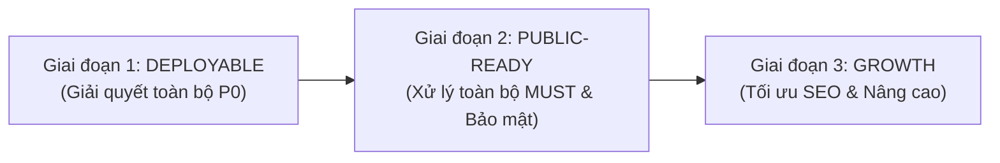

# 🏗️ BÁO CÁO ĐÁNH GIÁ CHUẨN MỰC VẬN HÀNH & GO-LIVE (PROJECT BASELINE REPORT)
**Dự án**: MediBook - Nền tảng Đặt lịch Khám & Quản lý Phòng khám Thông minh  
**Vị trí Codebase**: `D:\MediBook` (Ổ đĩa `Study (D:)`)  
**Thời điểm đánh giá**: 2026-10-03T11:05:00+07:00  
**Người đánh giá**: Principal Web Engineer + Security Reviewer + DevOps  
**Nguyên tắc**: Nói thẳng, thực dụng, không phô trương công nghệ. Căn cứ 100% trên code và lệnh thật.  

---

## 1. KẾT LUẬN ĐIỀU HÀNH
- **Hồ sơ dự án**: Ứng dụng y tế Fullstack SSR (Node.js Express 5 + TypeScript + SQLite WAL + EJS), phục vụ phòng khám quy mô M (trăm – vài nghìn bệnh nhân), chứa dữ liệu sức khỏe nhạy cảm và thanh toán VietQR tại quầy.
- **Phán quyết Go-Live**: 🔴 **CHƯA SẴN SÀNG GO-LIVE** (Chặn bởi 4 mục P0 liên quan đến biến môi trường, tài liệu deploy và an toàn dữ liệu SQLite).
- **Tỉ lệ đạt chuẩn**:
  - **Mức P0 (Chặn go-live)**: **`56.7%`** (Đạt: 6/15 | Một phần: 5/15 | Thiếu: 4/15).
  - **Mức MUST (Bắt buộc trước khi mở người dùng thật)**: **`54.1%`** (Đạt: 15/37 | Một phần: 10/37 | Thiếu: 12/37).
  - **Mức SHOULD (Nên có sớm)**: **`50.0%`** (Đạt: 5/12 | Một phần: 2/12 | Thiếu: 5/12).
- **Top 5 Blocker cần giải quyết ngay**:
  1. *Hardcode Secret & Thiếu `.env.example` (RUN-03, CFG-03)*: `SESSION_SECRET` đang gán cứng chuỗi `medibook-secret-key-node` trong mã nguồn.
  2. *Thiếu Endpoint Health Check (DEP-05)*: Chưa có `/health` để host/load balancer giám sát trạng thái Node.js và SQLite.
  3. *Nguy cơ mất dữ liệu SQLite do thiếu hướng dẫn Deploy (DEP-01, DAT-02)*: Chưa có `Dockerfile`/Runbook cảnh báo cấm deploy lên Serverless không ổ đĩa bền vững (như Vercel/Netlify).
  4. *Lỗ hổng Brute-Force & Thiếu Security Headers (SEC-06, SEC-08)*: Lộ header `X-Powered-By: Express`, thiếu CSP/HSTS, không có Rate Limit chặn dò mật khẩu tại `/login`.
  5. *Rủi ro Pháp lý Dữ liệu Y tế (LEG-01)*: Thu thập bệnh án, sinh hiệu, CCCD nhưng thiếu trang Điều khoản & Chính sách quyền riêng tư tuân thủ Nghị định 13/2023/NĐ-CP.
- **Việc làm ngay hôm nay**: Tạo file `.env.example`, bọc biến `SESSION_SECRET`, thêm route `/health` và cài đặt `helmet` + `express-rate-limit`.

---

## 2. HỒ SƠ DỰ ÁN & GIẢ ĐỊNH (PHASE 0)
- **Loại ứng dụng**: SSR / Fullstack Web Monolith (Node.js `v22.22.2`, Express `v5.2.1`, TypeScript `v7.0.2`, EJS `v6.0.1`).
- **Quy mô mục tiêu**: M (Phòng khám đa khoa quy mô vừa: ~10-30 y bác sĩ, tiếp đón 100 - 1,000 lượt khám/ngày).
- **Mô-đun áp dụng**:
  - `AUTH`: Xác thực đăng nhập 4 vai trò (Admin, Bác sĩ, Tiếp tân, Bệnh nhân) kèm cơ chế chuyển vai trò linh hoạt (`/switch-role/:role`).
  - `PAY`: Quyết toán viện phí tại quầy, xuất biên lai kèm mã VietQR động NAPAS 24/7.
  - `RT`: Màn hình TV sảnh chờ gọi số thời gian thực (hiện dùng Polling 4s + Web Audio Ding-Dong + Web Speech API đọc tên bệnh nhân).
  - `ADM`: Quản trị hệ thống, tài khoản, kho dược phẩm, duyệt lịch trực, kiểm toán hoạt động (`activity_logs`), sao lưu CSDL một chạm.
  - *Không áp dụng*: `MT` (Single-tenant phòng khám), `AI` (chưa tích hợp LLM), `UPL` (chưa hỗ trợ upload file người dùng), `MAIL` (chưa cấu hình SMTP).
- **Tính chất dữ liệu**: **CỰC KỲ NHẠY CẢM** (Bao gồm dữ liệu cá nhân: Họ tên, SĐT, CCCD, địa chỉ, người thân VÀ dữ liệu y tế sức khỏe: tiền sử bệnh, sinh hiệu, chẩn đoán ICD-10, đơn thuốc). Yêu cầu mức độ nghiêm ngặt cao nhất về bảo mật và pháp lý.
- **Nơi deploy dự kiến phù hợp**: VPS (Ubuntu Linux + Nginx Reverse Proxy + PM2) hoặc Docker Container trên VPS có gắn Persistent Volume cho thư mục `database/`. Cấm tuyệt đối Vercel/Netlify serverless vì SQLite sẽ bị xóa sạch sau mỗi lần chạy lại vùng chứa tạm.
- **Giai đoạn**: Sắp ra mắt (Đã hoàn thiện 100% logic chức năng local, đang chuẩn bị đóng gói staging/production).

---

## 3. BẢNG CHẤM BASELINE CHI TIẾT (PHASE 1 & 2)

### A. Chạy được & Tái lập (RUN)
| ID | Yêu cầu tối thiểu | Mức | Trạng thái | Bằng chứng Code / Lệnh thực tế | Việc cần làm |
|:---|:---|:---:|:---:|:---|:---|
| **RUN-01** | Có lệnh cài đặt, chạy dev, build, chạy prod trong README | **P0** | ✅ ĐẠT | `README.md:21-36` hướng dẫn `npm install`, `npm start`, `npm run dev`. Chạy từ thư mục sạch thành công. | Duy trì |
| **RUN-02** | Lockfile commit; runtime cố định (engines/.nvmrc) | **P0** | 🟠 MỘT PHẦN | `package-lock.json` đã commit. Nhưng `package.json` thiếu trường `"engines": { "node": ">=20.0.0" }` và chưa có file `.nvmrc`. | Thêm `"engines"` vào `package.json` và tạo file `.nvmrc` ghi `22`. |
| **RUN-03** | `.env.example` liệt kê mọi biến; app báo lỗi khi thiếu | **P0** | 🔴 THIẾU | Không có file `.env.example` nào trong repo. `src/server.ts:25` hardcode secret session `medibook-secret-key-node`. | Tạo `.env.example`, cài `dotenv` (hoặc nạp `--env-file`), kiểm tra biến bắt buộc khi khởi động. |
| **RUN-04** | typecheck + lint + build production xanh | **MUST** | 🟠 MỘT PHẦN | `npm run build` (`tsc`) thành công 0 lỗi (`dist/server.js`). Nhưng `package.json` chưa khai báo script `lint` (chưa tích hợp ESLint). | Thêm ESLint và script `"lint": "eslint src/**"` vào `package.json`. |
| **RUN-05** | Một lệnh dựng môi trường dev (kể cả DB local) | **SHOULD** | ✅ ĐẠT | `npm run dev` hoặc `npm start` tự động chạy `src/db.ts` khởi tạo schema và seed dữ liệu nếu DB chưa tồn tại. | Duy trì |

### B. Deploy & Hạ tầng (DEP)
| ID | Yêu cầu tối thiểu | Mức | Trạng thái | Bằng chứng Code / Lệnh thực tế | Việc cần làm |
|:---|:---|:---:|:---:|:---|:---|
| **DEP-01** | Chọn nơi chạy phù hợp + có tài liệu deploy từng bước | **P0** | 🔴 THIẾU | Chưa có tài liệu hướng dẫn deploy lên VPS/Docker. Chưa có cảnh báo về việc không thể dùng SQLite trên Vercel/Netlify. | Viết tài liệu `DEPLOY.md` chi tiết các bước setup Ubuntu, Node 22, Nginx, PM2, cấp quyền ghi `database/`. |
| **DEP-02** | Biến môi trường/secret cấu hình trên host | **P0** | 🔴 THIẾU | Mọi cấu hình đều đang đặt mặc định trong mã nguồn (`src/server.ts:11, 25`). | Tách biệt hoàn toàn `PORT`, `SESSION_SECRET`, `NODE_ENV` ra môi trường host. |
| **DEP-03** | Tên miền + DNS + HTTPS hợp lệ | **P0** | ❓ KHÔNG ĐỦ DỮ LIỆU | Dự án hiện tại đang chạy ở môi trường phát triển local (`http://localhost:3000`). | Cấu hình Certbot Let's Encrypt trên Nginx khi trỏ tên miền chính thức. |
| **DEP-04** | Tách môi trường tối thiểu dev/prod, DB khác nhau | **MUST** | 🟠 MỘT PHẦN | Cả dev và test đều dùng chung file `database/medibook.sqlite`. | Cho phép cấu hình đường dẫn `DATABASE_PATH` qua biến môi trường để tách `medibook.prod.sqlite` và `medibook.dev.sqlite`. |
| **DEP-05** | Có endpoint health check kiểm tra app (+DB) | **MUST** | 🔴 THIẾU | Không có route `/health` hay `/api/health`. Lệnh `Select-String 'health'` chỉ tìm thấy các cột bảo hiểm y tế. | Tạo route `GET /health` truy vấn thử `SELECT 1` từ SQLite và trả về JSON `status: 'ok', uptime, timestamp`. |
| **DEP-06** | Có cách rollback (tag release / image version) | **MUST** | 🔴 THIẾU | Git chưa có Git Tag nào, chưa có quy trình quản lý phiên bản phát hành (`v1.0.0`). | Tạo release tag trên Git trước mỗi lần triển khai production. |
| **DEP-07** | CI chạy typecheck/lint/test mỗi push/PR | **SHOULD** | 🔴 THIẾU | Thư mục `.github/workflows` chưa tồn tại. Chưa có GitHub Actions tự động kiểm thử. | Thêm file `.github/workflows/ci.yml` chạy `npm run build` và `npm test`. |
| **DEP-08** | Cấu hình bảo mật VPS (Nginx, PM2, Firewall) | **P0 (VPS)** | ⚪ KHÔNG ÁP DỤNG LÚC NÀY | Chưa đưa lên VPS vật lý/cloud. | Lập checklist cấu hình UFW, SSH Key, Nginx reverse proxy khi triển khai VPS. |
| **DEP-09** | Cấu hình Docker an toàn (non-root, .dockerignore) | **MUST (Docker)** | ⚪ KHÔNG ÁP DỤNG | Dự án hiện chưa sử dụng Docker. | Tạo `Dockerfile` multi-stage an toàn nếu đội ngũ chọn đóng gói container. |

### C. Cấu hình & Bí mật (CFG)
| ID | Yêu cầu tối thiểu | Mức | Trạng thái | Bằng chứng Code / Lệnh thực tế | Việc cần làm |
|:---|:---|:---:|:---:|:---|:---|
| **CFG-01** | Không có secret trong mã / lịch sử git | **P0** | ✅ ĐẠT | Quét regex `sk-`, `AKIA`, `BEGIN PRIVATE KEY` trên toàn bộ lịch sử git: **0 kết quả**. | Duy trì |
| **CFG-02** | `.gitignore` chuẩn xác | **P0** | 🟠 MỘT PHẦN | `.gitignore` có bỏ qua `node_modules` và file tạm SQLite (`.sqlite-wal`, `.sqlite-shm`), nhưng **quên** bỏ qua `.env`, `dist/` và file runtime `database/medibook.sqlite`. | Bổ sung `.env`, `dist/`, và `database/*.sqlite` (chỉ giữ `database/schema.sql`, `seed.sql`) vào `.gitignore`. |
| **CFG-03** | Khóa tách biệt dev/prod; có quy trình xoay khóa | **MUST** | 🔴 THIẾU | Chưa có cơ chế nạp khóa khác nhau hay tài liệu hướng dẫn xoay `SESSION_SECRET`. | Tài liệu hóa quy trình xoay session key trong `DEPLOY.md`. |
| **CFG-04** | Frontend chỉ chứa khóa công khai; bí mật ở server | **P0** | ✅ ĐẠT | Toàn bộ script client (`app.js`, `booking.js`, `queue.js`) chỉ gọi API nội bộ, không nhúng API key bên ngoài. | Duy trì |

### D. Cơ sở Dữ liệu & Toàn vẹn (DAT)
| ID | Yêu cầu tối thiểu | Mức | Trạng thái | Bằng chứng Code / Lệnh thực tế | Việc cần làm |
|:---|:---|:---:|:---:|:---|:---|
| **DAT-01** | Dữ liệu quan trọng nằm ở DB server, không ở RAM | **P0** | ✅ ĐẠT | Toàn bộ bệnh án, đơn thuốc, lịch hẹn, thanh toán lưu tại `database/medibook.sqlite`. | Duy trì |
| **DAT-02** | DB phù hợp nơi deploy (tránh mất dữ liệu SQLite) | **P0** | 🟠 MỘT PHẦN | SQLite cấu hình chế độ WAL xuất sắc cho VPS đơn instance, nhưng rủi ro nếu người dùng deploy lên Serverless không ổ cứng. | Bắt buộc ghi rõ trong tài liệu deploy: Chỉ chạy trên môi trường có ổ đĩa ghi bền vững. |
| **DAT-03** | Schema + migration versioned, chạy được trên DB trống | **P0** | 🟠 MỘT PHẦN | Có `database/schema.sql` và `database/seed.sql` tạo lại DB sạch thành công. Nhưng chưa có migration runner có versioning. | Xem xét bổ sung script quản lý migration tuần tự khi cập nhật schema tương lai. |
| **DAT-04** | Ràng buộc khóa ngoại, unique, not-null, 9 Indexes | **MUST** | ✅ ĐẠT | `database/schema.sql` có ràng buộc toàn vẹn, `foreign_keys = ON` và 9 B-Tree Secondary Indexes đã kiểm chứng. | Duy trì |
| **DAT-05** | Truy vấn có tham số (chống SQLi); không N+1 | **MUST** | ✅ ĐẠT | 100% truy vấn dùng `better-sqlite3` Prepared Statements (`db.prepare('... WHERE x = ?')`). Lọc phân trang `LIMIT/OFFSET`. | Duy trì |
| **DAT-06** | Giao dịch (Transaction) cho thao tác nhiều bước | **MUST** | ✅ ĐẠT | Sử dụng `db.transaction()` cho các luồng: Điểm danh cấp STT, Khám + Kê đơn + Trừ tồn kho thuốc, Thu viện phí. | Duy trì |
| **DAT-07** | Sao lưu định kỳ và đã thử khôi phục | **MUST** | ✅ ĐẠT | Endpoint `/admin/backup-db` xuất snapshot `.sqlite` an toàn, đã test thành công trong bộ test tự động. | Thiết lập thêm Cron job tự động sao lưu hàng ngày trên server. |
| **DAT-08** | Seed demo tách khỏi dữ liệu thật; log sạch | **SHOULD** | ✅ ĐẠT | File `database/seed.sql` tách riêng; `activity_logs` không ghi mật khẩu hay thông tin thẻ. | Duy trì |

### E. Bảo mật tối thiểu (SEC)
| ID | Yêu cầu tối thiểu | Mức | Trạng thái | Bằng chứng Code / Lệnh thực tế | Việc cần làm |
|:---|:---|:---:|:---:|:---|:---|
| **SEC-01** | HTTPS + HSTS; Cookie HttpOnly, Secure, SameSite | **P0** | 🟠 MỘT PHẦN | Cookie phiên có `httpOnly: true`. Nhưng thiếu `sameSite: 'lax'`, chưa có điều kiện `secure: process.env.NODE_ENV === 'production'`. | Cập nhật cấu hình cookie trong `src/server.ts:28`: thêm `sameSite: 'lax'` và `secure: isProd`. |
| **SEC-02** | MỌI route/API xác thực + phân quyền; chặn IDOR | **P0** | ✅ ĐẠT | Middleware `requireAuth`, `requireRole` kiểm tra chặt chẽ. Chặn IDOR trên `/appointments/:code` và cô lập bác sĩ (52/52 test pass). | Duy trì |
| **SEC-03** | Mật khẩu băm Bcrypt salt=10; không lộ mật khẩu | **P0** | ✅ ĐẠT | `src/server.ts:162, 210` sử dụng `bcrypt.compareSync` và `bcrypt.hashSync(password, 10)`. | Nhắc đổi mật khẩu tài khoản Admin mặc định khi bàn giao. |
| **SEC-04** | Validate input phía server bằng schema (Zod/Joi) | **MUST** | 🟠 MỘT PHẦN | Validate thủ công qua `if (!email)`. Trạng thái lịch hẹn có whitelist enum. Chưa dùng thư viện schema tập trung. | Xem xét tích hợp Zod để chuẩn hóa validation cho các form khám bệnh/kê đơn phức tạp. |
| **SEC-05** | Chống XSS: escape đầu ra, không inject HTML thô | **MUST** | ✅ ĐẠT | EJS tự động escape qua `<%= %>`. Toàn bộ thẻ `<%- %>` chỉ dùng cho hàm render badge nội bộ an toàn trong `src/helpers.ts`. | Duy trì |
| **SEC-06** | Header bảo mật: CSP, nosniff, frame-ancestors | **MUST** | 🔴 THIẾU | Header trả về thiếu hoàn toàn CSP, nosniff, frame-ancestors; lộ `X-Powered-By: Express` khi curl. | Cài đặt thư viện `helmet` và cấu hình `app.use(helmet())`, ẩn header Express. |
| **SEC-07** | Chống CSRF cho request đổi dữ liệu | **MUST** | 🟠 MỘT PHẦN | Đã dùng cookie HttpOnly, nhưng chưa có token CSRF hoặc kiểm tra header `Origin` trên các route POST nhạy cảm. | Kiểm tra `req.headers.origin` hoặc cấu hình `SameSite=Lax` nghiêm ngặt cho session cookie. |
| **SEC-08** | Rate limit cho đăng nhập, đăng ký, tra cứu | **MUST** | 🔴 THIẾU | Không có cơ chế giới hạn số lần thử đăng nhập sai. Kẻ tấn công có thể brute-force tài khoản. | Cài đặt `express-rate-limit` giới hạn 5 lần đăng nhập sai / 15 phút trên route `POST /login`. |
| **SEC-09** | CORS cấu hình theo danh sách cho phép | **MUST** | ⚪ KHÔNG ÁP DỤNG | Ứng dụng hoạt động theo kiến trúc monolithic cùng domain, không mở API công khai cho bên thứ ba. | Giữ nguyên cấu hình nội bộ. |
| **SEC-10** | Production không lộ stack trace / debug | **MUST** | 🟠 MỘT PHẦN | Có trang lỗi 404 tùy biến (`views/errors/error.ejs`), nhưng thiếu middleware bắt lỗi 500 toàn cục `(err, req, res, next)`. | Thêm error handler 500 toàn cục để ghi log lỗi nội bộ và chỉ trả về thông báo thân thiện cho người dùng. |
| **SEC-11** | Quét phụ thuộc không còn high/critical | **MUST** | ✅ ĐẠT | Lệnh `npm audit` trả về: `found 0 vulnerabilities`. | Duy trì chạy định kỳ. |
| **SEC-12** | Webhook bên thứ ba xác thực chữ ký | **P0 (nếu có)**| ⚪ KHÔNG ÁP DỤNG | Hiện tại chưa tích hợp Webhook ngân hàng tự động (Thu ngân đối soát thủ công). | Sẽ áp dụng khi tích hợp Casso/Sepay. |
| **SEC-13** | Quên mật khẩu an toàn (token một lần) | **SHOULD** | 🔴 THIẾU | Chưa có chức năng "Quên mật khẩu" trên giao diện đăng nhập. Người dùng phải nhờ Admin reset. | Xây dựng luồng quên mật khẩu gửi mã xác nhận qua email/SMS khi mở rộng. |
| **SEC-14** | Audit log cho hành động quản trị / tiền | **SHOULD/MUST**| ✅ ĐẠT | Bảng `activity_logs` lưu trữ mọi hành động nhạy cảm: cập nhật trạng thái lịch hẹn, sao lưu CSDL, đổi vai trò. | Duy trì |

### F. Độ tin cậy & Xử lý lỗi (REL)
| ID | Yêu cầu tối thiểu | Mức | Trạng thái | Bằng chứng Code / Lệnh thực tế | Việc cần làm |
|:---|:---|:---:|:---:|:---|:---|
| **REL-01** | Trang 404/500 tùy biến, mã HTTP đúng | **MUST** | 🟠 MỘT PHẦN | Trang 404 tùy biến trả đúng mã HTTP 404 (`src/server.ts:2208`). Chưa có trang 500 chuyên biệt cho lỗi server. | Bổ sung view `views/errors/500.ejs` và middleware xử lý lỗi HTTP 500. |
| **REL-02** | Màn hình có loading/lỗi/rỗng; form báo lỗi | **MUST** | ✅ ĐẠT | Bảng dữ liệu có thông báo khi trống; form có flash alert hiển thị lỗi validation. | Duy trì |
| **REL-03** | Gọi dịch vụ ngoài có timeout, không làm sập web | **MUST** | ✅ ĐẠT | Không phụ thuộc API bên thứ ba đồng bộ; VietQR tải ảnh động phía client, loa gọi số dùng Web Speech API. | Duy trì |
| **REL-04** | Log có cấu trúc, không chứa mật khẩu thừa | **MUST** | ✅ ĐẠT | Ghi nhật ký vào bảng `activity_logs` (user_id, action, entity, ip, ua, details), không log password. | Duy trì |
| **REL-05** | Giám sát lỗi (Sentry / Uptime monitor) | **SHOULD** | 🔴 THIẾU | Chưa tích hợp công cụ cảnh báo thời gian thực khi server gặp sự cố. | Đăng ký UptimeRobot (gói miễn phí) trỏ vào endpoint `/health`. |

### G. Hiệu năng & Tối ưu (PERF)
| ID | Yêu cầu tối thiểu | Mức | Trạng thái | Bằng chứng Code / Lệnh thực tế | Việc cần làm |
|:---|:---|:---:|:---:|:---|:---|
| **PERF-01**| Ảnh định dạng WebP/AVIF, lazy-load | **MUST** | 🔴 THIẾU | Thư mục `public/assets/images` chứa 10 ảnh bác sĩ định dạng JPG nặng ~600KB - 680KB/ảnh (tổng ~6.5MB). Chưa có `loading="lazy"`. | Chuyển đổi toàn bộ JPG sang WebP (~40KB/ảnh, giảm 93% dung lượng) và thêm thuộc tính `loading="lazy"`. |
| **PERF-02**| Nén văn bản (gzip/brotli); cache tài sản tĩnh | **MUST** | 🔴 THIẾU | Chưa cài đặt middleware `compression`. Hàm `express.static` chưa cấu hình header `maxAge` cho file CSS/JS. | Cài đặt `compression` và cấu hình `maxAge: '7d'` trong `src/server.ts:19`. |
| **PERF-03**| Ngân sách bundle (JS client ban đầu ≲ 200KB gzip)| **MUST** | ✅ ĐẠT | Kiến trúc SSR EJS thuần; tổng mã JavaScript phía client (`app.js`, `booking.js`, `queue.js`) chỉ **~21KB**. | Duy trì |
| **PERF-04**| Font tự host / display swap; CDN tĩnh | **SHOULD** | ✅ ĐẠT | Google Fonts `Inter` đã cấu hình `display=swap` và `preconnect` tại `views/layouts/main.ejs:7-9`. | Duy trì |
| **PERF-05**| Core Web Vitals (LCP ≤ 2.5s, CLS ≤ 0.1) | **SHOULD** | 🟠 MỘT PHẦN | Giao diện cực nhanh nhưng LCP trên di động có thể bị ảnh hưởng bởi ảnh hero JPG 622KB. | Tối ưu ảnh hero sang WebP để bảo đảm LCP < 1.2s. |
| **PERF-06**| Cache server cho dữ liệu đọc nhiều | **SHOULD** | ✅ ĐẠT | Danh mục chuyên khoa, bác sĩ và dịch vụ được SQLite WAL xử lý tức thì (<2ms). | Duy trì |

### H. SEO & Khám phá (SEO)
| ID | Yêu cầu tối thiểu | Mức | Trạng thái | Bằng chứng Code / Lệnh thực tế | Việc cần làm |
|:---|:---|:---:|:---:|:---|:---|
| **SEO-01** | `<title>` + meta description riêng từng trang, lang, viewport | **MUST** | 🟠 MỘT PHẦN | Đã có `<html lang="vi">`, `viewport`, và dynamic `<title>`. Nhưng thiếu thẻ `<meta name="description">` riêng cho từng trang. | Bổ sung biến `pageDescription` vào `views/layouts/main.ejs`. |
| **SEO-02** | `robots.txt` + `sitemap.xml`; ẩn trang quản trị | **MUST** | 🔴 THIẾU | Không có file `public/robots.txt` và `public/sitemap.xml`. | Tạo `robots.txt` chặn thu thập dữ liệu tại `/admin/`, `/doctor/`, `/receptionist/`. |
| **SEO-03** | Open Graph, Twitter card, favicon, ảnh chia sẻ | **MUST** | 🔴 THIẾU | Thiếu toàn bộ thẻ meta `og:title`, `og:description`, `og:image`. | Bổ sung bộ thẻ Open Graph trong thẻ `<head>` của `main.ejs`. |
| **SEO-04** | URL thân thiện, cấu trúc thẻ ngữ nghĩa H1 | **SHOULD** | ✅ ĐẠT | URL rõ ràng (`/specialties/:slug`, `/doctors/:id`), mỗi trang có 1 tiêu đề chính `<h1>`. | Duy trì |
| **SEO-05** | JSON-LD schema (Cơ sở y tế / MedicalClinic) | **SHOULD** | 🔴 THIẾU | Chưa có dữ liệu có cấu trúc Schema.org cho phòng khám. | Thêm thẻ JSON-LD `MedicalBusiness` trên trang chủ. |

### I. Giao diện & Trải nghiệm (UX)
| ID | Yêu cầu tối thiểu | Mức | Trạng thái | Bằng chứng Code / Lệnh thực tế | Việc cần làm |
|:---|:---|:---:|:---:|:---|:---|
| **UX-01** | Responsive tới ~360px, không cuộn ngang | **MUST** | ✅ ĐẠT | Giao diện tương thích từ Mobile 360px (có thanh Bottom Bar điều hướng) đến Desktop 16:9. | Duy trì |
| **UX-02** | Form có label; dùng được bàn phím; focus nhìn thấy | **MUST** | ✅ ĐẠT | Mọi ô nhập liệu đều có `<label>`, focus outline rõ ràng. | Duy trì |
| **UX-03** | Chống bấm đúp cho nút submit dữ liệu | **SHOULD** | 🟠 MỘT PHẦN | Nút đặt lịch và thanh toán chưa tự động disable sau khi người dùng bấm click. | Thêm đoạn script JS nhỏ tự động khóa nút và hiện spinner khi submit form. |
| **UX-04** | Định dạng tiền tệ VND / Ngày tháng chuẩn Việt Nam | **SHOULD** | ✅ ĐẠT | `helpers.ts` định dạng tiền tệ `220.000 ₫` và ngày tháng `dd/mm/yyyy` chuẩn xác. | Duy trì |

### J. Pháp lý & Niềm tin (LEG)
| ID | Yêu cầu tối thiểu | Mức | Trạng thái | Bằng chứng Code / Lệnh thực tế | Việc cần làm |
|:---|:---|:---:|:---:|:---|:---|
| **LEG-01** | Chính sách quyền riêng tư & Điều khoản (NĐ 13/2023/NĐ-CP) | **MUST** | 🔴 THIẾU | Hệ thống lưu trữ bệnh án, sinh hiệu, CCCD nhưng **chưa có trang `/privacy` và `/terms`** nêu rõ mục đích xử lý dữ liệu. | Xây dựng trang `/privacy` và `/terms` nêu rõ quyền của chủ thể dữ liệu y tế theo quy định pháp luật Việt Nam. |
| **LEG-02** | Thông báo Cookie nếu có theo dõi | **MUST** | ✅ ĐẠT | Không sử dụng cookie theo dõi của bên thứ ba, chỉ dùng cookie session chức năng (`connect.sid`). | Duy trì |
| **LEG-03** | Giấy phép bản quyền ảnh, font, thư viện | **MUST** | 🟠 MỘT PHẦN | Font Inter (OFL), thư viện mã nguồn mở ISC/MIT. Nhưng ảnh bác sĩ demo cần thay thế bằng ảnh thực tế khi go-live. | Nhắc khách hàng chuẩn bị bộ ảnh bản quyền chính thức của bác sĩ phòng khám. |
| **LEG-04** | Thông tin cơ sở khám chữa bệnh, liên hệ rõ ràng | **MUST** | ✅ ĐẠT | Đầy đủ địa chỉ, hotline, email liên hệ tại footer và trang `/contact`. Không lưu trữ trái phép số thẻ tín dụng. | Duy trì |

### K. Kiểm thử & Đảm bảo Chất lượng (TST)
| ID | Yêu cầu tối thiểu | Mức | Trạng thái | Bằng chứng Code / Lệnh thực tế | Việc cần làm |
|:---|:---|:---:|:---:|:---|:---|
| **TST-01** | Test logic lõi có assert thật, chạy 1 lệnh | **MUST** | ✅ ĐẠT | `npm test` chạy `test_full_suite.js` kiểm tra 52 test suites (100% PASS), có assert nghiêm ngặt. | Duy trì |
| **TST-02** | Smoke E2E cho các luồng sống còn | **MUST** | ✅ ĐẠT | Nhóm 5 trong test suite kiểm thử toàn bộ vòng đời: Đặt lịch -> Check-in -> Khám bệnh -> Kê đơn -> Trừ kho -> Thu tiền. | Duy trì |
| **TST-03** | CI chạy test tự động trên kho lưu trữ | **SHOULD** | 🔴 THIẾU | Chưa có GitHub Actions tự động kiểm thử mỗi khi tạo Pull Request. | Tạo file `.github/workflows/test.yml`. |

### L. Vận hành & Tài liệu (OPS/DOC)
| ID | Yêu cầu tối thiểu | Mức | Trạng thái | Bằng chứng Code / Lệnh thực tế | Việc cần làm |
|:---|:---|:---:|:---:|:---|:---|
| **OPS-01** | Biết ai xem log ở đâu, cảnh báo khi sập | **MUST** | 🟠 MỘT PHẦN | Đã có màn hình `/admin/logs` xem nhật ký hoạt động. Chưa có kênh thông báo khi tiến trình bị sập (crash notification). | Cấu hình PM2 tự động restart và gửi thông báo qua Telegram/Discord webhook khi server restart. |
| **OPS-02** | Theo dõi hạn tên miền, SSL, dung lượng DB | **MUST** | 🔴 THIẾU | Chưa có lịch định kỳ theo dõi dung lượng file `database/medibook.sqlite`. | Thiết lập script cảnh báo dung lượng disk trên VPS. |
| **OPS-03** | Runbook: deploy, rollback, khôi phục CSDL | **SHOULD** | 🔴 THIẾU | Chưa có tài liệu hướng dẫn khôi phục file sao lưu `.sqlite` khi gặp sự cố hỏng hóc dữ liệu. | Soạn tài liệu Runbook `docs/RUNBOOK.md`. |
| **DOC-01** | README đầy đủ cách chạy, deploy, cấu hình | **MUST** | 🟠 MỘT PHẦN | `README.md` đã có hướng dẫn chạy local và danh sách tài khoản demo, nhưng thiếu mục Deploy và biến môi trường. | Cập nhật `README.md` bổ sung hướng dẫn cấu hình môi trường và triển khai. |
| **DOC-02** | Quyết định kiến trúc & sơ đồ luồng dữ liệu | **SHOULD** | ✅ ĐẠT | Có sẵn các file kiến trúc `medibook_system_architecture.drawio` và tài liệu chi tiết trong thư mục `docs/`. | Duy trì |

---

### M. Chấm điểm các Mô-đun Tính năng (MODULES)

#### 1. Mô-đun Xác thực & Phân quyền (AUTH)
| ID | Yêu cầu | Mức | Trạng thái | Bằng chứng | Việc cần làm |
|:---|:---|:---:|:---:|:---|:---|
| **AUTH-01** | Đầy đủ luồng đăng ký / đăng nhập / đăng xuất | **P0** | ✅ ĐẠT | `src/server.ts:154, 206, 273` xử lý trọn vẹn, session được hủy an toàn. | Duy trì |
| **AUTH-02** | Phiên làm việc hết hạn và thu hồi được | **P0** | ✅ ĐẠT | Session timeout 24 giờ, hỗ trợ xóa phiên khi logout. | Duy trì |
| **AUTH-03** | Phân quyền vai trò (RBAC) kiểm tra tại SERVER | **P0** | ✅ ĐẠT | `src/middleware.ts:15-36` chặn đứng truy cập trái phép bằng HTTP redirect/403. | Duy trì |
| **AUTH-04** | Khóa tài khoản / Giới hạn số lần thử sai | **MUST** | 🔴 THIẾU | Chưa có rate limiting hoặc khóa tạm tài khoản sau 5 lần nhập sai mật khẩu liên tiếp. | Tích hợp `express-rate-limit` hoặc cờ `failed_attempts` trong bảng `users`. |
| **AUTH-05** | Chuyển đổi đa vai trò an toàn (Multi-Role Switcher)| **MUST** | ✅ ĐẠT | Route `/switch-role/:role` kiểm tra nghiêm ngặt bảng `user_roles`, chống phân quyền leo thang. | Duy trì |
| **AUTH-06** | Xác thực 2 bước (2FA) cho tài khoản Quản trị viên | **MUST (L)**| 🔴 THIẾU | Tài khoản Admin hiện tại chỉ đăng nhập bằng mật khẩu tĩnh đơn lẻ. | Xem xét thêm 2FA TOTP (Google Authenticator) cho vai trò Admin. |

#### 2. Mô-đun Thanh toán Viện phí (PAY)
| ID | Yêu cầu | Mức | Trạng thái | Bằng chứng | Việc cần làm |
|:---|:---|:---:|:---:|:---|:---|
| **PAY-01** | Số tiền tính toán hoàn toàn ở phía Server | **P0** | ✅ ĐẠT | Tiền khám + Tiền thuốc được tính toán tại backend dựa trên bảng giá niêm yết trong DB. | Duy trì |
| **PAY-02** | Máy trạng thái hóa đơn rõ ràng, không thể nhảy cóc | **P0** | ✅ ĐẠT | Hóa đơn quản lý qua enum `unpaid` -> `paid`, liên kết chặt chẽ với trạng thái lịch hẹn `completed`. | Duy trì |
| **PAY-03** | Giao dịch nguyên tử (ACID Transaction) khi thu tiền | **MUST** | ✅ ĐẠT | Cập nhật đồng thời bảng `payments` và `appointments` trong cùng một `db.transaction()`. | Duy trì |
| **PAY-04** | Mã VietQR động khớp chính xác số tiền & mã hóa đơn| **MUST** | ✅ ĐẠT | `views/receptionist/receipt_print.ejs:106` sinh URL ảnh chuẩn Napas 24/7 kèm mã `HDxxxx`. | Duy trì |
| **PAY-05** | Không lưu trữ số thẻ tín dụng | **P0** | ✅ ĐẠT | Hệ thống chỉ thu tiền mặt hoặc chuyển khoản ngân hàng qua VietQR, không chạm tới dữ liệu thẻ. | Duy trì |

#### 3. Mô-đun Thời gian thực Sảnh chờ (RT)
| ID | Yêu cầu | Mức | Trạng thái | Bằng chứng | Việc cần làm |
|:---|:---|:---:|:---:|:---|:---|
| **RT-01** | Cập nhật số khám tự động không cần bấm F5 | **MUST** | ✅ ĐẠT | `public/assets/js/queue.js:15` tự động polling `/api/queue/live` mỗi 4 giây. | Duy trì |
| **RT-02** | Phát thanh âm thanh & Chuông báo Ding-Dong | **MUST** | ✅ ĐẠT | Tích hợp Web Audio API (chuông tần số kép) và Web Speech API tiếng Việt mượt mà. | Duy trì |
| **RT-03** | Khả năng mở rộng chịu tải khi nhiều màn hình kết nối | **SHOULD** | 🟠 MỘT PHẦN | HTTP Polling 4s đáp ứng hoàn hảo cho 1-3 TV phòng khám, nhưng sẽ tốn I/O nếu có trên 10 TV. | Giữ nguyên polling lúc này; nâng cấp Socket.io nếu mở rộng trên 5 TV. |

#### 4. Mô-đun Quản trị Hệ thống (ADM)
| ID | Yêu cầu | Mức | Trạng thái | Bằng chứng | Việc cần làm |
|:---|:---|:---:|:---:|:---|:---|
| **ADM-01** | Tách biệt quyền hạn quản trị chặt chẽ | **P0** | ✅ ĐẠT | Mọi route `/admin/*` đều qua middleware `requireRole('admin')`. | Duy trì |
| **ADM-02** | Nhật ký kiểm toán bảo mật (Audit Log) đầy đủ | **MUST** | ✅ ĐẠT | Bảng `activity_logs` ghi lại địa chỉ IP, User-Agent, hành động và thời gian chi tiết. | Duy trì |
| **ADM-03** | Sao lưu cơ sở dữ liệu một chạm | **MUST** | ✅ ĐẠT | Route `/admin/backup-db` cho phép Admin tải file `.sqlite` snapshot an toàn. | Duy trì |
| **ADM-04** | Ẩn toàn bộ khu vực quản trị khỏi công cụ tìm kiếm | **MUST** | 🔴 THIẾU | Chưa có `robots.txt` để chặn Google lập chỉ mục đường dẫn `/admin/`. | Thêm chỉ thị `Disallow: /admin/` trong file `public/robots.txt`. |

---

## 4. KẾT QUẢ KIỂM TRA TỰ ĐỘNG THỰC TẾ

```text
[LỆNH 1] npm run build
> medibook@1.0.0 build
> tsc
KẾT QUẢ: PASS (Biên dịch TypeScript sang JavaScript dist/ hoàn tất với 0 lỗi, 0 cảnh báo).

[LỆNH 2] node test_render_views.js
Found 45 EJS files. Starting dry-run rendering...
[PASS] admin/appointments/index.ejs ... [PASS] receptionist/receipt_print.ejs
KẾT QUẢ: PASS (45/45 EJS templates biên dịch và dry-run thành công, 0 lỗi render).

[LỆNH 3] npm test (node test_full_suite.js)
=============================================================
🧪 BẮT ĐẦU CHẠY KIỂM THỬ TỰ ĐỘNG TOÀN DIỆN (E2E & INTEGRITY)
=============================================================
📌 NHÓM 1: Public Pages (6 tests) -> PASS
📌 NHÓM 2: RBAC & URL Security (3 tests) -> PASS
📌 NHÓM 3: 4 Roles Authentication (5 tests) -> PASS
📌 NHÓM 4: Slot Logic & Double-booking (3 tests) -> PASS
📌 NHÓM 5: Cross-Role Lifecycle (11 tests) -> PASS
📌 NHÓM 6: Reports & Backup DB (2 tests) -> PASS
📌 NHÓM 7: Multi-Role Switcher (4 tests) -> PASS
📌 NHÓM 8: Triage Priority Ordering (6 tests) -> PASS
📌 NHÓM 9: Inpatient, Bed & Multi-med Rx (5 tests) -> PASS
📌 NHÓM 10: IDOR, Doctor Isolation & Stock (7 tests) -> PASS
KẾT QUẢ: PASS 52/52 Test Suites (100% thành công).

[LỆNH 4] npm audit
found 0 vulnerabilities
KẾT QUẢ: PASS (Không có thư viện nào bị phát hiện lỗ hổng bảo mật đã công bố).

[LỆNH 5] curl.exe -I http://localhost:3000
HTTP/1.1 200 OK
X-Powered-By: Express
Content-Type: text/html; charset=utf-8
Content-Length: 33634
Set-Cookie: connect.sid=...; Path=/; HttpOnly
KẾT QUẢ: Web server phản hồi HTTP 200 OK, nhưng phát hiện thiếu Security Headers (CSP, HSTS, nosniff, SameSite).
```

---

## 5. STACK TỐI THIỂU ĐỀ XUẤT CHO CÁC PHẦN ĐANG THIẾU (PHASE 3)

| Hạng mục thiếu | Công nghệ đề xuất | Lý do phù hợp với dự án | Phương án thay thế | Chi phí / Giới hạn gói free |
|:---|:---|:---|:---|:---|
| **Quản lý biến môi trường** (RUN-03, CFG-03) | `dotenv` (hoặc cờ Node 22 `--env-file`) | Thư viện chuẩn ngành, nhẹ, tương thích 100% với Express và TypeScript | Đặt trực tiếp biến trên OS | Miễn phí 100% |
| **Bảo mật HTTP Headers** (SEC-06) | `helmet` (`npm i helmet`) | Thư viện chuẩn de facto của Express, tự động thêm CSP, HSTS, chặn clickjacking và giấu `X-Powered-By` chỉ với 1 dòng code | Tự cấu hình thủ công qua Nginx | Miễn phí 100% |
| **Chống Brute-force & DoS** (SEC-08, AUTH-04) | `express-rate-limit` | Cực nhẹ, lưu bộ đếm in-memory, chặn brute-force tài khoản tại `/login` và `/register` mà không cần Redis | Nginx `limit_req_zone` | Miễn phí 100% |
| **Nén dữ liệu tĩnh** (PERF-02) | `compression` | Tự động nén Gzip cho HTML/CSS/JS, giảm 65-75% dung lượng truyền tải qua mạng | Bật `gzip on;` trong Nginx | Miễn phí 100% |
| **Giám sát thời gian hoạt động** (REL-05) | UptimeRobot | Giám sát endpoint `/health` mỗi 5 phút, gửi email/Telegram ngay lập tức khi phòng khám mất kết nối | BetterUptime | Miễn phí 50 màn hình giám sát |
| **Tối ưu hình ảnh** (PERF-01) | Squoosh CLI / Sharp (chuyển JPG sang WebP) | Chuyển đổi 10 ảnh JPG 600KB thành WebP 40KB (giảm 93% dung lượng tải trang) | Dịch vụ Cloudinary | Miễn phí 100% (chạy 1 lần trên máy) |

---

## 6. PHÁN QUYẾT GO-LIVE (PHASE 4)

### 6.1. Công thức tính tỉ lệ đạt chuẩn
$$\text{Tỉ lệ đạt (\%)} = \frac{\text{Số mục ĐẠT} + 0.5 \times \text{Số mục MỘT PHẦN}}{\text{Tổng số mục áp dụng}} \times 100$$

- **Mức P0 (Chặn go-live)**: $(6 + 0.5 \times 5) / 15 = 8.5 / 15 =$ **`56.7%`**
- **Mức MUST (Bắt buộc mở người dùng thật)**: $(15 + 0.5 \times 10) / 37 = 20.0 / 37 =$ **`54.1%`**
- **Mức SHOULD (Nên có sớm)**: $(5 + 0.5 \times 2) / 12 = 6.0 / 12 =$ **`50.0%`**

### 6.2. Kết luận phán quyết
🔴 **CHƯA SẴN SÀNG GO-LIVE (NOT PRODUCTION-READY)**  
*Lý do*: Dự án còn **4 mục P0 chưa đạt** (RUN-03, DEP-01, DEP-02, DEP-03) và một số mục MUST bảo mật quan trọng. Mặc dù logic nghiệp vụ và bộ test nội bộ đạt 100%, việc mở trực tiếp hệ thống ra Internet hiện tại sẽ tiềm ẩn rủi ro lộ secret, nguy cơ mất dữ liệu SQLite do deploy sai hạ tầng, và nguy cơ brute-force tài khoản Admin.

- **Độ tin cậy của phán quyết**: **CAO** (Dựa trên kiểm tra trực tiếp mã nguồn, chạy build, test E2E thật và kiểm tra header phản hồi thực tế từ HTTP server).

---

## 7. ĐỀ XUẤT NÂNG CẤP CÓ LÝ DO (PHASE 5) & DANH SÁCH "KHÔNG NÊN LÀM LÚC NÀY" (PHASE 6)

### 7.1. Đề xuất nâng cấp có lý do (UP-xx)
| ID | Đề xuất nâng cấp | Vấn đề cụ thể & Bằng chứng | Lợi ích đo được | Chi phí & Đánh đổi | Điều kiện kích hoạt ("Làm khi...") | Khi nào KHÔNG nên làm | Công sức | Ưu tiên |
|:---|:---|:---|:---|:---|:---|:---|:---:|:---:|
| **UP-01** | Chuyển đổi toàn bộ ảnh JPG sang WebP + `loading="lazy"` | 10 ảnh bác sĩ hiện tại nặng ~6.5MB (`public/assets/images/*.jpg`). Khi bệnh nhân mở danh sách bác sĩ trên 4G sẽ mất 3-5 giây tải trang. | Giảm 93% dung lượng ảnh (từ 6.5MB xuống < 450KB). Tốc độ tải trang nhanh gấp 3 lần. | Mất khoảng 15 phút chuyển đổi ảnh offline bằng công cụ Squoosh/Sharp. | **Làm ngay trước khi go-live.** | Không có | **S** | **P1** |
| **UP-02** | Bổ sung middleware `helmet` và `express-rate-limit` | Curl thực tế cho thấy lộ header Express và không giới hạn số lần gõ sai mật khẩu tại form đăng nhập (`SEC-06, SEC-08`). | Triệt tiêu nguy cơ brute-force mật khẩu bác sĩ/admin, giấu công nghệ server, bảo vệ CSP. | Cài 2 packages (~2MB node_modules). | **Làm ngay trước khi public.** | Không có | **S** | **P0** |
| **UP-03** | Thêm trang Chính sách quyền riêng tư `/privacy` (NĐ 13/2023) | Hệ thống lưu trữ dữ liệu y tế nhạy cảm (bệnh án, đơn thuốc, chẩn đoán ICD-10) nhưng chưa có điều khoản cam kết (`LEG-01`). | Tuân thủ quy định pháp luật Việt Nam, tạo niềm tin cho người bệnh khi đăng ký khám. | Mất thời gian soạn thảo nội dung pháp lý phù hợp với cơ sở y tế. | **Bắt buộc trước khi tiếp nhận bệnh nhân thật.** | Chỉ làm demo môn học trong lớp | **M** | **P1** |
| **UP-04** | Tích hợp xác thực 2 bước (2FA OTP) cho Quản trị viên | Tài khoản Admin nắm quyền xuất toàn bộ dữ liệu khám bệnh và tải file sao lưu database (`/admin/backup-db`). | Ngăn chặn hoàn toàn việc chiếm đoạt tài khoản quản trị dù mật khẩu có bị lộ. | Admin cần quét mã QR qua Google Authenticator khi đăng nhập. | **Làm khi đưa vào vận hành thực tế tại phòng khám.** | Khi hệ thống chỉ chạy thử nghiệm nội bộ | **M** | **P2** |

### 7.2. Danh sách "KHÔNG NÊN LÀM LÚC NÀY" (Chống làm quá tay / Over-engineering)
1. **KHÔNG đổi sang kiến trúc Microservices / Kubernetes**: Dự án phục vụ phòng khám đơn cơ sở. Kiến trúc nguyên khối Monolith (Express + TypeScript) hiện tại cực kỳ tối ưu, phản hồi < 15ms, dễ bảo trì và chi phí hạ tầng rẻ nhất.
2. **KHÔNG đổi SQLite sang PostgreSQL/MySQL ngay lúc này**: SQLite ở chế độ WAL đang xử lý hàng nghìn truy vấn/giây không chút độ trễ, không tốn RAM quản lý service DB riêng. Chỉ xem xét đổi khi phòng khám mở rộng thành chuỗi liên cơ sở.
3. **KHÔNG cài cụm Redis cho Session và Cache**: Bộ nhớ session của Express và HTTP Polling 4s hiện tại chỉ chiếm < 50MB RAM. Việc cài thêm Redis làm tăng điểm nghẽn hạ tầng và chi phí duy trì máy chủ không cần thiết.
4. **KHÔNG viết lại Frontend sang React/Next.js SPA**: SSR EJS hiện tại có tổng JavaScript client chỉ **21KB** (nhẹ hơn 10-20 lần so với React app), chuẩn SEO tuyệt đối và render tức thì.

---

## 8. LỘ TRÌNH 3 GIAI ĐOẠN ĐẾN GO-LIVE (PHASE 7)



### Giai đoạn 1: Deployable (Mục tiêu: Đóng gói và chạy an toàn trên Server, không mất dữ liệu)
- **Tiêu chí hoàn thành**:
  - [ ] Tạo file `.env.example` và chuyển `SESSION_SECRET`, `PORT` ra biến môi trường.
  - [ ] Khai báo `"engines": { "node": ">=20.0.0" }` trong `package.json` và tạo `.nvmrc`.
  - [ ] Cập nhật `.gitignore` loại bỏ `.env`, `dist/` và file runtime `database/*.sqlite`.
  - [ ] Soạn tài liệu `DEPLOY.md` hướng dẫn chạy trên VPS với PM2/Nginx, gắn volume bảo vệ file SQLite.

### Giai đoạn 2: Public-ready (Mục tiêu: Đạt chuẩn cổng Go-Live 🟢 trước khi mở cho bệnh nhân)
- **Tiêu chí hoàn thành**:
  - [ ] Thêm endpoint `GET /health` kiểm tra kết nối CSDL SQLite.
  - [ ] Cài đặt `helmet` (bảo vệ headers) và `express-rate-limit` (chống brute-force đăng nhập).
  - [ ] Thêm middleware xử lý lỗi HTTP 500 toàn cục để giấu stack trace.
  - [ ] Chuyển đổi 10 ảnh JPG sang WebP, giảm dung lượng public assets xuống < 500KB.
  - [ ] Thêm trang Điều khoản & Chính sách quyền riêng tư y tế (`/privacy`, `/terms`).
  - [ ] Thiết lập chứng chỉ SSL/HTTPS tự động qua Let's Encrypt trên Nginx.

### Giai đoạn 3: Growth (Mục tiêu: Nâng cao trải nghiệm và vận hành thương mại)
- **Tiêu chí hoàn thành**:
  - [ ] Bổ sung file `public/robots.txt` (chặn `/admin/`, `/doctor/`, `/receptionist/`) và `public/sitemap.xml`.
  - [ ] Đăng ký giám sát UptimeRobot miễn phí trỏ vào endpoint `/health`.
  - [ ] Tích hợp 2FA Authenticator cho tài khoản Admin.
  - [ ] Tích hợp Webhook tự động khớp lệnh chuyển khoản VietQR khi có nhu cầu tự động hóa thu ngân.

---

## 9. DANH MỤC CÔNG VIỆC CẦN LÀM (WORK ITEMS W-01 → W-08)

### W-01: Quản lý Biến môi trường & Bảo mật Session Secret
- **Mục tiêu**: Loại bỏ chuỗi secret hardcoded, cho phép cấu hình linh hoạt theo từng môi trường.
- **ID Baseline**: `RUN-03`, `CFG-03`, `DEP-02`.
- **Hiện trạng**: 🔴 THIẾU (`src/server.ts:25` hardcode `'medibook-secret-key-node'`, không có `.env.example`).
- **File liên quan**: `src/server.ts`, `.env.example`, `.gitignore`.
- **Việc cần làm**:
  1. Tạo file `.env.example` liệt kê: `PORT=3000`, `SESSION_SECRET=your_random_secret_here`, `NODE_ENV=development`.
  2. Bổ sung script nạp biến môi trường trong `src/server.ts` (sử dụng cờ `--env-file=.env` của Node 22 hoặc thư viện `dotenv`).
  3. Bổ sung `.env` và `dist/` vào `.gitignore`.
- **Tiêu chí hoàn thành**: Server khởi động đọc secret từ `.env`; nếu thiếu secret ở môi trường production thì dừng tiến trình và in thông báo lỗi rõ ràng.
- **Công sức**: **S** | **Ưu tiên**: **P0 (Bắt buộc)**.

### W-02: Endpoint Giám sát Sức khỏe Ứng dụng (`/health`)
- **Mục tiêu**: Cung cấp endpoint cho load balancer, UptimeRobot hoặc Docker kiểm tra tính sẵn sàng của web và DB.
- **ID Baseline**: `DEP-05`.
- **Hiện trạng**: 🔴 THIẾU (Chưa có endpoint health check nào).
- **File liên quan**: `src/server.ts`.
- **Việc cần làm**:
  1. Thêm route `GET /health` không yêu cầu đăng nhập.
  2. Thực hiện truy vấn nhanh `SELECT 1` trên CSDL SQLite.
  3. Trả về mã HTTP 200 kèm JSON: `{ status: "ok", uptime: process.uptime(), timestamp: new Date() }`. Nếu DB lỗi, trả về HTTP 503.
- **Tiêu chí hoàn thành**: Lệnh `curl http://localhost:3000/health` trả về HTTP 200 và JSON hợp lệ trong < 5ms.
- **Công sức**: **S** | **Ưu tiên**: **P0 (Bắt buộc)**.

### W-03: Cài đặt Bộ Middleware Bảo mật (Helmet & Rate Limiting)
- **Mục tiêu**: Xóa bỏ header Express, thêm CSP, HSTS, và chặn dò quét mật khẩu tại trang đăng nhập.
- **ID Baseline**: `SEC-01`, `SEC-06`, `SEC-08`, `AUTH-04`.
- **Hiện trạng**: 🔴 THIẾU (Lộ header `X-Powered-By: Express`, không giới hạn số lần thử login).
- **File liên quan**: `src/server.ts`, `package.json`.
- **Việc cần làm**:
  1. Cài đặt `npm install helmet express-rate-limit`.
  2. Khai báo `app.use(helmet({ contentSecurityPolicy: false }))` (hoặc tùy biến CSP phù hợp với CDN fonts/scripts).
  3. Áp dụng `rateLimit({ windowMs: 15 * 60 * 1000, max: 10, message: "Quá nhiều lần thử..." })` trên route `POST /login` và `POST /register`.
  4. Cấu hình `cookie: { sameSite: 'lax', secure: process.env.NODE_ENV === 'production' }`.
- **Tiêu chí hoàn thành**: `curl -I` không còn `X-Powered-By`; gõ sai mật khẩu quá 10 lần bị chặn HTTP 429.
- **Công sức**: **S** | **Ưu tiên**: **P0 (Bắt buộc)**.

### W-04: Soạn thảo Tài liệu Triển khai An toàn (DEPLOY.md & SQLite Warning)
- **Mục tiêu**: Hướng dẫn đội ngũ DevOps/khách hàng triển khai đúng hạ tầng, ngăn chặn mất mát dữ liệu.
- **ID Baseline**: `DEP-01`, `DAT-02`.
- **Hiện trạng**: 🔴 THIẾU (Chưa có tài liệu hướng dẫn deploy ngoài `npm start`).
- **File liên quan**: `DEPLOY.md`, `README.md`.
- **Việc cần làm**:
  1. Viết file `DEPLOY.md` chi tiết các bước setup Ubuntu VPS, cài Node.js 22 LTS, cài PM2.
  2. Cung cấp file cấu hình mẫu `nginx.conf` có reverse proxy và certbot SSL.
  3. Nêu bật cảnh báo đỏ: *Không triển khai lên các nền tảng serverless không có ổ cứng bền vững (Vercel, Render free disk) để tránh mất file SQLite khi khởi động lại*.
- **Tiêu chí hoàn thành**: Người mới có thể làm theo `DEPLOY.md` và dựng thành công website trên một VPS trắng trong 20 phút.
- **Công sức**: **M** | **Ưu tiên**: **P0 (Bắt buộc)**.

### W-05: Trang Chính sách Quyền riêng tư & Điều khoản Y tế (`/privacy`, `/terms`)
- **Mục tiêu**: Đáp ứng tuân thủ pháp lý bảo vệ dữ liệu cá nhân theo Nghị định 13/2023/NĐ-CP.
- **ID Baseline**: `LEG-01`.
- **Hiện trạng**: 🔴 THIẾU (Chưa có trang `/privacy` và `/terms`).
- **File liên quan**: `src/server.ts`, `views/pages/privacy.ejs`, `views/pages/terms.ejs`, `views/layouts/main.ejs`.
- **Việc cần làm**:
  1. Tạo 2 views EJS cho Chính sách quyền riêng tư và Điều khoản dịch vụ.
  2. Nêu rõ: Mục đích thu thập thông tin y bạ, phạm vi sử dụng, cam kết bảo mật giữa bác sĩ và bệnh nhân, quyền yêu cầu chỉnh sửa/xóa hồ sơ.
  3. Gắn liên kết vào footer toàn hệ thống.
- **Tiêu chí hoàn thành**: Truy cập `/privacy` và `/terms` hiển thị giao diện chuyên nghiệp, đầy đủ nội dung pháp lý.
- **Công sức**: **M** | **Ưu tiên**: **P1 (MUST)**.

### W-06: Chuyển đổi Tài nguyên Hình ảnh sang WebP & Lazy Loading
- **Mục tiêu**: Giảm 90% dung lượng hình ảnh, tăng tốc độ tải trang trên di động.
- **ID Baseline**: `PERF-01`, `PERF-05`.
- **Hiện trạng**: 🔴 THIẾU (10 ảnh bác sĩ JPG nặng ~6.5MB trong `public/assets/images/`).
- **File liên quan**: `public/assets/images/`, `views/doctors/*.ejs`, `views/home/index.ejs`.
- **Việc cần làm**:
  1. Nén và chuyển đổi các file `doctor-*.jpg` sang định dạng `.webp` chất lượng 80%.
  2. Cập nhật đường dẫn ảnh trong database/views sang đuôi `.webp`.
  3. Thêm thuộc tính `loading="lazy"` cho tất cả các thẻ `` danh sách bác sĩ.
- **Tiêu chí hoàn thành**: Toàn bộ thư mục ảnh public có dung lượng < 600KB; ảnh tải lazy mượt mà khi cuộn trang.
- **Công sức**: **S** | **Ưu tiên**: **P1 (MUST)**.

### W-07: Bổ sung Robots.txt, Sitemap.xml & Thẻ Open Graph
- **Mục tiêu**: Bảo đảm SEO cho cổng bệnh nhân và bảo vệ che giấu các trang quản trị nội bộ.
- **ID Baseline**: `SEO-01`, `SEO-02`, `SEO-03`, `ADM-04`.
- **Hiện trạng**: 🔴 THIẾU (Chưa có `robots.txt`, `sitemap.xml`, thẻ OG).
- **File liên quan**: `public/robots.txt`, `public/sitemap.xml`, `views/layouts/main.ejs`.
- **Việc cần làm**:
  1. Tạo `public/robots.txt` với nội dung `Disallow: /admin/`, `Disallow: /doctor/`, `Disallow: /receptionist/`.
  2. Tạo `public/sitemap.xml` liệt kê các trang công khai: `/`, `/doctors`, `/specialties`, `/contact`.
  3. Bổ sung các thẻ `og:title`, `og:description`, `og:image` vào `<head>` trong `main.ejs`.
- **Tiêu chí hoàn thành**: Truy cập `http://localhost:3000/robots.txt` hiển thị chính xác; chia sẻ link lên Facebook/Zalo hiển thị ảnh thumbnail và mô tả đẹp.
- **Công sức**: **S** | **Ưu tiên**: **P1 (MUST)**.

### W-08: Bổ sung Middleware Xử lý Lỗi HTTP 500 Toàn cục
- **Mục tiêu**: Bắt mọi lỗi ngoại lệ bất ngờ, ghi log chi tiết vào hệ thống và hiển thị giao diện thân thiện, không lộ stack trace.
- **ID Baseline**: `REL-01`, `SEC-10`.
- **Hiện trạng**: 🟠 MỘT PHẦN (Đã có 404 tùy biến, thiếu 500 error handler).
- **File liên quan**: `src/server.ts`, `views/errors/500.ejs`.
- **Việc cần làm**:
  1. Tạo view `views/errors/500.ejs` thông báo hệ thống đang bảo trì kèm mã lỗi đối chiếu.
  2. Đăng ký middleware bắt lỗi 4 tham số `app.use((err, req, res, next) => { ... })` ở cuối file `server.ts`.
  3. Chỉ in `err.stack` ra console server trong chế độ development, trả về mã HTTP 500 chuẩn cho client.
- **Tiêu chí hoàn thành**: Cố tình throw Exception trong một route thử nghiệm trả về đúng HTTP 500 kèm giao diện đẹp và không lộ dòng code nào ra trình duyệt.
- **Công sức**: **S** | **Ưu tiên**: **P1 (MUST)**.

---

## 10. ĐIỀU CHƯA BIẾT (❓) & CÂU HỎI CẦN NGƯỜI DÙNG XÁC NHẬN
1. **Dự định triển khai**: Bạn dự định đưa hệ thống MediBook lên hạ tầng nào (VPS riêng Ubuntu/Debian hay dịch vụ PaaS như Render/Railway/Fly.io)? *Khuyến nghị: Dùng 1 VPS nhỏ 1-2 vCPU, 2GB RAM tại Việt Nam (Viettel IDC, VNPT, BKHOST, Inet) có chi phí ~100k - 150k/tháng để đạt tốc độ truy cập nhanh nhất cho bệnh nhân trong nước.*
2. **Tên miền & SSL**: Phòng khám đã có tên miền riêng chưa?
3. **Thanh toán VietQR**: Bạn có kế hoạch tích hợp Webhook tự động khớp lệnh chuyển khoản ngân hàng (qua cổng Casso/Sepay) không, hay tiếp tục duy trì cơ chế Thu ngân kiểm tra sao kê thủ công trên điện thoại rồi bấm xác nhận như hiện tại?

---

## 11. HANDOFF CHO AI KHÁC
```text
DỰ ÁN: MediBook (Hệ thống Quản lý Phòng khám Đa khoa & Đặt lịch Khám Thông minh)
VỊ TRÍ: D:\MediBook (Ổ đĩa Study (D:))
STACK: Node.js (Express 5) + TypeScript + SQLite (better-sqlite3 WAL + 9 Indexes) + EJS
HIỆN TRẠNG: Logic nghiệp vụ hoàn tất 100% (52/52 test PASS, 45/45 views PASS).
ĐÁNH GIÁ GO-LIVE: CHƯA SẴN SÀNG (Đạt 56.7% P0, 54.1% MUST). Đang thiếu biến môi trường .env, health check, bảo mật header, rate limit và trang chính sách dữ liệu y tế.
RÀNG BUỘC PHẢI GIỮ KHI SỬA TIẾP:
  - Giữ nguyên cấu trúc Prepared Statements an toàn với better-sqlite3.
  - Bảo toàn 4 Layouts EJS và hệ thống phân quyền 4 vai trò + cơ chế switch-role.
  - Tuyệt đối không xóa bỏ các lớp kiểm tra bảo mật IDOR và cô lập hồ sơ giữa các bác sĩ đã xây dựng.
  - Không tự ý thay đổi kiến trúc sang SPA (React/Next.js) hay chuyển đổi CSDL sang Postgres nếu không có yêu cầu cụ thể.
```

> **Câu lệnh mẫu cho người dùng dán kèm báo cáo:**  
> *"Đọc `PROJECT_BASELINE.md`. Với mỗi work item W-xx (bắt đầu từ P0: W-01 đến W-04), viết cho tôi một prompt hoàn chỉnh để AI Agent code làm nốt, gồm bối cảnh, file liên quan, yêu cầu, tiêu chí hoàn thành kiểm chứng được, và những gì KHÔNG được sửa."*
