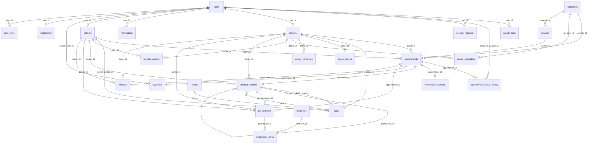

# MediBook — ERD theo SQLite đang chạy

Tự sinh bằng `npm run erd:sync` từ DB mới tạo bởi `src/db.ts`. Schema hiện có **27 bảng** và **41 khóa ngoại**. Các bảng, cột và quan hệ dưới đây phản ánh code chạy thật; `contact_requests` là bảng phát sinh sau ERD cũ.

## Bảng và cột

### activity_logs

| Cột | Kiểu | Ràng buộc |
|---|---|---|
| id | INTEGER | PK |
| user_id | INTEGER | FK → users.id; DELETE SET NULL |
| action | TEXT | NOT NULL |
| entity_type | TEXT | — |
| entity_id | INTEGER | — |
| details | TEXT | — |
| ip_address | TEXT | — |
| user_agent | TEXT | — |
| created_at | DATETIME | — |

### appointment_status_history

| Cột | Kiểu | Ràng buộc |
|---|---|---|
| id | INTEGER | PK |
| appointment_id | INTEGER | NOT NULL; FK → appointments.id; DELETE CASCADE |
| old_status | TEXT | — |
| new_status | TEXT | NOT NULL |
| changed_by_user_id | INTEGER | FK → users.id; DELETE SET NULL |
| note | TEXT | — |
| created_at | DATETIME | — |

### appointments

| Cột | Kiểu | Ràng buộc |
|---|---|---|
| id | INTEGER | PK |
| booking_code | TEXT | NOT NULL; UNIQUE |
| patient_id | INTEGER | NOT NULL; FK → patients.id; DELETE CASCADE |
| doctor_id | INTEGER | NOT NULL; FK → doctors.id; DELETE CASCADE |
| specialty_id | INTEGER | FK → specialties.id; DELETE SET NULL |
| service_id | INTEGER | FK → services.id; DELETE SET NULL |
| appointment_date | TEXT | NOT NULL |
| start_time | TEXT | NOT NULL |
| end_time | TEXT | NOT NULL |
| status | TEXT | NOT NULL |
| symptoms | TEXT | — |
| notes | TEXT | — |
| cancellation_reason | TEXT | — |
| source | TEXT | NOT NULL |
| priority_level | TEXT | NOT NULL |
| priority_reason | TEXT | — |
| is_bumped | INTEGER | — |
| bumped_from_slot | TEXT | — |
| estimated_start_time | TEXT | — |
| created_at | DATETIME | — |
| updated_at | DATETIME | — |

### articles

| Cột | Kiểu | Ràng buộc |
|---|---|---|
| id | INTEGER | PK |
| category | TEXT | NOT NULL |
| category_name | TEXT | NOT NULL |
| pill_label | TEXT | NOT NULL |
| icon | TEXT | — |
| slug | TEXT | NOT NULL; UNIQUE |
| title | TEXT | NOT NULL |
| summary | TEXT | NOT NULL |
| content | TEXT | NOT NULL |
| author_name | TEXT | NOT NULL |
| author_role | TEXT | NOT NULL |
| views_count | INTEGER | NOT NULL |
| status | TEXT | NOT NULL |
| created_at | DATETIME | — |
| updated_at | DATETIME | — |

### beds

| Cột | Kiểu | Ràng buộc |
|---|---|---|
| id | INTEGER | PK |
| room_id | INTEGER | NOT NULL; FK → rooms.id; DELETE CASCADE |
| bed_number | TEXT | NOT NULL |
| status | TEXT | NOT NULL |
| current_patient_id | INTEGER | FK → patients.id; DELETE SET NULL |
| current_medical_record_id | INTEGER | FK → medical_records.id; DELETE SET NULL |
| current_doctor_id | INTEGER | FK → doctors.id; DELETE SET NULL |
| admission_date | DATETIME | — |
| notes | TEXT | — |
| updated_at | DATETIME | — |

### contact_requests

| Cột | Kiểu | Ràng buộc |
|---|---|---|
| id | INTEGER | PK |
| user_id | INTEGER | FK → users.id; DELETE SET NULL |
| name | TEXT | NOT NULL |
| phone | TEXT | NOT NULL |
| email | TEXT | NOT NULL |
| subject | TEXT | — |
| message | TEXT | NOT NULL |
| created_at | DATETIME | NOT NULL |

### doctor_leaves

| Cột | Kiểu | Ràng buộc |
|---|---|---|
| id | INTEGER | PK |
| doctor_id | INTEGER | NOT NULL; FK → doctors.id; DELETE CASCADE |
| start_date | TEXT | NOT NULL |
| end_date | TEXT | NOT NULL |
| reason | TEXT | — |
| status | TEXT | NOT NULL |
| created_at | DATETIME | — |

### doctor_schedules

| Cột | Kiểu | Ràng buộc |
|---|---|---|
| id | INTEGER | PK |
| doctor_id | INTEGER | NOT NULL; FK → doctors.id; DELETE CASCADE |
| day_of_week | INTEGER | NOT NULL |
| start_time | TEXT | NOT NULL |
| end_time | TEXT | NOT NULL |
| max_patients | INTEGER | — |
| is_active | INTEGER | — |
| created_at | DATETIME | — |
| updated_at | DATETIME | — |
| slot_duration | INTEGER | — |
| status | TEXT | — |

### doctor_specialties

| Cột | Kiểu | Ràng buộc |
|---|---|---|
| id | INTEGER | PK |
| doctor_id | INTEGER | NOT NULL; FK → doctors.id; DELETE CASCADE |
| specialty_id | INTEGER | NOT NULL; FK → specialties.id; DELETE CASCADE |
| is_primary | INTEGER | — |
| created_at | DATETIME | — |

### doctors

| Cột | Kiểu | Ràng buộc |
|---|---|---|
| id | INTEGER | PK |
| user_id | INTEGER | NOT NULL; UNIQUE; FK → users.id; DELETE CASCADE |
| title | TEXT | NOT NULL |
| bio | TEXT | — |
| experience_years | INTEGER | — |
| consultation_fee | REAL | NOT NULL |
| rating | REAL | NOT NULL |
| rating_count | INTEGER | NOT NULL |
| room_number | TEXT | NOT NULL |
| created_at | DATETIME | — |
| updated_at | DATETIME | — |

### examination_queues

| Cột | Kiểu | Ràng buộc |
|---|---|---|
| id | INTEGER | PK |
| appointment_id | INTEGER | NOT NULL; UNIQUE; FK → appointments.id; DELETE CASCADE |
| queue_number | TEXT | NOT NULL |
| queue_date | TEXT | — |
| room | TEXT | NOT NULL |
| status | TEXT | NOT NULL |
| priority_level | TEXT | NOT NULL |
| priority_order | INTEGER | NOT NULL |
| is_bumped | INTEGER | — |
| bumped_reason | TEXT | — |
| checkin_time | DATETIME | — |
| called_time | DATETIME | — |
| finish_time | DATETIME | — |
| created_at | DATETIME | — |
| updated_at | DATETIME | — |

### favorite_doctors

| Cột | Kiểu | Ràng buộc |
|---|---|---|
| id | INTEGER | PK |
| patient_id | INTEGER | NOT NULL; FK → patients.id; DELETE CASCADE |
| doctor_id | INTEGER | NOT NULL; FK → doctors.id; DELETE CASCADE |
| created_at | DATETIME | — |

### medical_records

| Cột | Kiểu | Ràng buộc |
|---|---|---|
| id | INTEGER | PK |
| appointment_id | INTEGER | NOT NULL; UNIQUE; FK → appointments.id; DELETE CASCADE |
| patient_id | INTEGER | NOT NULL; FK → patients.id; DELETE CASCADE |
| doctor_id | INTEGER | NOT NULL; FK → doctors.id; DELETE CASCADE |
| parent_visit_id | INTEGER | FK → medical_records.id; DELETE NO ACTION |
| visit_type | TEXT | NOT NULL |
| treatment_type | TEXT | NOT NULL |
| inpatient_room | TEXT | — |
| inpatient_bed | TEXT | — |
| admission_date | TEXT | — |
| discharge_date | TEXT | — |
| vital_signs | TEXT | — |
| anamnesis | TEXT | — |
| clinical_diagnosis | TEXT | NOT NULL |
| icd10_code | TEXT | — |
| treatment_plan | TEXT | — |
| doctor_notes | TEXT | — |
| re_examination_date | TEXT | — |
| created_at | DATETIME | — |
| updated_at | DATETIME | — |
| bed_id | INTEGER | FK → beds.id; DELETE NO ACTION |

### medicines

| Cột | Kiểu | Ràng buộc |
|---|---|---|
| id | INTEGER | PK |
| code | TEXT | UNIQUE |
| name | TEXT | NOT NULL |
| unit | TEXT | NOT NULL |
| usage_instruction | TEXT | — |
| unit_price | REAL | NOT NULL |
| stock_quantity | INTEGER | NOT NULL |
| status | TEXT | NOT NULL |
| created_at | DATETIME | — |
| updated_at | DATETIME | — |
| category | TEXT | — |

### notifications

| Cột | Kiểu | Ràng buộc |
|---|---|---|
| id | INTEGER | PK |
| user_id | INTEGER | NOT NULL; FK → users.id; DELETE CASCADE |
| title | TEXT | NOT NULL |
| message | TEXT | NOT NULL |
| type | TEXT | — |
| link | TEXT | — |
| is_read | INTEGER | — |
| created_at | DATETIME | — |

### patients

| Cột | Kiểu | Ràng buộc |
|---|---|---|
| id | INTEGER | PK |
| user_id | INTEGER | NOT NULL; UNIQUE; FK → users.id; DELETE CASCADE |
| dob | TEXT | — |
| gender | TEXT | — |
| blood_group | TEXT | — |
| address | TEXT | — |
| emergency_contact | TEXT | — |
| health_insurance_no | TEXT | — |
| medical_history | TEXT | — |
| priority_category | TEXT | — |
| created_at | DATETIME | — |
| updated_at | DATETIME | — |

### payments

| Cột | Kiểu | Ràng buộc |
|---|---|---|
| id | INTEGER | PK |
| appointment_id | INTEGER | NOT NULL; UNIQUE; FK → appointments.id; DELETE CASCADE |
| invoice_code | TEXT | NOT NULL; UNIQUE |
| service_fee | REAL | NOT NULL |
| medicine_fee | REAL | NOT NULL |
| discount | REAL | NOT NULL |
| total_amount | REAL | NOT NULL |
| final_amount | REAL | NOT NULL |
| payment_method | TEXT | NOT NULL |
| payment_status | TEXT | NOT NULL |
| paid_at | DATETIME | — |
| cashier_user_id | INTEGER | FK → users.id; DELETE SET NULL |
| notes | TEXT | — |
| created_at | DATETIME | — |
| updated_at | DATETIME | — |
| note | TEXT | — |

### prescription_items

| Cột | Kiểu | Ràng buộc |
|---|---|---|
| id | INTEGER | PK |
| prescription_id | INTEGER | NOT NULL; FK → prescriptions.id; DELETE CASCADE |
| medicine_id | INTEGER | FK → medicines.id; DELETE SET NULL |
| medicine_name | TEXT | NOT NULL |
| dosage | TEXT | — |
| unit | TEXT | — |
| quantity | REAL | NOT NULL |
| morning | TEXT | — |
| noon | TEXT | — |
| afternoon | TEXT | — |
| night | TEXT | — |
| instructions | TEXT | — |
| unit_price | REAL | NOT NULL |
| amount | REAL | NOT NULL |
| created_at | DATETIME | — |

### prescriptions

| Cột | Kiểu | Ràng buộc |
|---|---|---|
| id | INTEGER | PK |
| medical_record_id | INTEGER | NOT NULL; UNIQUE; FK → medical_records.id; DELETE CASCADE |
| appointment_id | INTEGER | FK → appointments.id; DELETE CASCADE |
| doctor_id | INTEGER | FK → doctors.id; DELETE CASCADE |
| patient_id | INTEGER | FK → patients.id; DELETE CASCADE |
| total_amount | REAL | NOT NULL |
| usage_instructions | TEXT | — |
| created_at | DATETIME | — |

### receptionists

| Cột | Kiểu | Ràng buộc |
|---|---|---|
| id | INTEGER | PK |
| user_id | INTEGER | NOT NULL; UNIQUE; FK → users.id; DELETE CASCADE |
| staff_code | TEXT | NOT NULL; UNIQUE |
| created_at | DATETIME | — |
| updated_at | DATETIME | — |
| department | TEXT | — |
| shift_default | TEXT | — |

### reviews

| Cột | Kiểu | Ràng buộc |
|---|---|---|
| id | INTEGER | PK |
| patient_id | INTEGER | NOT NULL; FK → patients.id; DELETE CASCADE |
| doctor_id | INTEGER | NOT NULL; FK → doctors.id; DELETE CASCADE |
| appointment_id | INTEGER | UNIQUE; FK → appointments.id; DELETE SET NULL |
| rating | INTEGER | NOT NULL |
| comment | TEXT | — |
| created_at | DATETIME | — |
| is_anonymous | INTEGER | — |

### roles

| Cột | Kiểu | Ràng buộc |
|---|---|---|
| id | INTEGER | PK |
| code | TEXT | NOT NULL; UNIQUE |
| name | TEXT | NOT NULL |
| description | TEXT | — |

### rooms

| Cột | Kiểu | Ràng buộc |
|---|---|---|
| id | INTEGER | PK |
| room_number | TEXT | NOT NULL; UNIQUE |
| room_name | TEXT | NOT NULL |
| department_name | TEXT | — |
| room_type | TEXT | — |
| total_beds | INTEGER | — |
| status | TEXT | — |
| created_at | DATETIME | — |

### services

| Cột | Kiểu | Ràng buộc |
|---|---|---|
| id | INTEGER | PK |
| specialty_id | INTEGER | FK → specialties.id; DELETE SET NULL |
| name | TEXT | NOT NULL |
| description | TEXT | — |
| price | REAL | NOT NULL |
| duration_minutes | INTEGER | — |
| status | TEXT | NOT NULL |
| created_at | DATETIME | — |
| updated_at | DATETIME | — |

### specialties

| Cột | Kiểu | Ràng buộc |
|---|---|---|
| id | INTEGER | PK |
| name | TEXT | NOT NULL; UNIQUE |
| slug | TEXT | NOT NULL; UNIQUE |
| description | TEXT | — |
| icon | TEXT | — |
| created_at | DATETIME | — |
| updated_at | DATETIME | — |
| image | TEXT | — |
| status | TEXT | NOT NULL |

### user_roles

| Cột | Kiểu | Ràng buộc |
|---|---|---|
| id | INTEGER | PK |
| user_id | INTEGER | NOT NULL; FK → users.id; DELETE CASCADE |
| role | TEXT | NOT NULL |
| created_at | DATETIME | — |

### users

| Cột | Kiểu | Ràng buộc |
|---|---|---|
| id | INTEGER | PK |
| role | TEXT | NOT NULL |
| name | TEXT | NOT NULL |
| email | TEXT | NOT NULL; UNIQUE |
| password_hash | TEXT | NOT NULL |
| phone | TEXT | — |
| avatar | TEXT | — |
| status | TEXT | NOT NULL |
| created_at | DATETIME | — |
| updated_at | DATETIME | — |

## Giới hạn

- Các mối quan hệ suy ra từ `PRAGMA foreign_key_list`; liên hệ nghiệp vụ không có FK sẽ không xuất hiện.
- `database/schema.sql` mô tả DB mới. Cập nhật DB đang có phải chạy migration trong `src/db.ts`.
- Dữ liệu demo được tạo bởi `src/seed.ts` và `src/seed-data.json`; không nhập `database/seed.sql`.
