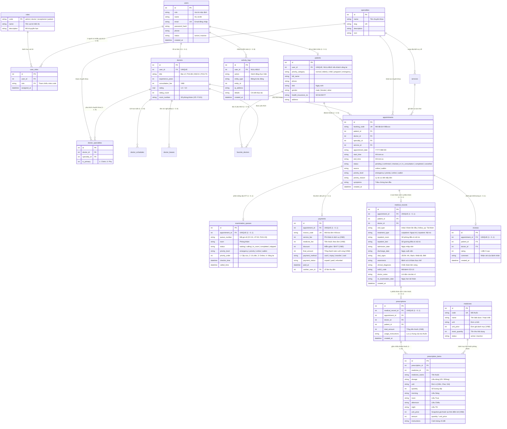

# MediBook - Sơ đồ Quan hệ Thực thể & Thiết kế Cơ sở Dữ liệu (ERD)

## 1. Chuẩn hóa & Khắc phục Lỗi Kiến trúc theo Yêu cầu Thực tế

Bản vẽ đã hoàn thiện và đáp ứng đầy đủ các yêu cầu cốt lõi của hội đồng và giảng viên:
1. **Cơ chế 1 Người Có Nhiều Role (Multi-Role Support)**:
   - Thêm danh mục chuẩn `roles (code PK, name, description)`.
   - Thêm bảng liên kết N-N `user_roles (user_id, role, assigned_at)` với ràng buộc `UNIQUE(user_id, role)`.
   - Một người dùng có thể đồng thời sở hữu nhiều vai trò (ví dụ: vừa là Bác sĩ vừa là Bệnh nhân, hoặc Quản trị viên kiêm Bác sĩ) và chuyển đổi giao diện làm việc linh hoạt (`/switch-role/:role`).
2. **Chuỗi Nghiệp vụ Lâm sàng (Clinical Domain Chain)**:
   - **Chuyên khoa (Specialties)** &rarr; nhiều **Bác sĩ (Doctors)** qua bảng `doctor_specialties`.
   - 1 **Bác sĩ** tiếp nhận khám nhiều **Bệnh nhân (Patients)** qua các lượt khám `appointments`.
   - 1 Lượt khám sinh ra duy nhất 1 **Phiếu khám / Bệnh án điện tử (medical_records)** (`appointment_id UNIQUE`).
   - 1 Phiếu khám sinh ra 1 **Đơn thuốc điện tử (prescriptions)** (`medical_record_id UNIQUE`).
   - 1 Đơn thuốc bao gồm nhiều **Khoản thuốc (prescription_items)** &rarr; liên kết danh mục kho thuốc **medicines**.
3. **Phân loại Phiếu khám & Điều trị Nội trú / Ngoại trú**:
   - `visit_type`: **Lần đầu khám** (`initial`) vs **Tái khám** (`follow_up`).
   - `treatment_type`: **Điều trị Ngoại trú** (`outpatient` - kê đơn về nhà) vs **Nhập viện Nội trú** (`inpatient`).
   - Quản lý buồng bệnh nội trú: `inpatient_room` (Số phòng), `inpatient_bed` (Số giường), `admission_date` (Ngày vào viện), `discharge_date` (Ngày xuất viện).
4. **Phân Luồng Ưu Tiên Hàng Đợi (Triage Queue Priority)**:
   - Thứ tự ưu tiên khám bệnh: **Khẩn cấp &rarr; Người già, Trẻ em, Thai phụ &rarr; Đặt hẹn Online &rarr; Vãng lai tại quầy (Offline)**.
   - Mức 1 (`emergency`): Cấp cứu nguy kịch &rarr; Mã STT tiền tố `CC-xx`, `priority_order = 1` (Gọi số đầu tiên, ưu tiên tuyệt đối).
   - Mức 2 (`priority`): Người cao tuổi (≥60t), Trẻ em (≤6t), Phụ nữ mang thai &rarr; Mã STT tiền tố `UT-xx`, `priority_order = 2`.
   - Mức 3 (`online`): Đặt lịch trước qua mạng &rarr; `priority_order = 3`.
   - Mức 4 (`walkin`): Khách vãng lai đăng ký tại quầy &rarr; `priority_order = 4`.
5. **Đồng bộ Tài chính & Viện phí**:
   - `payments`: Tự động tính toán minh bạch `service_fee + medicine_fee - discount = final_amount`.
   - Snapshot giá thuốc `prescription_items.unit_price` cố định tại thời điểm kê đơn.

---

## 2. Sơ đồ Thực thể ERD (Mermaid Diagram)



---

## 3. Đặc tả Chi tiết các Bảng Mới & Các Trường Mở Rộng

### 3.1. Bảng `roles` & `user_roles` (Hỗ trợ 1 Người Có Nhiều Role)
- **`roles`**: Danh mục 4 vai trò chuẩn (`admin`, `doctor`, `receptionist`, `patient`).
- **`user_roles`**: Cho phép 1 tài khoản `users.id` liên kết với nhiều `role`. Khi đăng nhập, session lưu mảng `roles: ['admin', 'doctor']` và `active_role`. Người dùng có thể chuyển đổi vai trò tức thì qua route `/switch-role/:role`.

### 3.2. Bảng `medical_records` (Phiếu khám Lâm sàng & Nội trú)
- `visit_type`:
  - `'initial'`: Bệnh nhân khám lần đầu tại phòng khám.
  - `'follow_up'`: Khám lại theo lịch hẹn tái khám của bác sĩ.
- `treatment_type`:
  - `'outpatient'`: Khám ngoại trú, kê đơn thuốc về nhà tự điều trị.
  - `'inpatient'`: Chỉ định nhập viện điều trị nội trú.
- Thông tin buồng bệnh nội trú:
  - `inpatient_room`: Số phòng bệnh (ví dụ: `Phòng 402 - Khoa Tim Mạch`).
  - `inpatient_bed`: Số giường bệnh (ví dụ: `Giường C-12`).
  - `admission_date`: Ngày giờ nhập viện điều trị.
  - `discharge_date`: Ngày dự kiến hoặc thực tế xuất viện.
- Mối quan hệ kê toa:
  - **1 Phiếu khám &rarr; 1 Đơn thuốc điện tử** (`prescriptions.medical_record_id UNIQUE`).
  - **1 Đơn thuốc &rarr; Nhiều thuốc** (`prescription_items` liên kết `medicines`).

### 3.3. Bảng `examination_queues` & `appointments` (Phân Luồng Ưu Tiên Khám)
- Thuật toán sắp xếp thứ tự gọi số phòng khám:
  ```sql
  ORDER BY 
    CASE 
      WHEN status = 'calling' THEN 0 
      WHEN status = 'in_room' THEN 1 
      WHEN status = 'waiting' THEN 2 
      ELSE 3 
    END,
    priority_order ASC,
    id ASC
  ```
- Các cấp độ ưu tiên (`priority_order`):
  1. `priority_order = 1` (`priority_level = 'emergency'`): Trường hợp cấp cứu, sốc phản vệ, khó thở cấp. Mã số `CC-xx`. Gọi loa đầu tiên.
  2. `priority_order = 2` (`priority_level = 'priority'`): Đối tượng ưu tiên theo luật y tế: Người già ≥ 60 tuổi, Trẻ em ≤ 6 tuổi, Phụ nữ có thai. Mã số `UT-xx`.
  3. `priority_order = 3` (`priority_level = 'online'`): Bệnh nhân đặt lịch hẹn trước qua website. Mã số `Pxxx-xx`.
  4. `priority_order = 4` (`priority_level = 'walkin'`): Bệnh nhân vãng lai bốc số trực tiếp tại sảnh tiếp đón.
