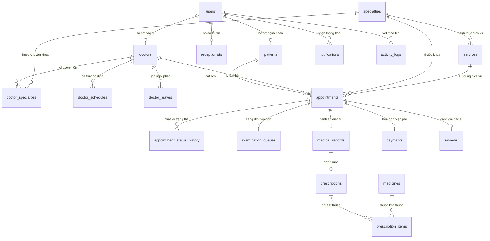

# MediBook - Sơ đồ quan hệ thực thể & Danh mục 20 bảng (ERD)

## 1. Sơ đồ thực thể ERD Mermaid

---

## 2. Danh mục 20 Bảng dữ liệu chi tiết

| STT | Tên bảng | Chức năng chính | Khóa ngoại & Liên kết |
|---|---|---|---|
| 1 | `users` | Tài khoản đăng nhập hệ thống (4 vai trò: admin, receptionist, doctor, patient) | Bảng gốc người dùng |
| 2 | `patients` | Hồ sơ chi tiết bệnh nhân (ngày sinh, giới tính, nhóm máu, địa chỉ, BHYT, tiền sử bệnh) | `user_id` -> `users.id` |
| 3 | `doctors` | Hồ sơ chi tiết bác sĩ (học vị, số phòng, kinh nghiệm, biểu phí khám, đánh giá) | `user_id` -> `users.id` |
| 4 | `receptionists` | Hồ sơ nhân viên lễ tân (mã nhân viên, bộ phận tiếp đón) | `user_id` -> `users.id` |
| 5 | `specialties` | Danh mục chuyên khoa (Nội, Ngoại, Nhi, Sản, Tim mạch...) | Danh mục cha của dịch vụ & bác sĩ |
| 6 | `services` | Danh mục dịch vụ khám và giá tiền niêm yết | `specialty_id` -> `specialties.id` |
| 7 | `doctor_specialties` | Bảng liên kết N-N giữa Bác sĩ và Chuyên khoa | `doctor_id` -> `doctors.id`, `specialty_id` -> `specialties.id` |
| 8 | `doctor_schedules` | Khung giờ làm việc định kỳ hàng tuần của bác sĩ | `doctor_id` -> `doctors.id` |
| 9 | `doctor_leaves` | Ngày xin nghỉ phép / bận đột xuất của bác sĩ | `doctor_id` -> `doctors.id` |
| 10 | `appointments` | Cuộc hẹn khám bệnh (mã đặt lịch `MB...`, ngày, giờ, trạng thái) | `patient_id`, `doctor_id`, `specialty_id`, `service_id` |
| 11 | `appointment_status_history` | Nhật ký ghi nhận mỗi lần chuyển trạng thái lịch hẹn | `appointment_id` -> `appointments.id`, `changed_by_user_id` -> `users.id` |
| 12 | `examination_queues` | Bảng hàng đợi tiếp đón tại sảnh phòng khám (số STT `A-01...`) | `appointment_id` -> `appointments.id` |
| 13 | `medical_records` | Bệnh án điện tử: Chẩn đoán, chỉ số sinh tồn (vitals JSON), mã ICD-10 | `appointment_id`, `patient_id`, `doctor_id` |
| 14 | `medicines` | Kho thuốc phòng khám: Tên thuốc, đơn vị, giá bán, số lượng tồn kho | Danh mục kho dược |
| 15 | `prescriptions` | Đơn thuốc tổng quát gắn liền với bệnh án | `medical_record_id`, `appointment_id`, `doctor_id` |
| 16 | `prescription_items` | Chi tiết từng loại thuốc trong toa (liều dùng, cữ uống S-T-C-Tối, thành tiền) | `prescription_id`, `medicine_id` |
| 17 | `payments` | Hóa đơn thu viện phí (tiền khám + tiền thuốc, mã `HD...`, trạng thái thu) | `appointment_id`, `cashier_user_id` |
| 18 | `reviews` | Đánh giá sao (1-5 sao) và nhận xét của bệnh nhân sau khi khám xong | `appointment_id`, `patient_id`, `doctor_id` |
| 19 | `notifications` | Thông báo gửi tới từng người dùng (chuông thông báo) | `user_id` -> `users.id` |
| 20 | `activity_logs` | Nhật ký bảo mật & kiểm toán các thao tác nhạy cảm trong hệ thống | `user_id` -> `users.id` |
