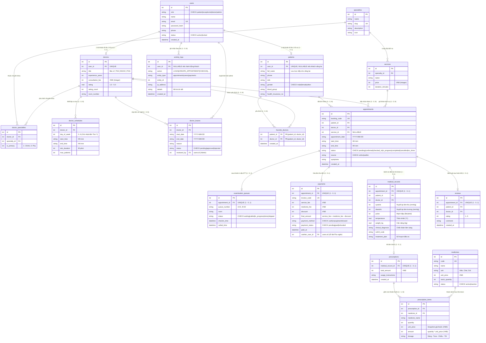

# MediBook - Sơ đồ Quan hệ Thực thể & Thiết kế Cơ sở Dữ liệu (ERD)

## 1. Bản sửa lỗi và chuẩn hóa ERD

Bản vẽ đã khắc phục triệt để **13 lỗi kiến trúc** của phiên bản cũ:
1. **Bác sĩ ↔ Chuyên khoa**: Thêm bảng liên kết N-N `doctor_specialties(doctor_id, specialty_id, is_primary)`.
2. **Quan hệ người dùng**: `users` → `patients` và `users` → `doctors` chuẩn hóa thành **1 - 0..1** (`user_id UNIQUE`).
3. **Quan hệ sau khám**: `appointments` → `examination_queues` / `payments` / `medical_records` sửa thành **1 - 0..1** (chỉ sinh sau check-in, thu ngân, hoặc khám).
4. **Đơn thuốc**: `medical_records` → `prescriptions` sửa thành **1 - 0..1** (không bắt buộc ca nào cũng có đơn).
5. **Bệnh nhân vãng lai**: `patients.user_id` cho phép `NULL` (không bắt buộc tạo tài khoản web), `patients` lưu trực tiếp `full_name`, `phone`.
6. **Bổ sung 4 thực thể cốt lõi**: `favorite_doctors`, `doctor_schedules` (ca trực), `doctor_leaves` (nghỉ phép), `activity_logs` (nhật ký bảo mật).
7. **Chỉ số sinh tồn**: Tách thành các trường số chuẩn y khoa: `systolic INT`, `diastolic INT`, `pulse INT`, `temperature REAL`, `weight_kg REAL`.
8. **Định dạng tiền tệ**: Chuẩn hóa toàn bộ thành số nguyên `INTEGER` (VNĐ).
9. **Snapshot giá thuốc**: `prescription_items.unit_price` lưu giá tại thời điểm kê đơn, không bị lệch hóa đơn khi giá danh mục đổi.
10. **Minh bạch viện phí**: `payments` chia rõ: `service_fee`, `medicine_fee`, `discount`, `final_amount`.
11. **Ràng buộc chống trùng lịch**: Unique index một phần trên `(doctor_id, appointment_date, start_time)` khi lịch chưa hủy.
12. **Ràng buộc miền giá trị**: Toàn bộ `role` và `status` có `CHECK constraint`.
13. **Đánh giá bác sĩ**: Thêm bảng `reviews` liên kết `appointments` (1 - 0..1).

---

## 2. Sơ đồ thực thể ERD (Mermaid)

