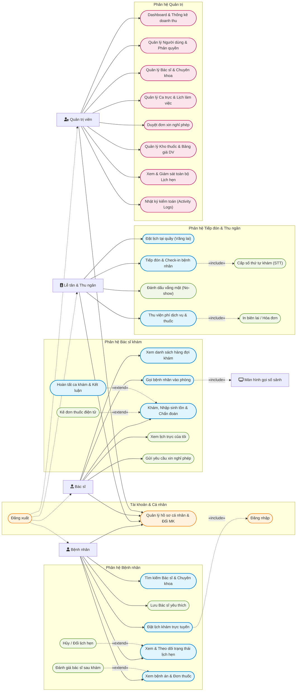

# MediBook - Tài liệu Use Case & Đặc tả luồng tương tác (USE_CASE)

## 1. Biểu đồ Use Case tổng thể (Chuẩn UML)

Bao gồm:
- **Tác tử chính**: Bệnh nhân, Lễ tân & Thu ngân, Bác sĩ khám bệnh, Quản trị viên (Admin).
- **Tác tử phụ / Hệ thống**: Màn hình gọi số sảnh chờ (Live TV Display).
- **Quan hệ bắt buộc `«include»`**:
  - `Đặt lịch khám trực tuyến` **«include»** `Đăng nhập hệ thống`
  - `Tiếp đón & Check-in` **«include»** `Cấp số thứ tự khám (STT)`
  - `Thu viện phí dịch vụ & thuốc` **«include»** `In biên lai / Hóa đơn`
  - `Gọi bệnh nhân vào phòng` **«include»** `Hiển thị Màn hình sảnh chờ`
- **Quan hệ mở rộng `«extend»`**:
  - `Kê đơn thuốc điện tử` **«extend»** `Khám, Nhập sinh tồn & Chẩn đoán`
  - `Hủy / Đổi lịch hẹn` **«extend»** `Xem & Theo dõi trạng thái lịch hẹn`
  - `Đánh giá bác sĩ sau khám` **«extend»** `Xem bệnh án & Đơn thuốc`

