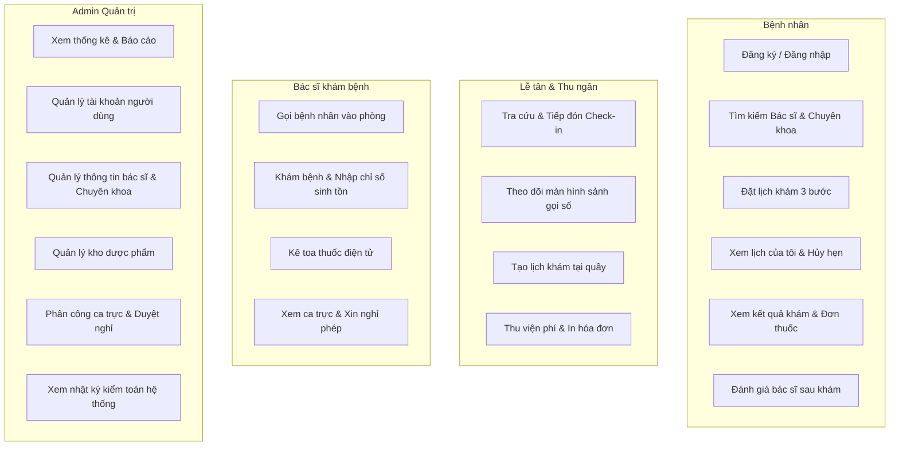

# MediBook - Tài liệu Use Case & Đặc tả luồng tương tác (USE_CASE)

## 1. Biểu đồ Use Case tổng thể

---

## 2. Đặc tả các Use Case chính

### UC-01: Đặt lịch khám bệnh trực tuyến (Online Appointment Booking)
- **Tác nhân chính**: Bệnh nhân (hoặc khách chưa đăng nhập).
- **Điều kiện tiên quyết**: Có kết nối internet, chọn ngày trong tương lai.
- **Luồng sự kiện chính**:
  1. Người dùng vào trang đặt lịch hoặc tìm kiếm từ trang chủ.
  2. Chọn Chuyên khoa -> Hệ thống nạp danh sách bác sĩ và dịch vụ chuyên khoa.
  3. Chọn Bác sĩ -> Hệ thống kiểm tra ca trực của bác sĩ và các ngày nghỉ phép đã duyệt.
  4. Chọn Ngày khám -> Hệ thống truy vấn các khung giờ khả dụng (mỗi khung 30 phút). Các khung giờ đã kín hoặc quá khứ sẽ hiển thị màu xám bị vô hiệu hóa.
  5. Chọn 1 khung giờ trống.
  6. Điền thông tin người khám (Họ tên, SĐT, Email) và triệu chứng ban đầu.
  7. Bấm nút "Xác nhận đặt lịch ngay".
  8. Hệ thống mở Transaction, khóa kiểm tra trùng giờ, sinh mã đặt lịch `MB...` độc nhất, lưu vào bảng `appointments` với trạng thái `confirmed`.
  9. Chuyển hướng đến trang thành công hiển thị phiếu khám.

### UC-02: Tiếp đón bệnh nhân & Cấp số thứ tự (Reception Check-in)
- **Tác nhân chính**: Nhân viên Lễ tân.
- **Điều kiện tiên quyết**: Bệnh nhân có mặt tại quầy lễ tân.
- **Luồng sự kiện chính**:
  1. Lễ tân nhập mã đặt lịch hoặc số điện thoại của bệnh nhân vào ô tìm kiếm.
  2. Hệ thống hiển thị thông tin cuộc hẹn.
  3. Lễ tân bấm nút "Tiếp đón (Check-in)".
  4. Hệ thống tính số thứ tự hôm nay cho phòng khám của bác sĩ (Ví dụ: `A-01`, `A-02`).
  5. Chuyển trạng thái lịch hẹn sang `checked_in` và ghi nhận vào bảng `examination_queues`.
  6. Bệnh nhân nhận số thứ tự và di chuyển đến sảnh chờ trước phòng khám.
  7. Màn hình gọi số tại sảnh tự động cập nhật danh sách chờ.

### UC-03: Thăm khám & Kê toa thuốc (Doctor Consultation & E-Prescription)
- **Tác nhân chính**: Bác sĩ.
- **Điều kiện tiên quyết**: Bệnh nhân đã check-in và đang chờ trong hàng đợi phòng khám.
- **Luồng sự kiện chính**:
  1. Bác sĩ mở màn hình "Hàng đợi khám bệnh".
  2. Bấm "Gọi bệnh nhân" -> Màn hình sảnh chờ phát hiệu ứng mời số thứ tự vào phòng.
  3. Bác sĩ bấm "Bắt đầu khám" -> Mở hồ sơ bệnh án.
  4. Xem lại tiền sử dị ứng, lý do khám và lịch sử khám các lần trước.
  5. Nhập các chỉ số sinh tồn (Huyết áp, Nhịp tim, Nhiệt độ, Chiều cao, Cân nặng -> hệ thống tự tính chỉ số BMI).
  6. Nhập chẩn đoán lâm sàng, mã ICD-10 và lời dặn dò.
  7. Thêm thuốc vào toa: Chọn từ danh mục kho hoặc nhập tên, hệ thống tự điền đơn giá và phân bổ liều dùng Sáng - Trưa - Chiều - Tối, tự tính tổng tiền thuốc.
  8. Bấm "Hoàn tất khám & Lưu bệnh án".
  9. Hệ thống cập nhật trạng thái lịch hẹn thành `completed`, trừ số lượng tồn kho dược phẩm tương ứng, sinh hóa đơn viện phí ở trạng thái `unpaid` và chuyển sang quầy thu ngân.

### UC-04: Thu ngân & Xuất hóa đơn viện phí (Billing & Invoice Payment)
- **Tác nhân chính**: Nhân viên Lễ tân / Thu ngân.
- **Điều kiện tiên quyết**: Buổi khám của bệnh nhân đã hoàn thành.
- **Luồng sự kiện chính**:
  1. Thu ngân mở màn hình "Quầy thu ngân & Viện phí".
  2. Xem hóa đơn chưa thanh toán của bệnh nhân (gồm tiền công khám + tiền thuốc theo đơn).
  3. Chọn phương thức thanh toán: Tiền mặt, Chuyển khoản, MoMo hoặc VNPay.
  4. Bấm "Thu tiền" -> Hệ thống ghi nhận trạng thái hóa đơn là `paid`, lưu thời gian thanh toán và người thực hiện.
  5. Bấm "In biên lai" -> Xuất mẫu in hóa đơn đạt chuẩn cho bệnh nhân.
